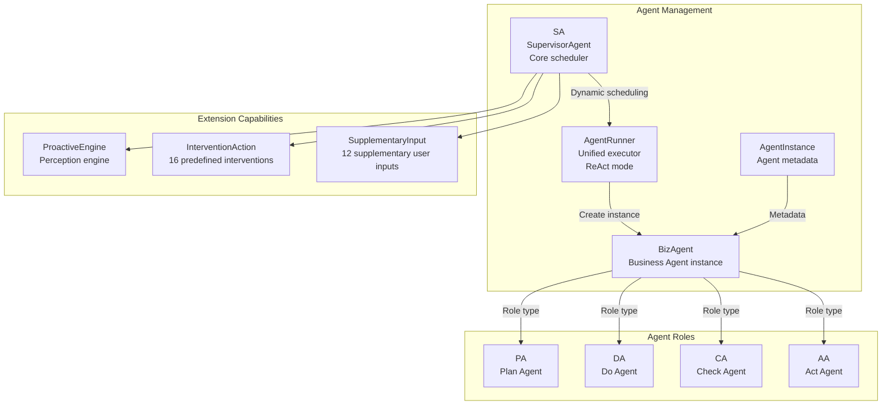
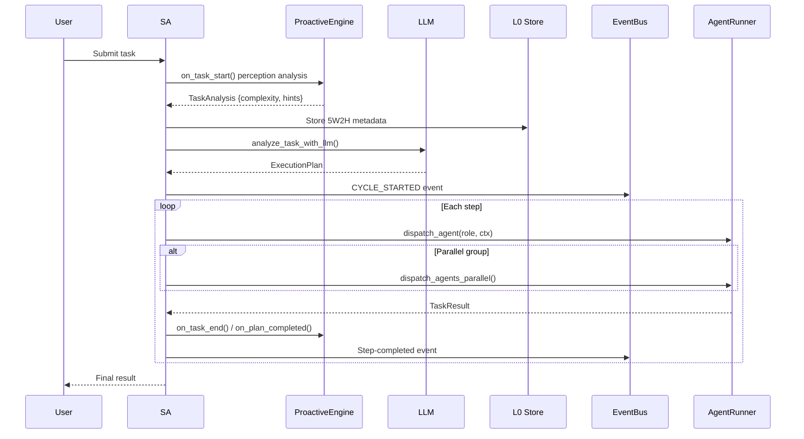
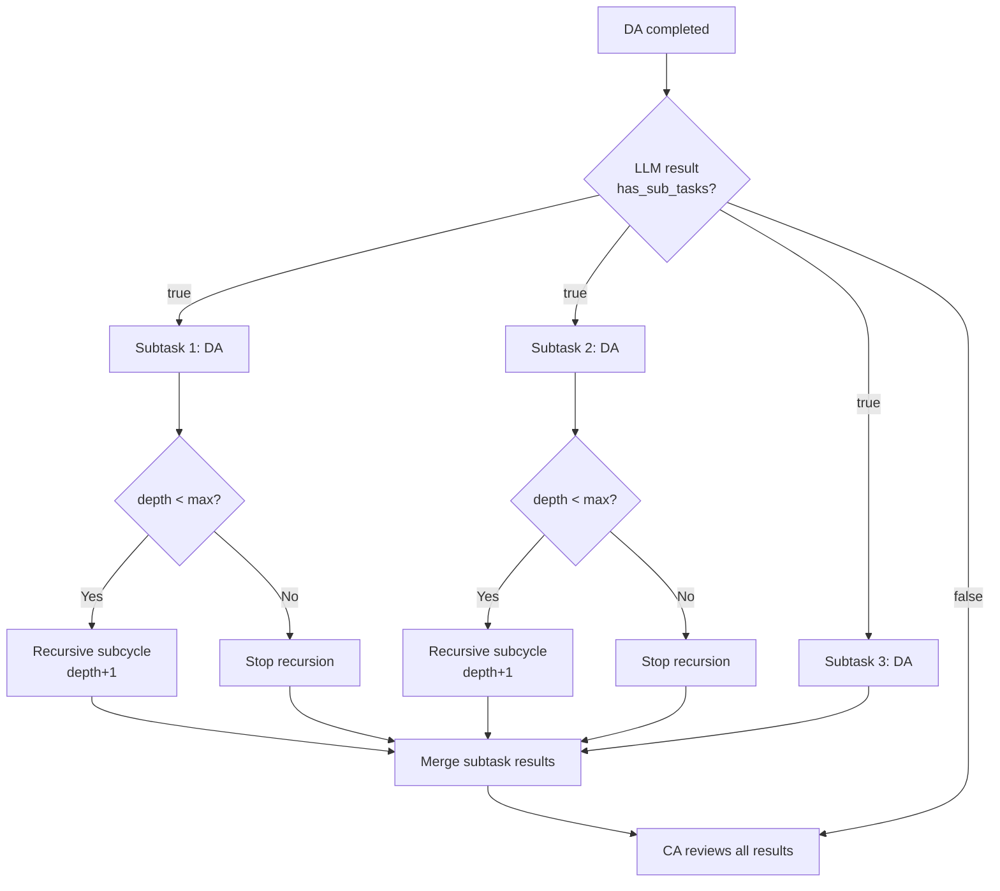
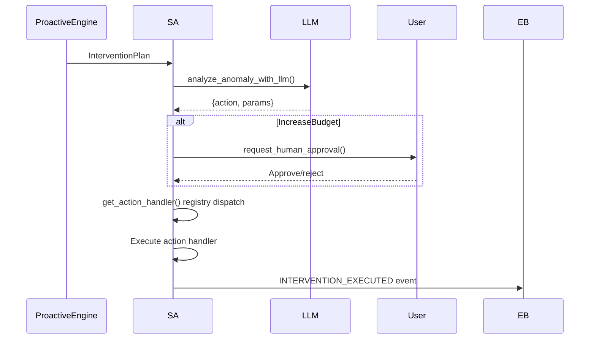
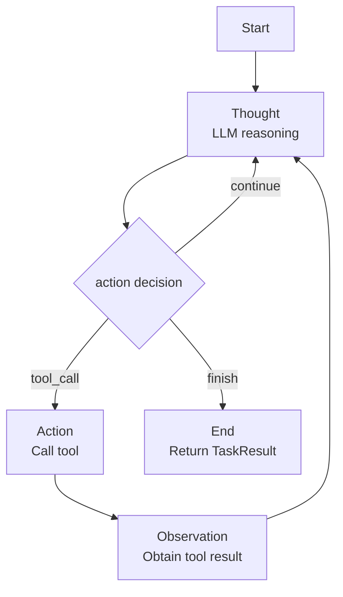
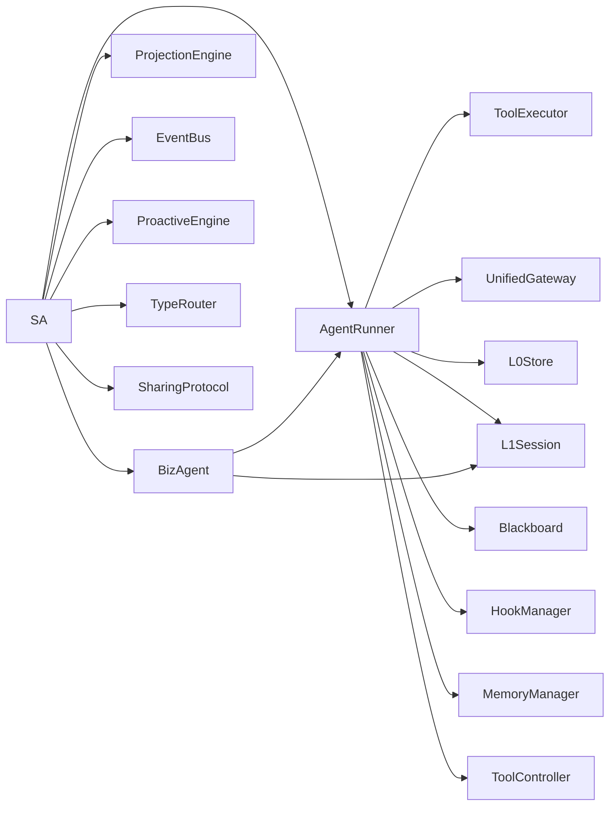

# 1. Agent Management and Scheduling

## 1.1 Module Overview

Agent management and scheduling is the system core. It dynamically selects Agent combinations and transitions. SA schedules PA/DA/CA/AA by task type and integrates the perception engine, intervention mechanisms, and supplementary user input.

### Tenant Scope and Chat RAG

New user Agents are written with the `tenant_id` and `project_id` from authentication-boundary-verified claims. Internal/scoped chat RAG accepts only Agents that exactly match those verified claims; records without scope, or with mismatched tenant/project values, are rejected. Legacy unscoped Agents are therefore no longer implicitly shared. For the trust boundary and public API-key chat behavior, see [17-isolation-contract.md](17-isolation-contract.md).



## 1.2 Core Components

### 1.2.1 SupervisorAgent (SA)

**File**: `src/core/sa.rs`
**Implementation status**: ✅ Complete

SA is the core scheduler and **dynamically determines** Agent composition and flow by task type:

| Task type | Agent flow | Description |
|---|---|---|
| Instant | DA only | Immediate execution (very short input) |
| Simple | DA only | Direct execution of simple queries |
| Standard | PA → DA → CA → AA | Full PDCA |
| Complex | PA → DA → CA → AA | Complex task with full validation |
| Exploratory | PA → [DA1, DA2, DA3] in parallel → CA → AA | Parallel exploratory execution |
| Emergency | DA → CA → AA | Direct repair without PA |
| Recursive | PA → DA (micro PDCA) → CA → AA | Recursively decomposed subtasks |

**Core structure**:

```rust
pub struct SupervisorAgent {
    runner: Arc<AgentRunner>,
    template_engine: Arc<TemplateEngine>,
    skills: Arc<SkillRegistry>,
    event_bus: Arc<EventBus>,
    event_receiver: Option<broadcast::Receiver<Event>>,
    active_cycles: HashMap<String, CycleState>,
    max_iterations: u32,
    perception: ProactiveEngine,
    sharing: Arc<SharingProtocol>,
    blackboard: Option<Arc<Blackboard>>,
    prefetch_engine: Option<Arc<PrefetchEngine>>,
    scheduler: Option<Arc<MemoryScheduler>>,
    type_router: TypeRouter,
    pending_approvals: Arc<tokio::sync::Mutex<HashMap<String, bool>>>,
    supplementary_inputs: HashMap<String, Vec<(String, String)>>,
}
```

| Method | Purpose |
|---|---|
| `process_task(task_iri, user_input)` | Handles task entry (full flow) |
| `start_cycle(user_input, task_iri)` | Starts a task cycle and invokes perception analysis |
| `analyze_task(user_input)` | Uses rules to determine task type and complexity |
| `analyze_task_with_llm(user_input, five_w2h, hints)` | Uses the LLM to produce a detailed execution plan |
| `execute_plan(plan, task_iri, input, five_w2h, iri)` | Schedules Agents sequentially/in parallel according to the plan |
| `dispatch_agent(role, ctx, cycle, plan_step)` | Schedules one Agent with BizAgent isolation |
| `dispatch_agents_parallel(role, count, ...)` | Schedules multiple Agents in parallel |
| `execute_intervention(plan, task_iri)` | Executes an intervention plan from the perception engine |

**Complete task-processing flow**:



### Recursive Task Decomposition

Recursive decomposition is the central innovation of the SA scheduling model for complex, multi-step, multi-level tasks.

**Trigger keywords**: `重构`, `refactor`, `重写`, `迁移`, `拆分`, `逐步实现`, `端到端`, `从零搭建`, and similar terms.

| Task type | Maximum recursion depth |
|---|---|
| Recursive | 3 levels |
| Complex | 2 levels |
| Other | 0 (no recursion) |

**Core method**: `execute_recursive_sub_cycle()`

1. After DA succeeds, send its summary to the LLM to decompose subtasks.
2. The LLM returns `has_sub_tasks` and the `sub_tasks` list.
3. Create a `TaskContext` for every subtask and schedule DA execution.
4. After success, recursively determine whether deeper decomposition is needed.
5. Merge all subtask results and pass them to CA.



### Intervention Action System

SA integrates 16 predefined intervention actions in five categories. After `ProactiveEngine` triggers them, an LLM classifies and decides what to execute.

| Category | Actions | Description |
|---|---|---|
| **Continue normally** | Continue / ContinueWithMonitor | No intervention or increased monitoring |
| **Parameter adjustment** | IncreaseRetry / IncreaseTimeout / ReduceComplexity / RestrictTools | Parameter changes without interruption |
| **Execution-flow adjustment** | SkipStep / RetryStep / Parallelize / SplitStep / InsertExtraStep | Flow changes requiring interruption |
| **Resources and mode** | FallbackToShallow / EmergencyMode / IncreaseBudget / FreezeAndReport | Mode changes (`IncreaseBudget` requires human approval) |
| **Terminate and escalate** | AbortTask / NotifyHuman | Last resort |



### Supplementary User Input

SA can receive supplementary input during execution in four categories with 12 predefined actions:

| Category | Actions | Description |
|---|---|---|
| **Information additions** | AddContext / RefineObjective / ProvideConstraint | User supplies additional context |
| **Direction guidance** | GuideDirection / PrioritizeStep / SuggestApproach | User directs the approach |
| **Execution control** | PauseExecution / ResumeExecution / SkipCurrentStep | Controls execution flow |
| **Feedback correction** | ConfirmDirection / CorrectApproach / AbortCurrentStep | Corrects mistakes |

Supplementary input is received through `EventBus.USER_SUPPLEMENTARY_INPUT`; SA checks and processes it between steps.

### 1.2.2 AgentRunner

**File**: `src/core/agent_runner.rs`
**Implementation status**: ✅ Complete

All PA/DA/CA/AA Agents share the unified `AgentRunner`; only injected prompt templates, tool allowlists, and maximum turns differ. It uses the ReAct (Thought-Action-Observation) execution pattern.

```rust
pub struct AgentRunner {
    pub gateway: Arc<UnifiedGateway>,
    pub skills: Arc<SkillRegistry>,
    pub blackboard: Arc<Blackboard>,
    pub l0_store: Arc<L0Store>,
    pub memory_manager: Arc<tokio::sync::Mutex<MemoryManager>>,
    pub templates: Arc<TemplateEngine>,
    pub tool_executor: Arc<RwLock<ToolExecutor>>,
    pub agent_settings: AgentSettings,
    pub hook_manager: Arc<HookManager>,
    pub projection: Arc<ProjectionEngine>,
    pub sharing: Arc<SharingProtocol>,
    pub emphasis_config: Option<EmphasisConfig>,
    pub event_bus: Option<Arc<EventBus>>,
    pub scheduler: Option<Arc<MemoryScheduler>>,
    pub prefetch_engine: Option<Arc<PrefetchEngine>>,
    pub unified_graph_store: Option<Arc<oxigraph::store::Store>>,
    pub tool_controller: Option<ToolController>,
    pub total_prompt_tokens: Arc<AtomicU64>,
    pub total_completion_tokens: Arc<AtomicU64>,
}
```

| Method | Purpose |
|---|---|
| `execute(agent, ctx)` | Executes an Agent ReAct cycle |
| `execute_with_biz_agent(agent, ctx, plan_step)` | Executes with BizAgent isolation |
| `build_system_prompt(agent, ctx)` | Builds the Agent system prompt |
| `parse_llm_response(response)` | Parses thought/content/summary from an LLM response |
| `route_tool_result(result, tool_name, call_id)` | Intelligently routes tool results |
| `set_event_bus(event_bus)` | Injects EventBus for granular event emission |



| Role | Maximum turns | Description |
|---|---|---|
| PA (Plan) | 8 | Research tasks need more turns |
| DA (Do) | max_iterations | No additional limit |
| CA (Check) | 15 | Complex-task review needs enough turns |
| AA (Act) | 8 | Decision tasks need enough turns |

```json
{
  "thought": "Reasoning process",
  "content": "Formal reply content",
  "summary": "Summary (no more than 50 characters)",
  "action": "tool_call|finish|continue",
  "emphasis": []
}
```

**Dual extraction of emphasized content**: LLM extraction parses the `emphasis` field from LLM JSON; keyword matching scans for emphasis keywords such as `必须` and `IMPORTANT`; configuration in the `emphasis` section of `config.yaml` controls extraction and thresholds.

### 1.2.3 TaskContext

**File**: `src/core/agent_runner.rs`
**Implementation status**: ✅ Complete

```rust
pub struct TaskContext {
    pub task_iri: String,
    pub objective: String,
    pub parent_task_iri: Option<String>,
    pub input_data: HashMap<String, Value>,
    pub constraints: HashMap<String, String>,
    pub max_iterations: u32,
    pub prev_agent_summary: Option<String>,
    pub original_task: Option<String>,
    pub completed_steps: Vec<String>,
    pub pending_steps: Vec<String>,
    pub five_w2h_iri: String,
    pub five_w2h_snapshot: Option<Task5W2H>,
}
```

When passed between Agents, `TaskContext` carries a 5W2H snapshot, historical summaries, and step state.

### 1.2.4 TaskResult

```rust
pub struct TaskResult {
    pub task_iri: String,
    pub status: String,           // "success" | "failed" | "completed"
    pub summary: String,
    pub output: Option<Value>,
    pub jsonld_output: Option<Value>,
    pub artifacts: Vec<Value>,
    pub errors: Vec<String>,
    pub turn_count: u32,
    pub tool_call_count: u32,
    pub five_w2h_updates: Option<serde_json::Value>,
}
```

`five_w2h_updates` lets an Agent update 5W2H metadata during execution.

### 1.2.5 5W2H Task Analyzer

**File**: `src/core/five_w2h.rs`
**Implementation status**: ✅ Complete

The analyzer uses 5W2H methodology for structured task analysis, supporting progressive completion and frozen archival.

```rust
pub struct Task5W2H {
    pub what: String,
    pub why: WhyDetail,
    pub who: Option<WhoDetail>,
    pub when: Option<WhenDetail>,
    pub where_: Option<WhereDetail>,
    pub how: Option<HowDetail>,
    pub how_much: Option<HowMuchDetail>,
    pub dimension_meta: HashMap<String, DimensionMeta>,
    pub frozen: bool,
}
```

| Type | Key fields |
|---|---|
| WhyDetail | description, success_criteria, priority |
| WhoDetail | requestor, assignees, stakeholders, required_role, access_level |
| WhenDetail | deadline, start_after, estimated_duration, timezone, reminder_before |
| WhereDetail | data_sources, execution_environment, target_repository, target_branch |
| HowDetail | plan_iri, preferred_skills, forbidden_tools, required_steps, dependencies |
| HowMuchDetail | token_budget, max_sub_agents, max_pdca_cycles, expected_quality, actual_cost |
| ActualCost | tokens_used, cycles_used, duration_secs |

| Stage | Filled dimensions | Populated by |
|---|---|---|
| Create | what, why | SA (LLM extraction) |
| Plan | who, when, how | PA |
| Do | where, how_much (partial) | DA |
| Check | how_much (actual) | CA |
| Act | freeze archive | SA |

```rust
pub enum TaskComplexity {
    Instant,      // Very short input (<15 characters without spaces)
    Simple,       // Simple factual query
    Standard,     // Standard task (default)
    Complex,      // Complex task
    Exploratory,  // Exploratory task (multiple parallel DAs)
    Emergency,    // Emergency repair (skip PA)
    Recursive,    // Recursive decomposition
}
```

Complexity is automatically categorized with keyword-matching rules and can also use LLM-assisted classification.

### 1.2.6 BizAgent

**File**: `src/core/biz_agent.rs`
**Implementation status**: ✅ Complete

A business Agent instance. Every PA/DA/CA/AA is a `BizAgent` instance and can create child Agents for parallel processing.

```rust
pub struct BizAgent {
    agent_id: String,
    role: AgentRole,
    task_iri: String,
    session: L1Session,
    tools: Vec<String>,
    parent_id: Option<String>,
    children: Vec<String>,
    max_children: usize,
}
```

### 1.2.7 AgentInstance

**File**: `src/core/agent_instance.rs`
**Implementation status**: ✅ Complete

Defines Agent metadata.

```rust
pub struct AgentInstance {
    pub agent_id: String,
    pub role: AgentRole,
    pub status: AgentStatus,
    pub task_iri: String,
    pub created_at: DateTime<Utc>,
    pub parent_id: Option<String>,
}
pub enum AgentRole { Plan, Do, Check, Act }
pub enum AgentStatus { Idle, Running, Completed, Failed }
```

## 1.3 Module Dependencies



## 1.4 Execution Event System

**File**: `src/core/execution_event.rs`

SA and AgentRunner emit granular events to EventBus through `ExecutionEvent`, enabling real-time UI and monitoring views.

| Event type | Trigger | Purpose |
|---|---|---|
| PhaseChange | Agent phase transition | Show execution progress |
| AgentStatus | Agent state change | Monitor Agent health |
| LlmContent | Streaming LLM response | Show reasoning in real time |
| ToolCall | Tool invocation begins | Show tool use |
| ToolResult | Tool invocation ends | Show execution result |
| Thought | SA/Agent thought | TUI reasoning display |
| TokenUsage | Token-use update | Budget monitoring |
| Error | Error occurs | Anomaly alert |
| Completion | Task completes | Result display |
