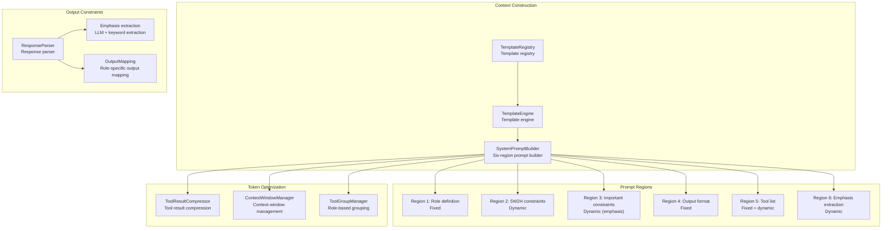
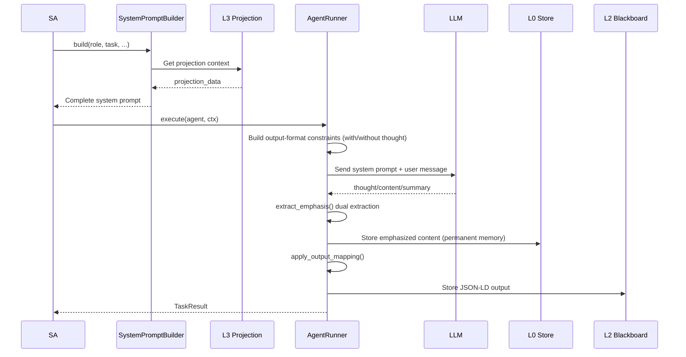

# 2. Context Management

## 2.1 Module Overview

Context management builds and manages Agent system prompts, context injection, output constraints, and Token optimization. `SystemPromptBuilder` builds prompts from six regions; together with the template engine and output mappings, it ensures consistent Agent behavior.



## 2.2 Core Components

### 2.2.1 SystemPromptBuilder

**File**: `src/core/system_prompt.rs`
**Implementation status**: ✅ Complete

The system-prompt builder constructs an Agent prompt in six regions. LLMs retain the first and last prompt content best, so fixed regions are placed first and dynamic regions are positioned as needed.

| Region | Type | Content | Description |
|---|---|---|---|
| Region 1 | Fixed | Role definition | Role descriptions for PA/DA/CA/AA |
| Region 2 | Dynamic | 5W2H constraints | Task 5W2H metadata: objectives, reasons, constraints, and so on |
| Region 3 | Dynamic | Emphasized content | Important constraints extracted from conversation (`emphasis`) |
| Region 4 | Fixed | Output format | JSON constraints: thought/content/summary/action/emphasis |
| Region 5 | Fixed + dynamic | Tool list | Built-in (fixed) plus role-based dynamic tools |
| Region 6 | Dynamic | Emphasis extraction | Configuration-driven `emphasis` extraction prompt |

```rust
pub enum SystemPromptRegion {
    RoleDefinition,         // Region 1: order=1
    FiveW2HConstraints,    // Region 2: order=2
    EmphasizedConstraints, // Region 3: order=3
    OutputFormat,          // Region 4: order=4
    Tools,                 // Region 5: order=5
    ExtractionPrompt,      // Region 6: order=6
}
```

| Method | Purpose |
|---|---|
| `set_region(region, content)` | Sets a region's content |
| `get_region(region)` | Gets a region's content |
| `build()` | Sorts by `order` and builds the complete prompt |
| `build_with_emphasis(items)` | Builds a prompt containing emphasized content |

**Example system-prompt construction**:

```
# Role
You are a Plan Agent (PA)...

---
# Task Constraints
- Objective: analyze Q2 sales data
- Reason: provide a basis for inventory planning
- Deadline: 2026-05-20T18:00:00+08:00
- Success criterion: output a regional growth comparison chart

---
# Important Constraints
- Must be implemented asynchronously

---
# Output Format
Return JSON: {"content": "...", "summary": "...", "action": "tool_call|finish|continue", "emphasis": []}

---
# Tools
## Built-in tools (fixed)
- file_read: read a file
- grep_search: search file contents
...

## Dynamic tools (adjusted on demand)
...

---
# Emphasized Content
## Emphasized-content extraction
If the user input contains emphasis such as "must" or "important", extract it into the emphasis field.
```

### 2.2.2 TemplateEngine

**File**: `src/templates/template_engine.rs`
**Implementation status**: ✅ Complete

The template engine loads and manages Agent prompt templates, supporting variable filling and recursive directory scanning.

```rust
pub struct TemplateEngine {
    templates_dir: PathBuf,
    loaded_templates: HashMap<String, String>,
    schemas_dir: PathBuf,
}
```

| Method | Purpose |
|---|---|
| `new(templates_dir)` | Creates the template engine |
| `load_templates()` | Loads every template |
| `render(template_name, variables)` | Renders a template |
| `get_template(name)` | Gets template content |

Templates substitute variables using `{placeholder}` syntax.

### 2.2.3 AgentTemplate (JSON-LD)

**File**: `src/templates/schemas/agent_template.rs`
**Implementation status**: ✅ Complete

The standardized JSON-LD template contains `@context`, `@type`, system-prompt segments, and output mappings.

```rust
pub struct AgentTemplate {
    pub context: String,           // JSON-LD @context
    pub id: String,                // Template IRI
    pub template_type: Vec<String>,  // @type list
    pub role: String,              // Agent role
    pub system_prompt: Vec<PromptSegment>,  // Prompt segments
    pub output_mapping: HashMap<String, String>,  // Output mappings
    pub skill_whitelist: Vec<String>,  // Tool allowlist
}
```

### 2.2.4 PromptSegment

**File**: `src/templates/schemas/prompt_segment.rs`
**Implementation status**: ✅ Complete

Prompt segments support three kinds:

| Type | Description | Example |
|---|---|---|
| `Fixed` | Fixed content | "You are a Plan Agent (PA)..." |
| `Variable` | Variable reference | `{task_description}` |
| `Dynamic` | Dynamically generated | `{available_skills}` |

### 2.2.5 LLM Response-Format Constraints

**File**: `src/core/agent_runner.rs`
**Implementation status**: ✅ Complete

LLM responses must follow JSON format.

**Models with reasoning capability**:
```json
{
  "thought": "Thinking/reasoning process",
  "content": "Formal reply content",
  "summary": "Summary (no more than 50 characters)",
  "action": "tool_call|finish|continue",
  "emphasis": []
}
```

**Models without reasoning capability**:
```json
{
  "content": "Reply content",
  "summary": "Summary (no more than 50 characters)",
  "action": "tool_call|finish|continue",
  "emphasis": []
}
```

**Model adaptation**:
- For models with native reasoning, such as DeepSeek-R1, `thought` is the chain of reasoning.
- Models without reasoning omit `thought`.
- `emphasis` contains extracted emphasized content and is configured in the `emphasis` section of `config.yaml`.
- `summary` is limited to 50 characters.

### 2.2.6 OutputMapping

| Role | Local field → mapped IRI |
|---|---|
| PA | plan → execution_plan, steps → plan_steps |
| DA | result → execution_result, artifacts → created_artifacts |
| CA | review → check_review, passed → check_passed |
| AA | decision → final_decision, action → recommended_action |

### 2.2.7 Emphasis Extraction Configuration

**Configuration**: the `emphasis` section of `config.yaml`

```yaml
emphasis:
  enabled: true
  extraction_prompt: |
    ## Emphasized-content extraction
    If user input contains emphasis (such as "must", "important", "do not forget", or "key"),
    extract it into the JSON "emphasis" field (an array of strings).
  max_items: 50
  dedup_threshold: 0.85
```

Extraction:
1. **LLM extraction**: the Region 6 prompt guides the LLM to produce `emphasis`.
2. **Keyword matching**: scans text for more than 20 Chinese and English emphasis keywords.
3. The results are merged and written to the emphasized-content region so important information is not missed.

## 2.3 Token Optimization System

### 2.3.1 ToolGroupManager

**File**: `src/tools/tool_groups.rs`

Tools are grouped by role to avoid exposing unnecessary tool lists:

```yaml
tool_groups:
  enabled: true
  roles:
    Plan:
      default: ["Core", "Search", "Knowledge", "System"]
      on_demand: ["Web", "Code", "Skill"]
    Do:
      default: ["Core", "Write", "Search", "Web", "Code", "Skill", "System"]
      on_demand: ["Knowledge"]
    Check:
      default: ["Core", "Search", "Knowledge", "System"]
      on_demand: ["Web", "Code"]
    Act:
      default: ["Core", "System"]
      on_demand: ["Search", "Knowledge"]
```

| Role | Default groups | On-demand groups |
|---|---|---|
| PA | Core, Search, Knowledge, System | Web, Code, Skill |
| DA | Core, Write, Search, Web, Code, Skill, System | Knowledge |
| CA | Core, Search, Knowledge, System | Web, Code |
| AA | Core, System | Search, Knowledge |

### 2.3.2 ToolResultCompressor

**File**: `src/core/context_compressor.rs`

Large tool results are compressed automatically:

```yaml
tool_result_compressor:
  enabled: true
  max_full_results: 2       # Keep at most two complete results
  max_summary_length: 200   # Maximum summary length
  compression_trigger: 10   # Compress after more than 10 tool calls
```

### 2.3.3 ContextWindowManager

**File**: `src/core/context_compressor.rs`

```yaml
context_window:
  max_messages: 15          # Maximum messages
  max_tokens: 16000         # Maximum Token count
  compression_ratio: 0.3    # Compression ratio
  preserve_recent: 4        # Preserve the most recent N messages
```

### 2.3.4 Prompt Optimization

```yaml
prompt_optimization:
  enabled: true
  use_layered_prompts: true     # Layered prompts
  store_specs_in_kg: true       # Store specifications in the knowledge graph
```

## 2.4 Context Data Flow



## 2.5 Configuration-Driven Behavior

`config.yaml` controls context construction:

| Configuration | Effect |
|---|---|
| emphasis.enabled | Enables injecting the Region 6 emphasis-extraction prompt |
| emphasis.extraction_prompt | Prompt content for Region 6 |
| tool_groups.enabled | Filters tool lists by role grouping |
| tool_groups.roles.* | Default/on-demand tool groups for every role |
| context_window.max_tokens | Context-window Token ceiling |
| context_window.max_messages | Maximum retained messages |
| token_optimization.enabled | Enables all Token-optimization features |
| prompt_optimization.use_layered_prompts | Uses layered prompts |
