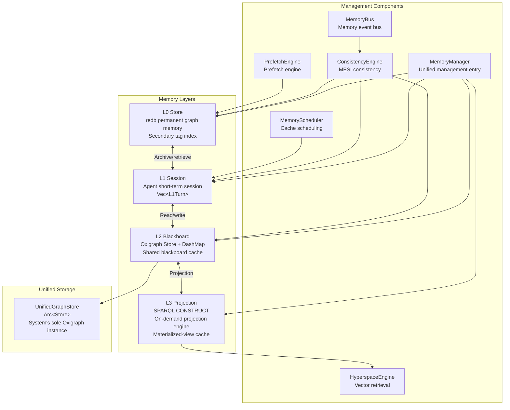
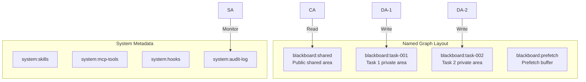
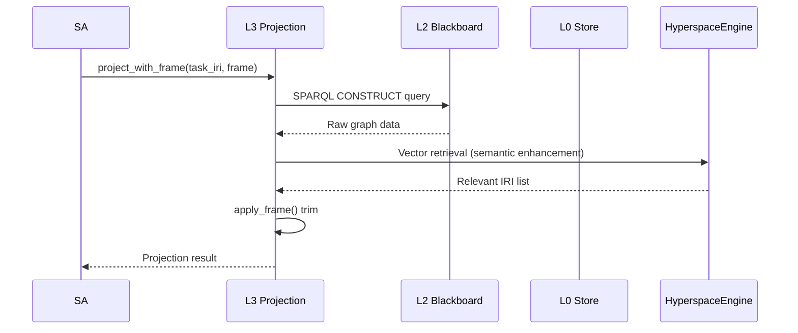
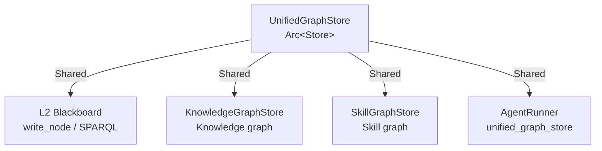
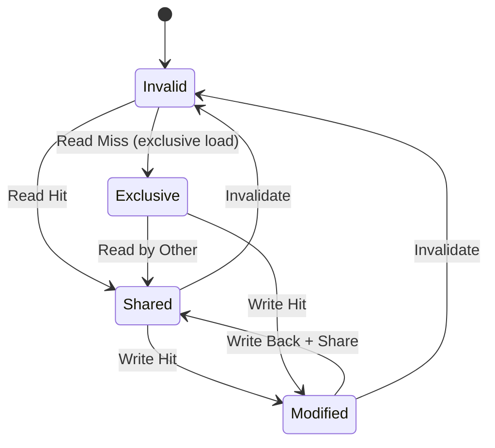
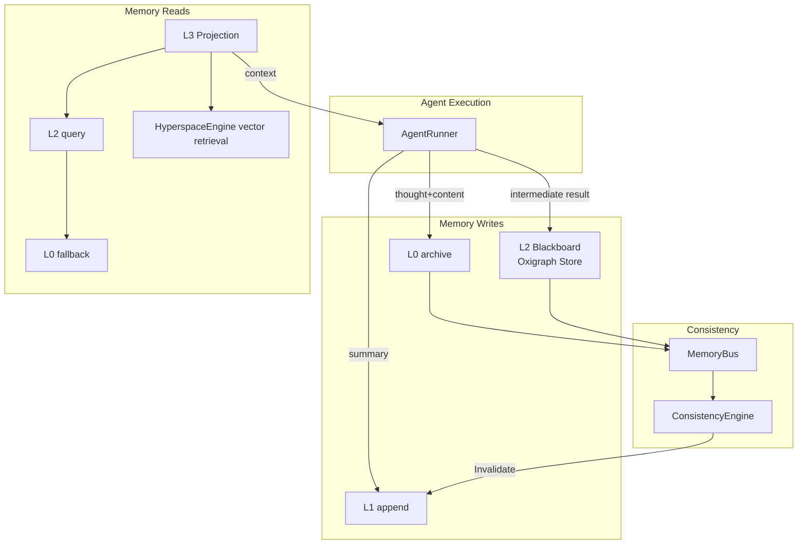

# 3. Memory System

## 3.1 Module Overview

The memory system uses a four-layer architecture, from permanent graph memory to on-demand projections, for fine-grained Token-budget control. All layers share underlying RDF graph data through the unified Oxigraph store and use named graphs for isolation.



### Current Storage Stack

Consistent with `src/memory/l0_store.rs`, `crates/hyperspace-engine`, and `src/memory/unified_graph.rs`:

| Role | Implementation | Interface | Code |
|---|---|---|---|
| L0 permanent KV | redb | IRI / tag / named-graph index | `src/memory/l0_store.rs` (data file: `l0.redb`) |
| Vector layer | hyperspace-engine (embedded HNSW) | ANN / hybrid retrieval | `crates/hyperspace-engine`, `src/memory/hyperspace_store.rs` |
| Graph storage | Oxigraph | SPARQL 1.1 | `src/memory/unified_graph.rs`, L2 Blackboard |

Vector retrieval comes from the workspace crate `hyperspace-engine`, so no external vector database is required. Graph queries use SPARQL 1.1.

## 3.2 Detailed Layer Design

### 3.2.1 L0 Store — Permanent Graph Memory

**File**: `src/memory/l0_store.rs`
**Implementation status**: ✅ Complete
**Storage engine**: redb (native embedded Rust key-value store with secondary tag and named-graph indexes)

L0 is the permanent KV layer. It writes complete JSON-LD graph data to `l0.redb` and supports entity alignment and MESI consistency state. Vector retrieval does not use L0: it is provided by `hyperspace-engine`; graph queries use Oxigraph SPARQL 1.1.

For HTTP task execution with JWT-verified `IsolationClaims`, L0 uses `L0Store::open_for_claims` to open the claims-minted tenant directory under the supplied L0 root, the `/data/l0/{tenant}` contract. Without claims, the legacy shared store opened at startup by `L0Store::new` remains read-only and writes fail closed. Legacy `./data/l0_store/l0.redb` has not been migrated and is not a claims-scoped path. For the complete scope and migration boundaries, see [17-isolation-contract.md](17-isolation-contract.md).

```rust
pub struct L0Entry {
    pub iri: String,
    pub content: String,
    pub importance: f32,
    pub access_count: u32,
    pub created_at: DateTime<Utc>,
    pub last_accessed: DateTime<Utc>,
    pub tags: Vec<String>,
    pub metadata: serde_json::Map<String, serde_json::Value>,
    pub mesi_state: MesiState,
    pub content_hash: String,
    pub named_graph: Option<String>,
    pub jsonld_context: Option<String>,    // JSON-LD @context
    pub jsonld_types: Vec<String>,         // Multiple types
    pub hyperspace_point_id: Option<u32>,  // Corresponding HyperspaceEngine vector point
}
```

**Indexes**: primary index: IRI → bincode-serialized `L0Entry`; tag index: `tag:{tag_name}` → IRIs with that tag; named-graph index: `graph:{graph_name}` → IRIs in that graph.

| Method | Purpose |
|---|---|
| `store(iri, content)` | Stores an entry |
| `store_entry(entry)` | Stores a complete L0Entry and updates tag indexes |
| `retrieve(iri)` | Retrieves an entry |
| `delete(iri)` | Deletes an entry and its indexes |
| `search(query)` | Searches entries |
| `search_by_tags(tags)` | Searches by tag |
| `get_by_importance(min)` | Gets entries by importance |
| `query_by_type(type_iri)` | Queries by type |
| `store_jsonld_node(node)` | Stores a JSON-LD node |
| `retrieve_jsonld_node(iri)` | Retrieves a JSON-LD node |
| `merge_entries(existing, new)` | Merges nodes with the same `@id` |

### 3.2.2 L1 Session — Agent Short-Term Session

**File**: `src/memory/l1_session.rs`
**Implementation status**: ✅ Complete

L1 is an Agent's short-term session memory. It stores turns in the current conversation and supports Token-budget control and eviction.

```rust
pub struct L1Turn {
    pub role: String,
    pub summary: String,
    pub timestamp: DateTime<Utc>,
    pub l0_archive_iri: Option<String>,  // L0 archive IRI
    pub embedding: Option<Vec<f32>>,      // Semantic vector
}
pub struct L1Session {
    session_id: String,
    agent_id: String,
    agent_role: String,
    task_iri: String,
    turns: Vec<L1Turn>,
    token_budget: usize,
    current_tokens: usize,
    weak_refs: Vec<String>,              // Weak references to evicted IRIs
    mesi_state: MesiState,               // MESI cache-consistency state
}
```

**Eviction policy**:
```
score = (1 / seconds since last access) × 0.3 + (1 / semantic relevance) × 0.4 + token_cost × 0.3
Lower scores should be evicted first.
```

### 3.2.3 L2 Blackboard — Shared Blackboard

**File**: `src/memory/l2_blackboard.rs`
**Implementation status**: ✅ Complete
**Storage engine**: Oxigraph Store + DashMap node cache

L2 is the blackboard shared by all Agents. It is based on the unified Oxigraph store and supports SPARQL reads/writes and named-graph isolation.

```rust
pub struct Node {
    pub iri: String,
    pub json_ld: String,
    pub size: usize,
    pub created_at: DateTime<Utc>,
    pub created_by: Option<String>,
    pub tags: Vec<String>,
    pub node_type: Option<String>,
    pub dirty: bool,
    pub mesi_state: MesiState,
    pub parent_task: Option<String>,
    pub named_graph: Option<String>,
    pub jsonld_types: Vec<String>,
}
pub struct Blackboard {
    store: Arc<Store>,
    node_cache: DashMap<String, Arc<Node>>,
    task_nodes: RwLock<HashMap<String, Vec<String>>>,
    task_tree: RwLock<HashMap<String, TaskTreeNode>>,
    node_count: AtomicU64,
    total_bytes: AtomicU64,
    permission_matrix: PermissionMatrix,
}
```

```rust
// Create independent storage
pub fn new() -> Result<Self, CoreError>
// Use shared unified storage (recommended)
pub fn with_store(store: Arc<Store>) -> Result<Self, CoreError>
```

| Method | Purpose |
|---|---|
| `write_node(node_iri, json_ld, config)` | Writes a node with permission and size checks |
| `write_node_to_graph(node_iri, json_ld, graph_name, config)` | Writes to a named graph |
| `read_node(iri)` | Reads a node |
| `query(sparql)` / `query_graph(graph_name, sparql)` | Executes SPARQL, optionally for one graph |
| `query_by_types(types)` / `query_nodes(task_iri)` | Queries types or task nodes |
| `write_batch_to_graphs(nodes)` | Batch writes to distinct named graphs |
| `gc_completed_tasks()` | Automatically garbage-collects completed tasks |
| `check_permission(role, graph, perm)` | Checks permissions |

L2 enforces permission checks in `write_node()`. The `system` role has full access; other roles are evaluated against the permission matrix and denied access returns `CoreError::PermissionDenied`.



### 3.2.4 L2 Battle Map Enhancements

**Implementation status**: ✅ Complete (v2.1.0)

The L2 Blackboard adds Battle Map capabilities, allowing Agents to perceive global state, coordinate resources, and track cross-task dependencies.

#### Agent Situation Awareness (AgentTracker)

Blackboard's `agent_registry` (`RwLock<HashMap<String, AgentStatus>>`) tracks each Agent's state in real time:

```rust
pub struct AgentStatus {
    pub agent_id: String,
    pub agent_role: String,       // Plan/Do/Check/Act/Supervisor
    pub task_iri: String,
    pub status: AgentActivity,    // Idle/Working/Blocked/Error
    pub started_at: DateTime<Utc>,
    pub last_heartbeat: DateTime<Utc>,
    pub current_operation: Option<String>,
    pub resource_locks: Vec<ResourceLock>,
}
```

`register_agent()`, `update_agent_status()`, `update_agent_heartbeat()`, `get_agent_status()`, `list_active_agents()`, `unregister_agent()`, and `detect_stale_agents(max_idle_secs)` manage tracking. `MemoryManager` delegates methods with these names to Blackboard through `self.l2`.

#### Resource Locking (ResourceLock)

Resource locks prevent conflicts from concurrent Agent access to the same resource:

```rust
pub enum LockType { Read, Write, Exclusive }
pub struct ResourceLock {
    pub resource_type: String,  // "file", "db", "api", "graph"
    pub resource_id: String,
    pub acquired_at: DateTime<Utc>,
    pub acquired_by: String,
    pub lock_type: LockType,
}
```

`Exclusive` conflicts with all locks; `Write` conflicts with other writes; multiple `Read` locks coexist; an Agent does not conflict with its own lock. Methods are `acquire_resource()`, `release_resource()`, `release_agent_resources()`, `list_resource_locks()`, and `check_resource_available()`.

#### Cross-Task Dependencies (TaskDAG)

`TaskTreeNode` adds `dependencies` / `dependents` for cross-task dependency tracking:

```rust
pub struct TaskTreeNode {
    pub task_iri: String,
    pub parent: Option<String>,
    pub children: Vec<String>,
    pub dependencies: Vec<String>,
    pub dependents: Vec<String>,
    pub status: String,
    pub node_iris: Vec<String>,
}
```

`add_task_dependency()`, `remove_task_dependency()`, `get_task_dependencies()`, `get_task_dependents()`, and `get_task_dag()` support this model. `get_task_dag()` uses Kahn's algorithm and returns `Vec<Vec<String>>`, allowing every layer to execute in parallel:

```
Layer 0: [task_a]
Layer 1: [task_b, task_c]   ← b and c can run in parallel
Layer 2: [task_d]
```

#### `blackboard:shared` Coordination Area (SharedZone)

Agents exchange coordination messages and shared state through the `blackboard:shared` named graph:

```rust
pub struct CoordinationMessage {
    pub from_agent: String,
    pub msg_type: CoordinationMsgType,  // TaskAnnouncement | ProgressUpdate | ResourceRequest | ConflictWarning | SyncRequest
    pub payload: serde_json::Value,
    pub timestamp: DateTime<Utc>,
}
```

`publish_coordination()`, `read_coordination_messages()`, and `read_coordination_messages_since(since)` manage messages. Each is written to a distinct `iri://coordination/{uuid}` node, so parallel publishing does not conflict.

```rust
pub fn publish_shared_state(&self, task_iri: &str, state: &Value) -> Result<(), CoreError>;
pub fn get_shared_state(&self, task_iri: &str) -> Result<Option<Value>, CoreError>;
```

`publish_agent_snapshot_to_shared(agent_id)` publishes Agent snapshots to `blackboard:shared`, making situation data directly queryable with SPARQL:

```sparql
-- Query all Working DAs
SELECT ?agent ?task ?operation WHERE {
  GRAPH <blackboard:shared> {
    ?agent a <https://wildagentos.org/type/AgentSnapshot> ;
           <https://wildagentos.org/prop/agent_role> "Do" ;
           <https://wildagentos.org/prop/status> "Working" ;
           <https://wildagentos.org/prop/current_operation> ?operation ;
           <https://wildagentos.org/prop/task_iri> ?task .
  }
}
```

### 3.2.5 L3 Projection — Projection Engine

**File**: `src/memory/l3_projection.rs`
**Implementation status**: ✅ Complete

L3 is an on-demand projection engine that generates tailored context views by Agent role and Token budget.

```rust
pub struct ProjectionEngine {
    blackboard: Arc<Blackboard>,
    max_size: usize,
    frames: HashMap<String, ProjectionFrame>,
    materialized_cache: RwLock<HashMap<String, MaterializedView>>,
    hyperspace_store: Option<Arc<HyperspaceStore>>,
}
```

| Template | Use | Included properties |
|---|---|---|
| `summary_only` | SA global situation awareness | summary, status |
| `pa_init` | PA initialization | summary, objective, constraints |
| `da_input` | DA input | plan, subtasks, resources |
| `ca_review` | CA review | results, validation_rules |
| `aa_decision` | AA decision | review_results, alternatives |
| `reference_only` | Minimal reference | `@id` only |

`invalidate_for_node(node_iri)`, `invalidate_for_nodes(node_iris)`, and `cleanup_invalid()` invalidate cached views. L2 writes publish an `Invalidate` event through MemoryBus; L3 marks dependent views invalid with `invalidate_for_node()`, then automatically regenerates a materialized view on the next projection request.



## 3.3 UnifiedGraphStore — Unified Storage

**File**: `src/memory/unified_graph.rs`
**Implementation status**: ✅ Complete

The system's only Oxigraph Store instance is shared between modules through `Arc` and separates data domains with named graphs.

```rust
pub struct UnifiedGraphStore {
    store: Arc<Store>,
}
impl UnifiedGraphStore {
    pub fn new() -> Result<Self, Box<dyn std::error::Error>>;
    pub fn store(&self) -> Arc<Store>;
    pub fn ref_count(&self) -> usize;
}
```



## 3.4 Supporting Components

### 3.4.1 MemoryBus — Memory Event Bus

**File**: `src/memory/memory_bus.rs`
**Implementation status**: ✅ Complete

| Event | Trigger | Action |
|---|---|---|
| `Invalidate(iri)` | L0 data changes | Invalidate all L1 cache lines |
| `WriteBack(iri)` | Dirty L1 data must be written back | Write L1 data back to L0 |
| `Evict(iri)` | L1 exceeds its Token budget | Evict low-priority cache line |
| `Prefetch(iri)` | Access is predicted | Load into L2 early |
| `Sync(iri, layer)` | Interlayer sync requested | Synchronize the layer |

| Method | Purpose |
|---|---|
| `publish_invalidate(iri, scope)` | Invalidates one node cache |
| `publish_invalidate_batch(iris, scope)` | Batch invalidates caches |
| `publish_with_priority(iri, scope, priority)` | Publishes an event with priority |

### 3.4.2 ConsistencyEngine — MESI Consistency

**File**: `src/memory/consistency_engine.rs`
**Implementation status**: ✅ Complete



### 3.4.3 HyperspaceEngine — Hyperspace Vector Engine

**File**: `src/memory/hyperspace_store.rs`, `src/memory/embedding_service.rs`, `crates/hyperspace-engine`
**Implementation status**: ✅ Complete

`HyperspaceEngine` is the embedded vector engine in the workspace crate `hyperspace-engine`, wrapped by `HyperspaceStore`, with no external vector-database dependency. It provides HNSW approximate nearest-neighbor search (~1 ms for 10K vectors), runtime-switchable Poincaré/Cosine/Euclidean/Lorentz metrics, CRC32-protected WAL with None/Sync/Full modes, tangent-space pruning for Poincaré-ball search, RoaringBitmap-based JSON-LD metadata indexes, and hybrid text-vector × structural-embedding search.

| Provider | Configuration key | Description |
|---|---|---|
| Ollama | `ollama` | Local Ollama service (default) |
| OneAPI | `oneapi` | OpenAI-compatible API |
| Fallback | `fallback` | Random-vector fallback |

### 3.4.4 PrefetchEngine — Prefetch Engine

**File**: `src/memory/prefetch_engine.rs`
**Implementation status**: ✅ Complete

Proactively prefetches data likely to be needed into L2 from access patterns. SA calls `prefetch.on_intent_change()` while executing a plan.

### 3.4.5 MemoryScheduler — Cache Scheduling

**File**: `src/memory/scheduler.rs`
**Implementation status**: ✅ Complete

The L1 cache scheduler manages Token budgets and eviction. It can be injected into `MemoryManager` for unified management.

### 3.4.6 MemoryManager — Unified Manager

**File**: `src/memory/memory_manager.rs`
**Implementation status**: ✅ Complete

```rust
pub struct MemoryManager {
    l0: Arc<L0Store>,
    l2: Arc<Blackboard>,
    projection: Arc<ProjectionEngine>,
    config: CoreConfig,
    sessions: HashMap<String, L1Session>,
    scheduler: Option<Arc<MemoryScheduler>>,
    l1_active_count: AtomicU64,
}
```

| Method | Purpose |
|---|---|
| `new(l0, l2, projection, config)` | Creates MemoryManager |
| `with_scheduler(l0, l2, projection, config, scheduler)` | Creates an instance with Scheduler |
| `create_session(agent_id, role, task_iri)` | Creates an L1 session |
| `track_session(session)` | Registers a session |
| `get_session(session_id)` | Gets a session |
| `projection()` | Gets the ProjectionEngine reference |

## 3.5 Complete Data Flow


