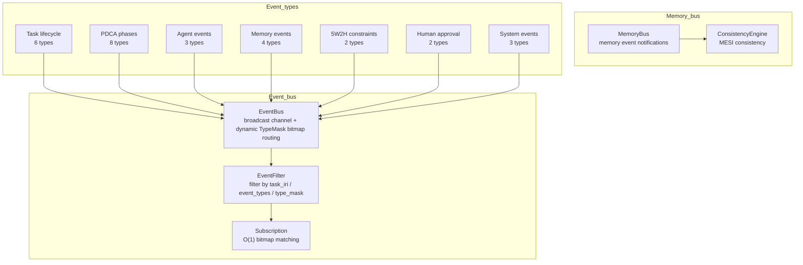
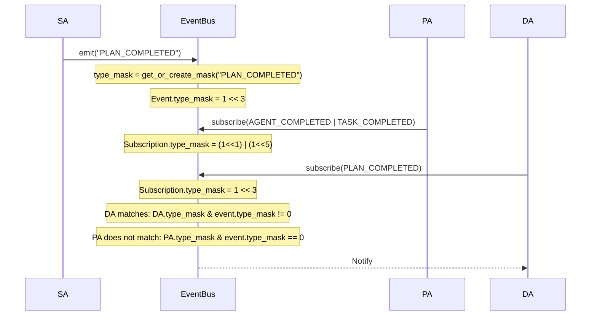
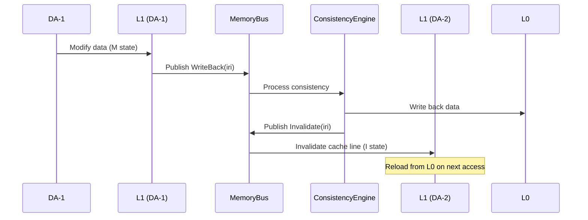
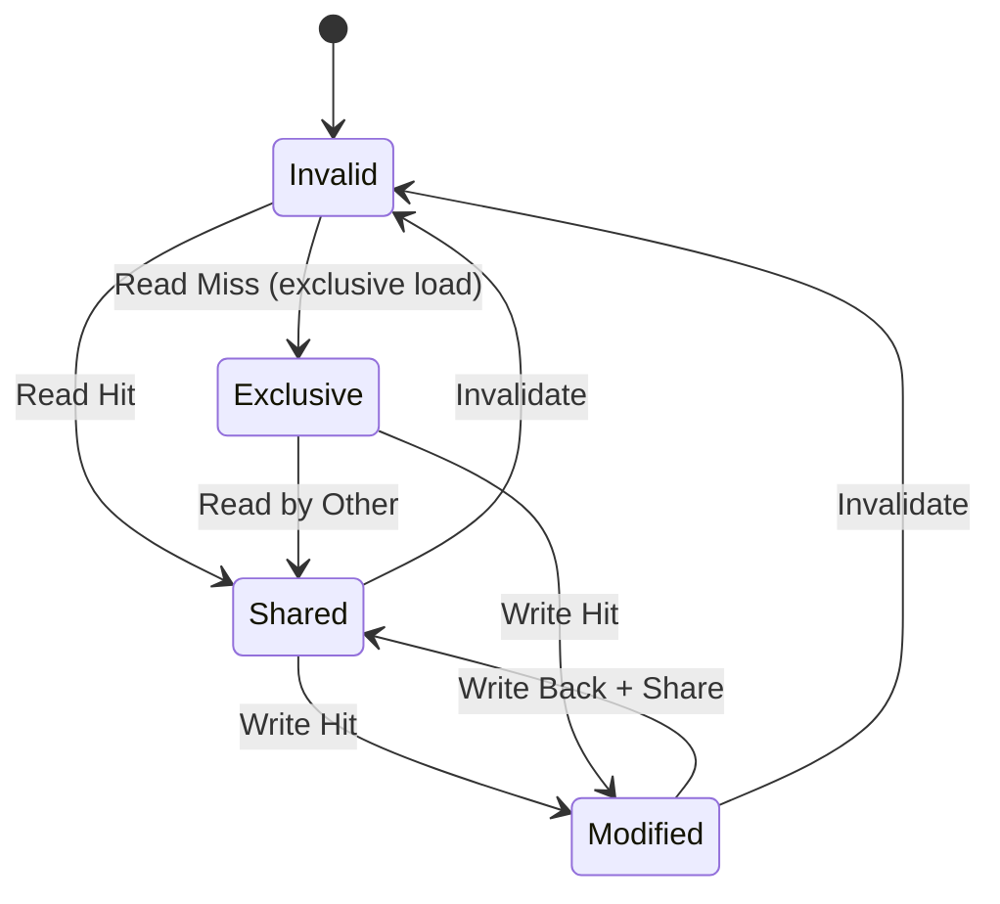
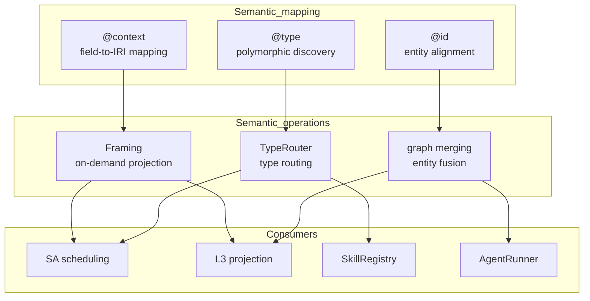

# 4. Bus System

## 4.1 Module Overview

The bus system is Agent OS's communication infrastructure. It comprises an event bus and a memory bus. The event bus sends notifications between Agents using dynamic TypeMask bitmap routing, while the memory bus coordinates consistency between memory layers.



## 4.2 EventBus — Event Bus

**File**: `src/core/event_bus.rs`
**Implementation status**: ✅ Complete

An efficient event bus based on a broadcast channel and dynamic TypeMask bitmap routing.

### Core Design

**Dynamic TypeMask bitmap routing**:

Each event type receives a unique bit when it is first registered. A HashMap maintains the type-to-bitmap mapping, and an AND operation performs O(1) matching.

```rust
pub struct TypeMask {
    masks: HashMap<String, u64>,  // type name → bitmap
    next_bit: u32,                // next available bit
}

impl TypeMask {
    pub fn get_or_create_mask(&mut self, type_name: &str) -> u64;
    pub fn combine_masks(&self, types: &[String]) -> u64;
    pub fn get_mask(&self, type_name: &str) -> Option<u64>;
}
```

TypeMask supports up to 64 event types (the width of `u64`).

### `EventType` Enum

```rust
pub enum EventType {
    // Task lifecycle
    TaskCreated, TaskStarted, TaskCompleted, TaskFailed, TaskArchived,
    
    // PDCA phase events
    PlanStarted, PlanCompleted, DoStarted, DoCompleted,
    CheckStarted, CheckCompleted, ActStarted, ActCompleted,
    
    // Node events
    NodeCreated, NodeUpdated, NodeDeleted,
    
    // Agent events
    AgentStarted, AgentCompleted, AgentError,
    
    // System events
    CycleIteration, ThresholdExceeded, InterventionRequired,
    
    // Memory events
    MemoryInvalidate, MemoryWriteBack, MemoryPrefetch, MemoryLoad,
    
    // 5W2H constraint events
    DeadlineApproaching, BudgetExceeded,
    
    // Human approval events
    HumanApprovalRequired, HumanApprovalResult,
    
    // User supplementary input
    UserSupplementaryInput,
    
    // Custom
    Custom(String),
}
```

### Priority Mechanism

```rust
#[derive(Debug, Clone, Copy, PartialEq, Eq, PartialOrd, Ord)]
pub enum EventPriority {
    Low = 0,
    Normal = 1,
    High = 2,
    Critical = 3,
}
```

| Priority | Value | Use case |
|--------|-----|---------|
| Low | 0 | Logging and statistics |
| Normal | 1 | Standard Agent events (default) |
| High | 2 | Task state changes and important data updates |
| Critical | 3 | System errors and urgent repair notifications |

### Core Structs

```rust
pub struct EventBus {
    sender: broadcast::Sender<Event>,
    event_count: AtomicU64,
    subscriber_count: AtomicU64,
    type_mask: std::sync::Mutex<TypeMask>,
}

pub struct Event {
    pub event_id: String,
    pub task_iri: String,
    pub event_type: String,
    pub source_agent_iri: String,
    pub payload: String,
    pub payload_json_ld: String,
    pub timestamp: DateTime<Utc>,
    pub sequence: u64,
    pub type_mask: u64,
    pub priority: EventPriority,
}

pub struct Subscription {
    pub subscriber_id: String,
    pub type_mask: u64,
    pub scope_iri: Option<String>,
    pub event_types: Vec<String>,
}

pub struct EventFilter {
    pub task_iri: Option<String>,
    pub event_types: Vec<String>,
    pub source_agent: Option<String>,
    pub type_mask: u64,
}
```

### Core Methods

| Method | Purpose |
|------|------|
| `new(capacity)` | Create an event bus |
| `emit(task_iri, type, source, payload)` | Publish a Normal-priority event |
| `emit_with_priority(task_iri, type, source, payload, priority)` | Publish an event at the specified priority |
| `subscribe()` | Subscribe to all events |
| `subscribe_with_filter(subscription)` | Subscribe with a filter |
| `register_type(type_name)` | Register a type for bitmap routing |
| `get_combined_mask(types)` | Get the combined bitmap for multiple types |
| `spawn_consumer(types, handler)` | Start a background asynchronous consumer |

### O(1) Event-Matching Flow



### Asynchronous Consumers

EventBus supports `spawn_consumer` to start a background Tokio task that processes events:

```rust
bus.spawn_consumer(
    vec!["PLAN_COMPLETED".to_string(), "DO_COMPLETED".to_string()],
    |event| async move {
        // Process the event asynchronously
    }
);
```

## 4.3 MemoryBus — Memory Event Bus

**File**: `src/memory/memory_bus.rs`
**Implementation status**: ✅ Complete

The memory event bus handles cross-layer memory-consistency notifications.

**Event types**:

| Event | Trigger | Action |
|------|---------|---------|
| `Invalidate(iri)` | L0 data is modified | Invalidate all L1 cache lines |
| `WriteBack(iri)` | Dirty L1 data must be written back | Write L1 data back to L0 |
| `Evict(iri)` | L1 exceeds its token budget | Evict low-priority cache lines |
| `Prefetch(iri)` | An upcoming access is predicted | Load into L2 in advance |
| `Sync(iri, layer)` | Inter-layer synchronization request | Synchronize data in the specified layer |

**Batch operations**:

| Method | Purpose |
|------|------|
| `publish_invalidate(iri, scope)` | Invalidate a single node cache |
| `publish_invalidate_batch(iris, scope)` | Batch cache invalidation (merged into one event) |
| `publish_with_priority(iri, scope, priority)` | Publish an event with priority |

**Consistency-guarantee flow**:



## 4.4 ConsistencyEngine — MESI Consistency

**File**: `src/memory/consistency_engine.rs`
**Implementation status**: ✅ Complete



## 4.5 JSON-LD Semantic Layer

**File**: `src/jsonld/`
**Implementation status**: ✅ Complete

The JSON-LD semantic layer provides semantic interoperability for the data bus: it is the “unified data bus” connecting all modules.

**Core components**:

| Component | File | Purpose |
|------|------|------|
| Context | `jsonld/context.rs` | `@context` semantic mapping |
| Types | `jsonld/types.rs` | `@type` polymorphic definitions |
| Utils | `jsonld/utils.rs` | IRI utility functions |
| Framing | `jsonld/framing.rs` | On-demand projection trimming |
| TypeRouter | `jsonld/type_router.rs` | Type-routing decisions |

**Semantic bus architecture**:


