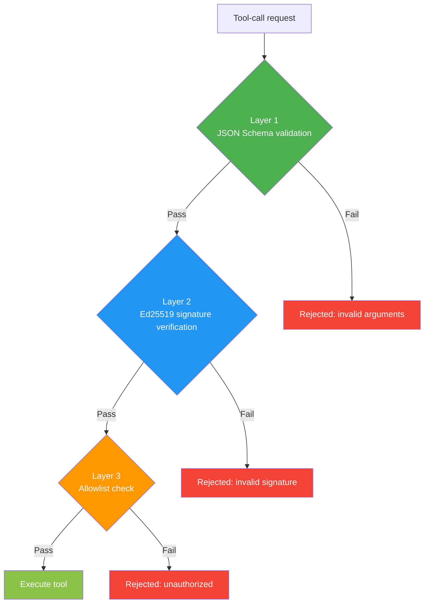
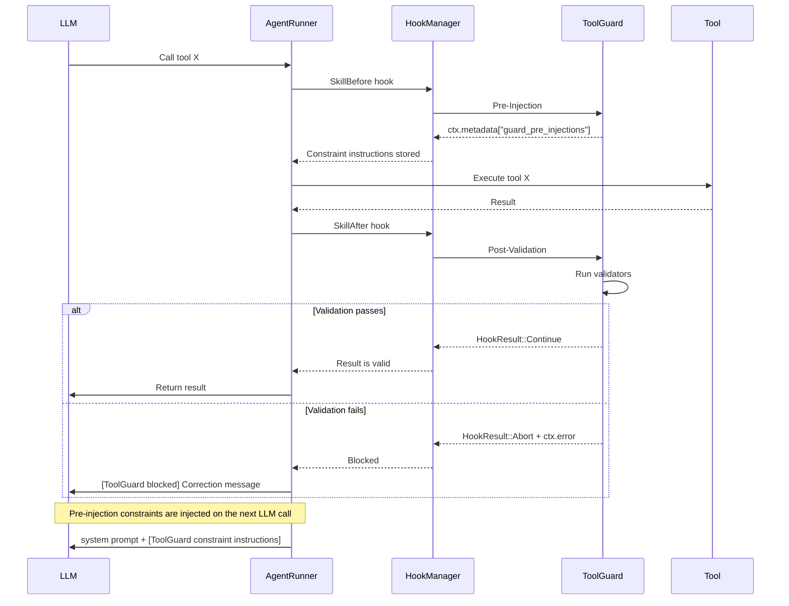
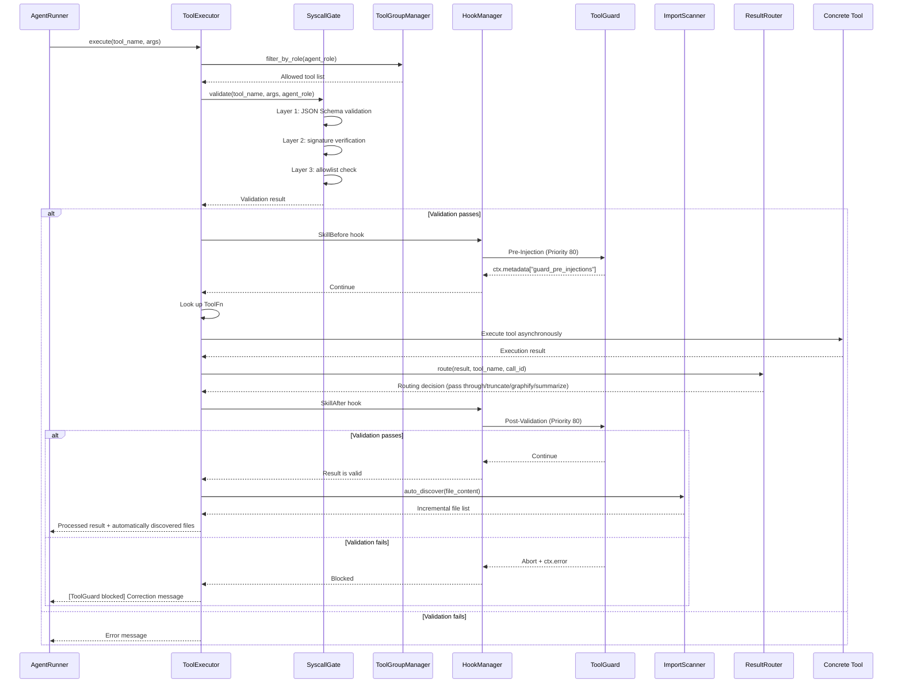

# 5. Tool System

## 5.1 Module Overview

The tool system is the interface between an Agent and the outside world. It includes built-in tools, Skills, MCP, Hooks, shared management, knowledge-graph tools, result routing, token optimization, and ToolGuard.

```mermaid
graph TB
    subgraph Tool_Execution
        TE["ToolExecutor<br/>Unified execution entry point<br/>(Arc&lt;dyn Fn&gt; asynchronous closure)"]
        KG_STORE["kg_store<br/>Arc&lt;Mutex&lt;KGStore&gt;&gt;<br/>Field injection (not global static state)"]
        UGS["unified_graph_store<br/>Arc&lt;Store&gt;"]
    end

    subgraph Built-in_Tools
        BASH["Bash<br/>Command execution"]
        FILE_OPS["FileOps<br/>File operations"]
        SEARCH["grep_search<br/>glob_search"]
        WEB["WebSearch<br/>WebFetch"]
        KNOWLEDGE_EMB["knowledge_search<br/>embedding_index"]
        KNOWLEDGE["knowledge_list<br/>knowledge_search"]
    end

    subgraph Knowledge-Graph_Tools
        KE["knowledge_extract<br/>LLM knowledge extraction"]
        KQ["knowledge_query<br/>SPARQL query"]
        KS["kg_search<br/>Fuzzy search"]
        KN["knowledge_neighbors<br/>Neighbor traversal"]
        KI["knowledge_import_json<br/>JSON import"]
        KEC["knowledge_extract_code<br/>Code AST extraction (incremental)"]
        OR["ontology_register<br/>Ontology registration"]
        KB["knowledge_bridge<br/>Knowledge bridging"]
    end

    subgraph Result_Routing
        RR["ResultRouter<br/>Intelligent routing"]
        GF["GraphifyEngine<br/>Graphification"]
        SM["Summary<br/>Intelligent truncation"]
        MT["MicroToolGenerator<br/>Micro-tool generation"]
    end

    subgraph Skills_System
        SR["SkillRegistry<br/>Skill registration"]
        SD["SkillMeta<br/>Skill metadata"]
        SDISC["Three-level progressive disclosure"]
    end

    subgraph MCP_Protocol
        MC["MCPClient<br/>MCP client"]
        MS["MCPServer<br/>MCP server"]
        MPROTO["JSON-RPC protocol"]
    end

    subgraph Hooks_System
        HM["HookManager<br/>Hook management"]
        HP["HookPoint<br/>20 hook points"]
        HC["HookContext<br/>Hook context"]
    end

    subgraph Tool_Guard
        TG2["ToolGuard<br/>Pre-Injection + Post-Validation"]
        IS["ImportScanner<br/>Cross-file import discovery"]
        AL["GUARD_AUDIT_LOG<br/>Global audit log"]
    end

    subgraph Token_Optimization
        TGC["ToolGroupManager<br/>Role-based grouping"]
        TRC["ToolResultCompressor<br/>Tool-result compression"]
        CWM["ContextWindowManager<br/>Context window"]
    end

    TE --> BASH & FILE_OPS & SEARCH & WEB & KNOWLEDGE
    TE --> KE & KQ & KS & KN & KI & KEC & OR & KB
    TE --> RR
    RR --> GF & SM & MT
    TE --> SR
    TE --> MC
    TE --> HM
    HM --> TG2
    TG2 --> AL
    TG2 --> IS
    TE --> KG_STORE
    TE --> UGS
    TE --> TGC & TRC & CWM
```



## 5.2 Core Components

### 5.2.1 ToolExecutor — Tool Executor

**File**: `src/tools/tool_executor.rs`
**Implementation status**: ✅ Complete

The unified entry point for tool execution; it finds tools, validates arguments, and runs them.

### Isolation and hardening (v0.1.6)

Runtime graph/vector built-ins require `IsolationClaims` passed by the authentication boundary. They ignore `graph`, `named_graph`, and `namespace` in tool arguments, and use only the graph and vector namespace minted by the claims. Calls explicitly fail without claims rather than falling back to a legacy graph or empty result.

When `AGENTOS_TENANT_TOOL_CALL_CAP` has a valid value, metered tool calls per tenant are limited in-process and require verified claims. Third-party MCP calls disclose their behavior; bash calls sanitize the environment passed to child processes; and tool schemas are enforced for the current turn. See [17-isolation-contract.md](17-isolation-contract.md) for trust boundaries, naming rules, and legacy paths, and [CHANGELOG.md](../CHANGELOG.md#016--2026-09-04) for the change summary.

**Core type**:

```rust
// Asynchronous ToolFn — unified signature for all tool handlers
type ToolFn = Arc<dyn Fn(Value) -> Pin<Box<dyn Future<Output = Result<Value, String>> + Send>> + Send + Sync>;
```

**Key design changes**:

| Change | Previous design | New design | Rationale |
|------|--------|--------|------|
| ToolFn type | `fn(&Value) -> Result<Value, String>` | `Arc<dyn Fn(Value) -> Pin<Box<dyn Future<...>>> + Send + Sync>` | Supports asynchronous closures that capture the store |
| KG storage location | `static KG_STORE: OnceCell<Mutex<KnowledgeGraphStore>>` | `ToolExecutor.kg_store: Arc<Mutex<KnowledgeGraphStore>>` | Eliminates global static state and fixes parallel-test contention |
| Tool registration | Function pointers passed directly | Closures wrapped in `Arc` are passed in (`sync_tool`/`sync_tool_ref`) | Knowledge-graph tools need to capture `kg_store` |

**Core struct**:

```rust
pub struct ToolExecutor {
    tools: HashMap<String, ToolFn>,
    tool_descriptions: Vec<ToolDescription>,
    kg_store: Arc<Mutex<KnowledgeGraphStore>>,
}
```

**PA role tool allowlist**:

The Plan Agent may use only read-only tools:
```
file_read, file_list, glob_search, grep_search,
WebSearch, WebFetch, ToolSearch,
knowledge_list, knowledge_search, kg_search,
knowledge_extract_code
```

**Core methods**:

| Method | Function |
|------|------|
| `execute(tool_name, args)` | Executes a tool call asynchronously |
| `list_tools()` | Lists all available tools |
| `get_tool_schema(name)` | Gets a tool's parameter schema |
| `tool_definitions_for_role(role)` | Filters tool definitions by role |
| `register(name, desc, params, handler, roles)` | Registers a tool (generic; accepts a closure) |

### 5.2.2 SkillRegistry — Skill Registration

**File**: `src/tools/skill_registry.rs`
**Implementation status**: ✅ Complete

```rust
pub struct SkillMeta {
    pub iri: String,
    pub name: String,
    pub description: String,
    pub version: String,
    pub input_schema: Value,
    pub output_schema: Value,
    pub disclosure_level: DisclosureLevel,
    pub dependencies: Vec<String>,
    pub signature: Option<String>,
    pub input_mapping: HashMap<String, String>,
    pub output_mapping: HashMap<String, String>,
    pub skill_types: Vec<String>,
}
```

**Three-level progressive disclosure**:

| Level | Exposed information | Use case |
|------|---------|---------|
| Basic | Name and description | Initial Agent scan |
| Schema | + Input/output schemas | Agent selects a tool |
| Full | + Dependencies, signature, mappings | Agent executes a tool |

**Default skills**:

| Skill | Type | Semantic capabilities |
|------|------|---------|
| file_read | IO | FileOperation, ReadOperation |
| file_write | IO | FileOperation, WriteOperation |
| http_request | Network | HTTPOperation, RemoteOperation |
| llm_chat | AI | LLMOperation, ChatOperation |
| code_execute | Execution | CodeExecution, SandboxOperation |
| jsonld_validate | Validation | ValidationOperation, JSONLDOperation |

### 5.2.3 MCPClient — MCP Protocol Client

**File**: `src/tools/mcp_client.rs`
**Implementation status**: ✅ HTTP transport implemented

The MCP (Model Context Protocol) client communicates with external tool services through JSON-RPC.

**Supported transports**:

| Type | Configuration | Description | Status |
|------|------|------|------|
| Stdio | `McpStdioServerConfig` | Local process communication | ⬜ |
| HTTP | `McpRemoteServerConfig` | Remote HTTP calls | ✅ |
| SSE | `McpRemoteServerConfig` | Server-Sent Events | ⬜ |
| WebSocket | `McpWebSocketServerConfig` | WebSocket communication | ⬜ |
| ManagedProxy | `McpManagedProxyConfig` | Managed proxy | ⬜ |
| SDK | `McpSdkConfig` | SDK integration | ⬜ |

**MCP message format**:

```json
{
  "jsonrpc": "2.0",
  "method": "tools/call",
  "params": {
    "name": "tool_name",
    "arguments": { ... }
  },
  "id": 1
}
```

### 5.2.4 HookManager — Hook System

**File**: `src/tools/hooks.rs`
**Implementation status**: ✅ Complete (including execution control)

**20 hook points**:

| Hook point | Trigger | Purpose |
|--------|---------|------|
| `AgentBeforeStart` | Before the Agent starts | Initialization checks |
| `AgentAfterComplete` | After the Agent completes | Result handling |
| `AgentOnError` | When the Agent errors | Error handling |
| `SkillBefore` | Before a tool call | Argument validation |
| `SkillAfter` | After a tool call | Result auditing |
| `L0BeforeStore` | Before L0 storage | Data validation |
| `L0AfterRetrieve` | After L0 retrieval | Data enrichment |
| `L1BeforeEvict` | Before L1 eviction | Data archival |
| `L2BeforeWrite` | Before L2 writes | Permission checks |
| `L2AfterRead` | After L2 reads | Cache updates |
| `L3BeforeProject` | Before L3 projection | Template selection |
| `L3AfterProject` | After L3 projection | Result trimming |
| `PlanBeforeCreate` | Before plan creation | Constraint injection |
| `PlanAfterCreate` | After plan creation | Plan validation |
| `CheckBeforeReview` | Before review | Standard loading |
| `CheckAfterReview` | After review | Issue marking |
| `DecisionBefore` | Before a decision | Option evaluation |
| `DecisionAfter` | After a decision | Execution tracking |
| `SystemBeforeInit` | Before system initialization | Configuration loading |
| `SystemAfterInit` | After system initialization | Health checks |

### 5.2.5 SyscallGate — System-Call Gate

**File**: `src/core/syscall_gate.rs`
**Implementation status**: ✅ Complete three-layer validation



### 5.2.6 ToolGuard — Tool Guard

**File**: `src/tools/tool_guard.rs`
**Implementation status**: ✅ Complete (including 7 validators and 14 tests)

ToolGuard is a two-phase tool-call guard system built on HookManager. It injects constraints before LLM tool calls and validates results afterward.

#### Core concepts

| Concept | Description |
|------|------|
| `ToolCategory` | Eight tool categories: FileRead/FileWrite/Search/CodeExecution/KnowledgeGraph/KnowledgeExtract/HttpRequest/Meta |
| `EnforcementLevel` | Three enforcement levels: `Must` (block), `Should` (warn), and `Info` (inform) |
| `PreInjectionRule` | Pre-injection rule — writes to context before a tool call and injects into the system prompt on the next LLM call |
| `ValidationRule` | Validation rule — validates results after a tool call and blocks violations with `HookResult::Abort` |
| `GuardAuditEntry` | Audit record for each validation, written both locally and to the global `GUARD_AUDIT_LOG` |

#### Two-phase workflow



#### Seven built-in validators

| Validator | Category | Validation logic |
|--------|------|---------|
| `file_length_check` | FileRead | Checks whether file content is empty or returned an error |
| `search_count_check` | Search | Compares `num_files` with the actual return count and blocks incomplete results |
| `exit_code_check` | CodeExecution | Checks whether `exit_code` is 0 |
| `knowledge_empty_check` | KnowledgeGraph | Checks whether SPARQL query results are empty |
| `knowledge_depth_check` | KnowledgeGraph | Checks the `depth` parameter for neighbor traversal |
| `extract_empty_check` | KnowledgeExtract | Checks whether entities and relations were extracted |
| `http_status_check` | HttpRequest | Checks whether the HTTP `status_code` is ≥ 400 |

#### External configuration

```json
{
  "categories": {
    "FileRead": {
      "pre_injections": [
        {
          "enforcement": "Must",
          "instruction": "Read the entire file contents",
          "tool_names": []
        }
      ],
      "validations": [
        {
          "validator": "file_length_check",
          "params": { "min_ratio": 0.95 },
          "fix_instruction": "The file was not read completely; please retry",
          "max_retries": 2
        }
      ]
    }
  }
}
```

**Loading**:
```rust
// In code
AgentRunner::new(...)
    .with_tool_guard_config("guard_rules.json")
    .build()

// Or use the default rules (registered automatically)
```

**Hot reloading**: ToolGuard starts a background polling task (`start_hot_reload(path, interval_secs)`) that detects `guard_rules.json` mtime changes and automatically reloads the rules.

#### Audit endpoints

| Endpoint | Method | Description |
|------|------|------|
| `/api/v1/guard/audit` | GET | Returns the complete audit log: `{ total, entries: [...] }` |
| `/api/v1/guard/stats` | GET | Returns the statistics summary: `{ total_checks, passed_checks, failed_checks, pass_rate }` |

### 5.2.7 ImportScanner — Cross-File Import Discovery

**File**: `src/tools/import_scanner.rs`
**Implementation status**: ✅ Complete (6 languages supported and 11 tests)

After ToolGuard validates a `file_read` result, ImportScanner automatically scans the file contents for import/mod/use/include statements, resolves them, and triggers automatic reading of related files.

#### Supported languages

| Language | Matching patterns | Example |
|------|---------|------|
| Rust | `mod foo;` / `use crate::path;` / `use super::path;` | `mod utils;` → `utils.rs` |
| JavaScript/TypeScript | `import ... from './path'` / `require('./path')` | `import {X} from './cmp'` → `cmp.ts` |
| Python | `from .module import` / `import module` (local only) | `from .models import User` → `models.py` |
| C/C++ | `#include "file.h"` | `#include "header.h"` → `header.h` |

#### Path-resolution logic

```
Relative path → try the direct path → try extensions (.ts/.tsx/.js/.jsx)
              → try index files (index.ts/index.js)
              → return only paths that exist
```

## 5.3 Built-in Tools

### 5.3.1 File Operation Tools

| Tool | Function |
|------|------|
| file_read | Reads file contents |
| file_write | Writes file contents |
| file_list | Lists directory contents |
| file_delete | Deletes a file |
| file_exists | Checks whether a file exists |
| mkdir | Creates a directory |

### 5.3.2 Search Tools

| Tool | Function |
|------|------|
| grep_search | Searches file contents by regular expression (supports parameters such as `context`, `head_limit`, and `offset`) |
| glob_search | Matches filenames using Glob patterns |

### 5.3.3 HyperspaceEngine Vector Retrieval

**File**: `src/memory/hyperspace_store.rs`, `src/memory/embedding_service.rs`

A self-contained embedding-vector engine with no external vector-database dependency. It supports HNSW ANN search, runtime-switchable metrics (Poincaré/Cosine/Euclidean/Lorentz), and WAL crash safety.

Multiple embedding service providers are supported:

| Provider | Configuration key | Description |
|--------|--------|------|
| Ollama | `ollama` | Local Ollama service (default) |
| OneAPI | `oneapi` | OpenAI-compatible API |
| Fallback | `fallback` | Random-vector fallback |

### 5.3.4 Knowledge-Graph Tools

| Tool | Function | Available to PA |
|------|------|---------|
| knowledge_extract | LLM extracts entities and relations from text | ✅ |
| knowledge_query | SPARQL SELECT query | ✅ |
| kg_search | Fuzzy entity search | ✅ |
| knowledge_neighbors | 1–3-hop neighbor traversal | ✅ |
| knowledge_import_json | Maps JSON data to graph nodes | ❌ |
| ontology_register | Registers custom ontology terms | ❌ |
| knowledge_bridge | Creates knowledge-skill bridges | ❌ |
| knowledge_extract_code | tree-sitter code AST extraction (incremental) | ✅ |

## 5.4 Tool-Call Flow



## 5.5 Token Optimization System

### 5.5.1 ToolGroupManager

**File**: `src/tools/tool_groups.rs`

Groups tools by role to reduce unnecessary tool-list exposure:

| Role | Default groups | On-demand loading |
|------|---------|---------|
| PA | Core, Search, Knowledge, System | Web, Code, Skill |
| DA | Core, Write, Search, Web, Code, Skill, System | Knowledge |
| CA | Core, Search, Knowledge, System | Web, Code |
| AA | Core, System | Search, Knowledge |

### 5.5.2 ToolResultCompressor

**File**: `src/core/context_compressor.rs`

Automatically compresses large tool results. Configuration path: `config.yaml`.

```yaml
tool_result_compressor:
  enabled: true
  max_full_results: 2
  max_summary_length: 200
  compression_trigger: 10
```

### 5.5.3 ContextWindowManager

```yaml
context_window:
  max_messages: 15
  max_tokens: 16000
  compression_ratio: 0.3
  preserve_recent: 4
```

## 5.6 OnceLock Race-Condition Fix

### Problem

The original implementation stored knowledge-graph data in a global static `OnceCell<Mutex<KnowledgeGraphStore>>`, causing data interference between parallel tests.

### Fix

```rust
// New implementation
type ToolFn = Arc<dyn Fn(Value) -> Pin<Box<dyn Future<Output = Result<Value, String>> + Send>> + Send + Sync>;

pub struct ToolExecutor {
    tools: HashMap<String, ToolFn>,
    tool_descriptions: Vec<ToolDescription>,
    kg_store: Arc<Mutex<KnowledgeGraphStore>>,  // Field injection
    unified_graph_store: Option<Arc<Store>>,     // Unified Oxigraph store
}
```

**Key changes**:
- `KG_STORE` moved from global static state to a `ToolExecutor` field.
- `ToolFn` changed from a function pointer to an `Arc<dyn Fn>` asynchronous closure.
- Knowledge-graph tools capture an `Arc` reference to `kg_store` through closures.
- Each `ToolExecutor` instance owns independent storage.
- A unified Oxigraph store can be shared through `unified_graph_store`.
