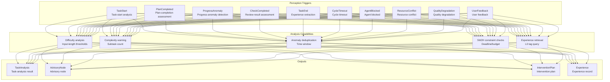
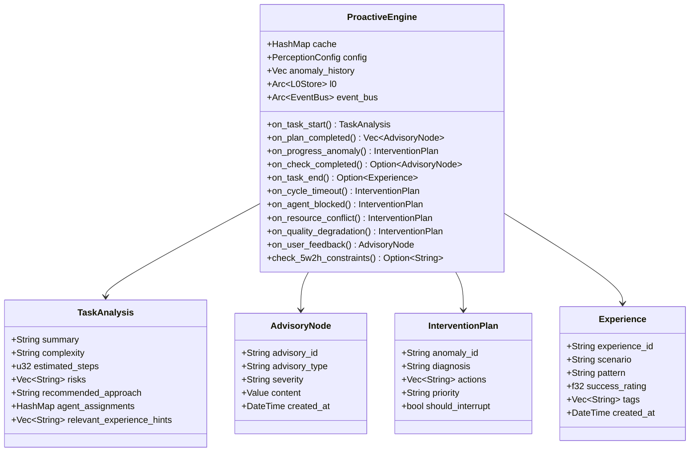
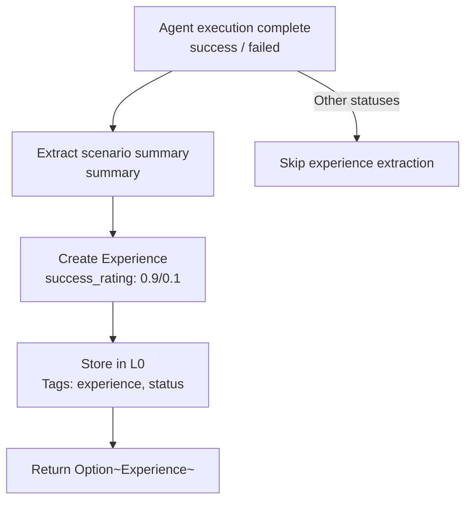
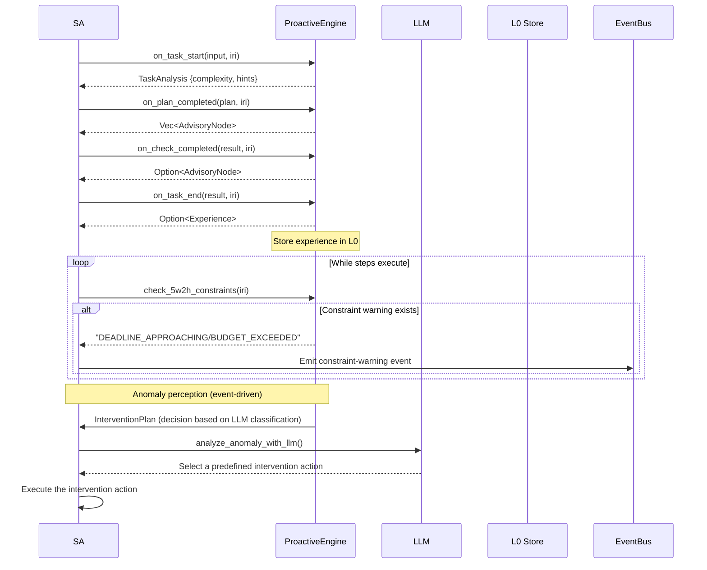

# 6. Perception System

> A proactive perception engine based on ProactiveEngine, monitoring task execution and triggering intervention when anomalies occur.

## 6.1 Module Overview

The perception system is Agent OS's “nervous system.” It proactively observes state at key points in task execution, generating intervention plans for SA to decide and execute when it finds anomalies. The system integrates ten perception triggers, cache deduplication, 5W2H constraint checks, and experience extraction.



## 6.2 Core Components

### 6.2.1 ProactiveEngine

**File**: `src/perception/proactive_engine.rs`
**Implementation status**: ✅ Complete

The proactive perception engine performs perception analysis at key task-execution points.

**Core struct**:

```rust
pub struct ProactiveEngine {
    cache: HashMap<String, (DateTime<Utc>, Value)>,  // Analysis-result cache
    config: PerceptionConfig,                          // Perception configuration
    anomaly_history: Vec<(String, DateTime<Utc>)>,     // Anomaly history (deduplication)
    l0: Arc<L0Store>,                                  // Persistent storage (experience queries)
    event_bus: Arc<EventBus>,                          // Event bus
}
```

**Data-type hierarchy**:



### 6.2.2 PerceptionConfig

```rust
pub struct PerceptionConfig {
    pub cache_ttl_seconds: i64,           // Cache TTL (default: 300s)
    pub cache_max_entries: usize,         // Maximum cache entries (default: 1000)
    pub anomaly_dedup_window_seconds: i64, // Anomaly-deduplication window (default: 60s)
    pub simple_input_threshold: usize,    // Simple-task input threshold (default: 50)
    pub medium_input_threshold: usize,    // Medium-task input threshold (default: 200)
    pub simple_steps: u32,                // Simple-task step count (default: 1)
    pub medium_steps: u32,                // Medium-task step count (default: 3)
    pub complex_steps: u32,               // Complex-task step count (default: 5)
    pub complex_subtask_threshold: usize, // Complex-subtask warning threshold (default: 5)
}
```

**Configuration source**: loaded from `config.yaml` through `PerceptionConfig::from_settings()`:

```yaml
perception:
  enabled: true
  triggers:
    - TaskStart
    - PlanCompleted
    - ProgressAnomaly
    - CheckCompleted
    - TaskEnd
  cache_ttl_seconds: 300
  cache_max_entries: 1000
  anomaly_dedup_window_seconds: 60
  simple_input_threshold: 50
  medium_input_threshold: 200
  cycle_timeout_secs: 300
  max_iterations_before_alert: 10
  error_rate_threshold: 0.5
```

## 6.3 Perception Trigger Details

### 6.3.1 `PerceptionTrigger` Enum

```rust
pub enum PerceptionTrigger {
    TaskStart,          // Task start — complexity analysis + experience retrieval
    PlanCompleted,      // Plan completed — subtask-count check
    ProgressAnomaly,    // Progress anomaly — detect duplicate anomalies within the deduplication window
    CheckCompleted,     // Review completed — review-failure warning
    TaskEnd,            // Task end — experience extraction
    CycleTimeout,       // Cycle timeout — execution-timeout intervention
    AgentBlocked,       // Agent blocked — health check
    ResourceConflict,   // Resource conflict — queue/latency analysis
    QualityDegradation, // Quality degradation — rollback signal
    UserFeedback,       // User feedback — feedback log
}
```

### 6.3.2 TaskStart — Task-Start Analysis

**Method**: `on_task_start(user_input, task_iri) -> Result<TaskAnalysis>`

Called when SA starts a new task cycle. It performs:

1. **Complexity analysis**: determines complexity from input length
   - Input < `simple_input_threshold` (50) → `simple`
   - Input < `medium_input_threshold` (200) → `medium`
   - Input ≥ `medium_input_threshold` → `complex`

2. **Experience retrieval**: queries L0 for historical records tagged `experience`, selects the five most relevant to the current task, and injects them into `relevant_experience_hints`.

3. **Caching**: stores the analysis result in `cache`; repeated requests within the TTL return the cached result directly.

```rust
fn analyze_task(&self, user_input: &str) -> TaskAnalysis {
    let input_len = user_input.len();
    let (complexity, steps) = if input_len < self.config.simple_input_threshold {
        ("simple".to_string(), self.config.simple_steps)
    } else if input_len < self.config.medium_input_threshold {
        ("medium".to_string(), self.config.medium_steps)
    } else {
        ("complex".to_string(), self.config.complex_steps)
    };

    TaskAnalysis {
        summary: user_input.chars().take(100).collect(),
        complexity,
        estimated_steps: steps,
        risks: /* identify broad-scope risks for complex tasks */,
        recommended_approach: /* simple→direct_da, medium→standard_pdca, complex→recursive_pdca */,
        agent_assignments: {plan: "PA", execute: "DA", check: "CA", act: "AA"},
        relevant_experience_hints: Vec::new(),
    }
}
```

### 6.3.3 PlanCompleted — Plan-Completion Assessment

**Method**: `on_plan_completed(plan, task_iri) -> Vec<AdvisoryNode>`

Called after PA completes plan creation. It checks:

- Whether the subtask count exceeds `complex_subtask_threshold` (5).
- If it does, creates an `AdvisoryNode` of type `complexity_warning` (severity: medium) that recommends parallelization.

### 6.3.4 ProgressAnomaly — Progress-Anomaly Detection

**Method**: `on_progress_anomaly(anomaly, task_iri) -> InterventionPlan`

Called when a progress anomaly is detected during SA execution:

1. **Deduplication check**: handles an anomaly with the same description only once within `anomaly_dedup_window_seconds` (60s).
2. Returns an `InterventionPlan` recommending “reassess the plan” and “consider additional resources.”
3. Sets `should_interrupt: true`.

### 6.3.5 CheckCompleted — Review-Result Assessment

**Method**: `on_check_completed(check_result, task_iri) -> Option<AdvisoryNode>`

Called after CA completes a review:

- Checks whether the `verdict` field is `"fail"`.
- When the review fails, creates an `AdvisoryNode` with severity `high` that contains the detailed review result.

### 6.3.6 TaskEnd — Experience Extraction

**Method**: `on_task_end(task_result, task_iri) -> Option<Experience>`

Called after Agent execution completes (`success` or `failed`):

1. Extracts the scenario description from the `summary` field of `task_result`.
2. Creates an `Experience` object with `success_rating` of 0.9 (success) or 0.1 (failure).
3. Stores the experience in L0 with tags including `["experience", "task:{iri}", "status:{status}"]`.

### 6.3.7 CycleTimeout — Cycle Timeout

**Method**: `on_cycle_timeout(cycle_id, task_iri, elapsed_secs) -> InterventionPlan`

Called when a task cycle exceeds its timeout threshold:

- Returns an `InterventionPlan` (`priority: critical`, `should_interrupt: true`).
- Recommends “extend the timeout” and “check Agent health.”

### 6.3.8 AgentBlocked — Agent Blocked

**Method**: `on_agent_blocked(agent_id, task_iri) -> InterventionPlan`

Called when Agent health checks detect a block:

- Returns an `InterventionPlan` (`priority: high`, `should_interrupt: true`).
- Recommends “restart the Agent” and “inject an assistive message.”

### 6.3.9 ResourceConflict — Resource Conflict

**Method**: `on_resource_conflict(conflict, task_iri) -> InterventionPlan`

Called when resource contention is detected:

- Returns an `InterventionPlan` (`priority: medium`, `should_interrupt: false`).
- Recommends “queue the conflicting requests” and “notify SA.”

### 6.3.10 QualityDegradation — Quality Degradation

**Method**: `on_quality_degradation(degradation, task_iri) -> InterventionPlan`

Called when output quality degrades:

- Returns an `InterventionPlan` (`priority: high`, `should_interrupt: true`).
- Recommends “roll back to the previous checkpoint” and “retry using a different approach.”

### 6.3.11 UserFeedback — User Feedback

**Method**: `on_user_feedback(feedback, task_iri) -> AdvisoryNode`

Called when explicit user feedback is received:

- Returns an `AdvisoryNode` (`type: user_feedback`, `severity: medium`).
- Preserves the full user-feedback content.

## 6.4 5W2H Constraint Checks

**Method**: `check_5w2h_constraints(five_w2h_iri) -> Option<String>`

Loads the 5W2H node from L0 and checks its constraints:

**Deadline check**:
- Reads the deadline from `task:when/task:deadline`.
- Reads the reminder lead time from `task:when/task:reminderBefore` (an ISO8601 duration, such as `"PT1H"`).
- If the time until the deadline is less than the reminder lead time → `"DEADLINE_APPROACHING"`.
- If the current time is past the deadline → `"DEADLINE_EXCEEDED"`.

**Budget check**:
- Reads the token budget from `task:howMuch/task:tokenBudget`.
- Reads actual usage from `task:howMuch/task:actualCost/tokensUsed`.
- If usage exceeds 80% of the budget → `"BUDGET_EXCEEDED"`.

**ISO8601 duration parsing**:

```rust
fn parse_iso8601_duration(s: &str) -> Option<chrono::Duration> {
    // Parses the "PT1H30M" format
    // Supports H (hours), M (minutes), and S (seconds)
}
```

## 6.5 Cache and Deduplication

### Result Cache

- `cache`: `HashMap<String, (DateTime<Utc>, Value)>`
- Cache-key format: `"{trigger}:{context}"` (for example, `"task_start:iri://task/001"`).
- TTL: `cache_ttl_seconds` (default: 300 seconds).
- Performs LRU eviction when `cache_max_entries` (default: 1000) is reached.

```rust
fn is_cached(&self, key: &str) -> bool {
    // Checks cache validity (within the TTL)
}

fn evict_cache(&mut self) {
    // Evicts expired and oldest cache entries when max_entries is exceeded
}
```

### Anomaly Deduplication

- `anomaly_history`: `Vec<(String, DateTime<Utc>)>`
- Deduplication window: `anomaly_dedup_window_seconds` (default: 60 seconds).
- Returns `already_handled` (with no intervention) if an anomaly with the same description recurs within the window.
- Cleans up history after retaining it for `anomaly_dedup_window_seconds × 2`.

```rust
fn on_progress_anomaly(&mut self, anomaly: &Value, task_iri: &str) -> InterventionPlan {
    // Deduplication check
    if self.anomaly_history.iter().any(|(d, t)| {
        d == desc && now.signed_duration_since(*t).num_seconds() < self.config.anomaly_dedup_window_seconds
    }) {
        return InterventionPlan { /* already_handled */ };
    }
    // Record the new anomaly
    self.anomaly_history.push((desc.to_string(), Utc::now()));
    // Return the actual intervention plan
}
```

## 6.6 Experience-Extraction Flow



Experience storage format in L0:

```json
{
  "@id": "iri://experience/{id}",
  "@type": "Experience",
  "scenario": "task summary content",
  "pattern": "task_{status}",
  "success_rating": 0.9,
  "tags": ["experience", "task:{task_iri}", "status:{status}"]
}
```

When subsequent tasks begin, `on_task_start()` queries relevant experience using `search_by_tags(["experience"])` and selects the top five through content-keyword matching.

## 6.7 Integration with SA

The perception system integrates with SA at the following points:



SA holds a `ProactiveEngine` instance through its `perception` field and invokes perception methods as appropriate in `process_task()`, `execute_plan()`, and `dispatch_agent()`.
