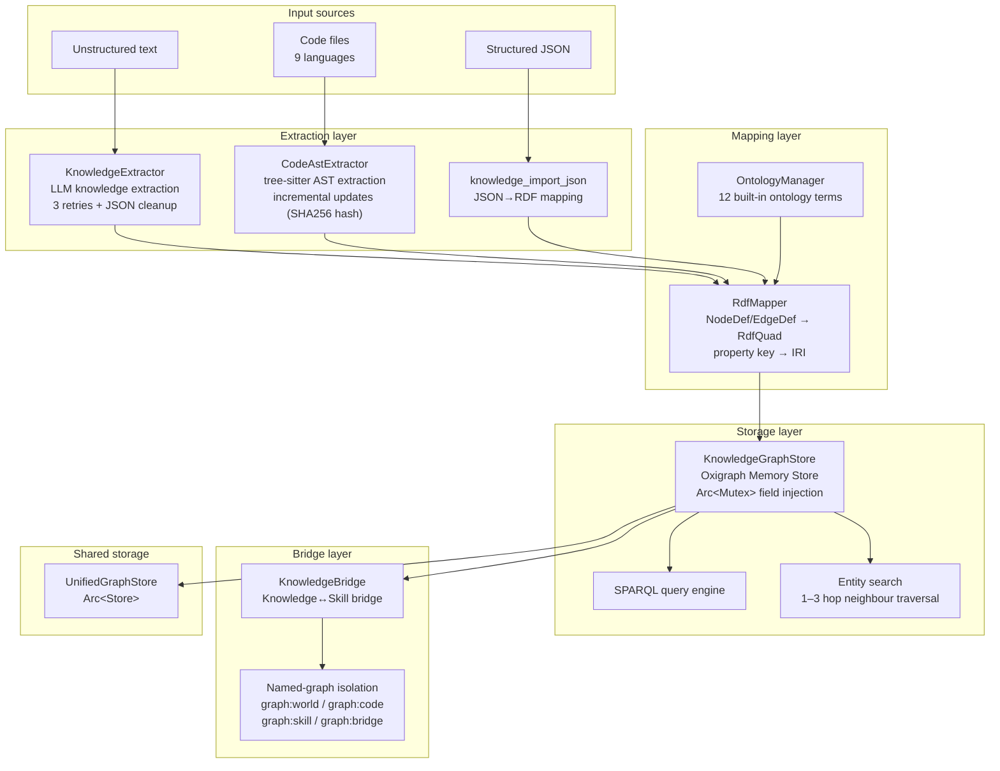

# 7. Knowledge Graph System

> *A Chinese version is available in [07-knowledge-graph.zh.md](07-knowledge-graph.zh.md).*

> An Oxigraph RDF knowledge-graph engine supporting LLM knowledge extraction,
> code AST extraction, SPARQL queries, and knowledge bridging.

Trusted tenant-data scope, naming, and historical-key status are defined by the
[Isolation Contract](17-isolation-contract.md).

## Module architecture



## Core components

### `KnowledgeGraphStore`

An Oxigraph Memory Store RDF graph store. `Arc<Mutex>` field injection removes
the global-static dependency:

```rust
pub struct KnowledgeGraphStore {
    store: Store,
    default_graph: String, // historical/system default named graph "graph:world"
}
```

| Method | Description |
|---|---|
| `write_quads(quads, graph)` | Batch-write RDF quads through SPARQL INSERT. |
| `delete_quads_for_source(source, graph)` | Delete quads associated with a file source. |
| `delete_quads_by_subject_prefix(prefix, graph)` | Batch-delete by subject IRI prefix. |
| `query_sparql(sparql, named_graph)` | Execute SPARQL SELECT. |
| `search_entities(keyword, entity_type)` | Case-insensitive entity search. |
| `get_neighbors(entity_id, depth)` | Traverse one to three hops. |

### `RdfMapper`

Maps internal data to standard RDF quads. A `NodeDef` becomes subject
`iri://entity/{id}`, `rdf:type` for `node_type`, `rdfs:label` for `label`, and
`ontology/meta/{key}` properties. An `EdgeDef` uses the source entity as
subject, `relation` as predicate, and target entity as object.

Property keys containing `/`, `#`, or `:` are already complete IRIs; all others
receive `https://agentos.ontology/meta/`. For example, `contentHash` becomes
`https://agentos.ontology/meta/contentHash`.

### `CodeAstExtractor`

tree-sitter extraction supports Rust, Python, JS/TS/TSX, Go, Java, and C/C++:

| Language | Entities | Relations |
|---|---|---|
| Rust | fn/struct/enum/trait/impl/use | calls/implements |
| Python | def/class/import | calls/inherits |
| JS/TS/TSX | function/class/method/import/interface/type | calls/inherits |
| Go | func/method/type/import | calls |
| Java | class/interface/method/import | calls/inherits/implements |
| C/C++ | function/class/struct/include | calls |

`extract_incremental()` calculates `SHA256(content)`, checks the cached
`contentHash`, skips unchanged files, otherwise deletes old subject-prefix
quads, parses the AST, maps it with `RdfMapper`, and writes new quads.

| Layer | Strategy | Cost |
|---|---|---|
| L1 hash skip | unchanged SHA256 → skip | zero |
| L2 file replacement | delete subject prefix + rewrite | low |
| L3 tree-sitter incremental | pass `old_tree` to accelerate parsing | very low |

```rust
pub enum IncrementalResult {
    Unchanged,
    Created { entity_count: usize, relation_count: usize, quad_count: usize },
    Updated { entity_count: usize, relation_count: usize, quad_count: usize, deleted_quads: usize },
}
```

### `KnowledgeExtractor`, `OntologyManager`, and `KnowledgeBridge`

`KnowledgeExtractor` calls an LLM API for entities and relations from
unstructured text, with three retries, Markdown/oversize JSON cleanup, JSON
Schema validation, and optional domain filtering.

`OntologyManager` has built-in classes `ontology:Person`,
`ontology:Organization`, `ontology:Concept`, `ontology:Event`,
`ontology:Product`, and `ontology:Project`; it also has `worksFor`, `manages`,
`dependsOn`, `hasSkill`, `applicableIn`, and the `ontology:bridge/*`
properties. `KnowledgeBridge` links entities to skills through
`hasSkill`, `applicableIn`, and `relatedTo`.

## Named-graph isolation

`graph:world` is a historical/system default graph, not the production-tenant
write target. Verified `IsolationClaims` mint production reads and writes to
`graph://{tenant}/{project}`. Compatibility APIs do not silently dual-write,
read through, or migrate `graph:world`; client-selected graphs cannot override
the target. Historical migration is separately scoped in the
[Isolation Contract](17-isolation-contract.md).

| Named graph | Purpose | Writer |
|---|---|---|
| `graph:world` | historical/system general knowledge | `knowledge_extract` (historical path) |
| `graph:code` | code-structure knowledge | `knowledge_extract_code` |
| `graph:skill` | skill graph | `SkillGraphStore` |
| `graph:ontology` | ontology definitions | `ontology_register` |
| `graph:bridge` | knowledge-skill bridges | `knowledge_bridge` |

## Registered tools

| Tool | Description | Available to PA |
|---|---|---|
| `knowledge_extract` | LLM extraction of entities and relations | yes |
| `knowledge_query` | SPARQL SELECT | yes |
| `kg_search` | fuzzy entity search | yes |
| `knowledge_neighbors` | one-to-three-hop traversal | yes |
| `knowledge_import_json` | map JSON into graph nodes | no |
| `ontology_register` | register custom ontology terms | no |
| `knowledge_bridge` | create knowledge-skill bridges | no |
| `knowledge_extract_code` | incremental tree-sitter code AST extraction | yes |

## Key design decisions

1. `OnceCell` became `Arc<Mutex>` field injection: `KnowledgeGraphStore` is
   shared as an `Arc<Mutex>` field of `ToolExecutor`, not a global static.
2. `ToolFn` became an async closure:
   `Arc<dyn Fn(Value) -> Pin<Box<dyn Future<...>>>>`, enabling asynchronous
   operations and closure captures.
3. Property keys normalize to complete IRIs so SPARQL remains valid.
4. Code changes replace only old file quads; unchanged SHA256 content is
   skipped.
5. `UnifiedGraphStore` shares the underlying Oxigraph `Store`; modules isolate
   through named graphs.
