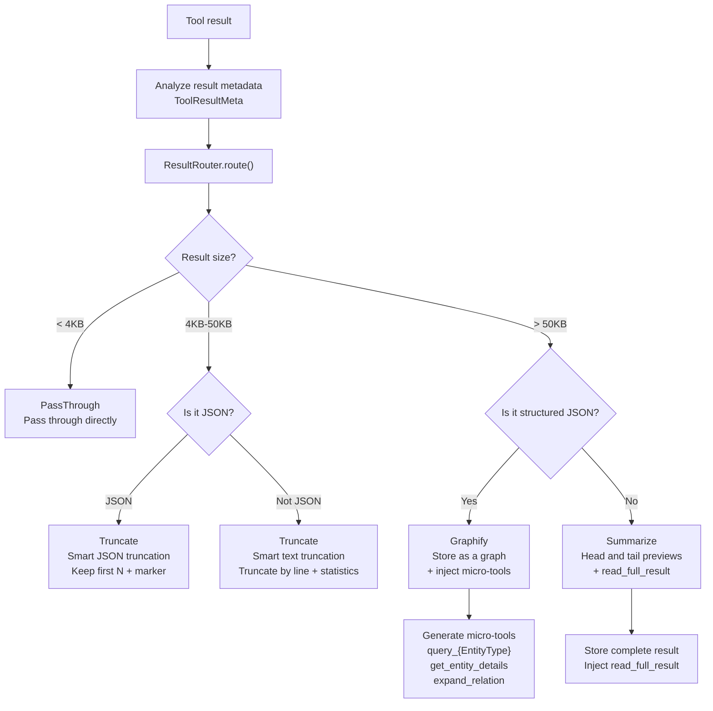
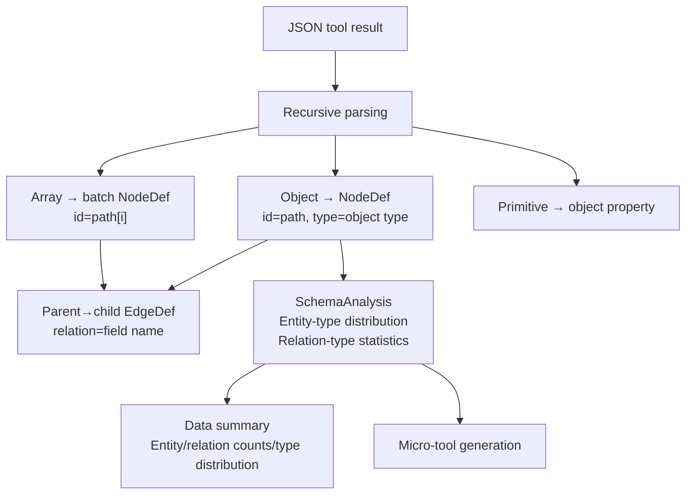
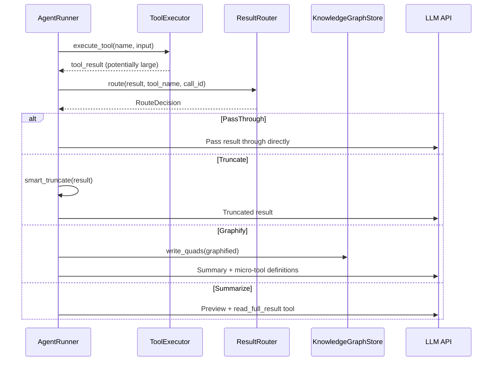

# 8. Intelligent Tool Result Routing

> *For the Chinese version, see [08-result-router.zh.md](08-result-router.zh.md).*

> When a tool returns a large result, automatically selects the optimal handling strategy to avoid wasting tokens.

## Background

When an LLM Agent executes a tool call, the tool may return a large amount of data (such as directory listings, search results, or code-file contents). Putting a large result directly into the LLM context causes:
- Rapidly increasing token consumption
- Important information to be overwhelmed
- API calls to potentially exceed their limits

## Routing Decision Flow



## Core Components

### ResultRouter — Routing Decision Engine

```rust
pub struct ResultRouter {
    settings: ToolResultRouterSettings,
}

pub enum RouteDecision {
    PassThrough,
    Truncate { max_chars: usize },
    Graphify { call_id: String, graph_name: String },
    Summarize { call_id: String, preview_size: usize },
}
```

### ToolResultRouterSettings

**Configuration file**: the `tool_result_router` section in `config.yaml`

```yaml
tool_result_router:
  enabled: true
  threshold_small: 2048          # Small-result threshold (bytes); pass through below this value
  threshold_large: 8192          # Large-result threshold; consider graphification above this value
  preview_size: 2000             # Summary preview size
  max_graph_entities: 500        # Maximum entities for graphification
  max_micro_tools: 5             # Maximum micro-tools
  sparql_query_timeout_ms: 100   # SPARQL query timeout
  auto_cleanup: true             # Automatically clean up expired graphs
```

| Parameter | Default | Description |
|------|--------:|------|
| `threshold_small` | 2048 | Pass-through threshold (bytes) |
| `threshold_large` | 8192 | Truncation/graphification threshold (bytes) |
| `preview_size` | 2000 | Summary preview size |
| `max_graph_entities` | 500 | Maximum number of graphified entities |
| `max_micro_tools` | 5 | Maximum number of micro-tools |

### Smart Truncation Strategies

**JSON truncation** (`smart_truncate_json`):
- Detects JSON arrays → retains the first N elements + `[Truncated: M total, N retained]`
- Detects JSON objects → retains the first N keys + a truncation marker
- Non-JSON → falls back to text truncation

**Text truncation** (`smart_truncate_text`):
- Truncates by line, retaining complete lines
- Counts total and retained lines
- Safely handles UTF-8 character boundaries

### GraphifyEngine — Graphification Engine

Recursively parses JSON tool results into knowledge-graph nodes:



`SchemaAnalysis` output:
- `entity_types: Vec<(String, usize)>` — entity types and counts
- `relation_types: Vec<String>` — relation-type list
- `total_entities / total_relations` — totals

### MicroToolGenerator — Micro-tool Generation

Dynamically generates query tools from graphification results and injects them into the LLM context:

| Micro-tool type | Naming pattern | Description |
|-----------|---------|------|
| EntityTypeQuery | `query_{EntityType}` | Query by entity type |
| EntityDetails | `get_entity_details` | Get entity details |
| RelationTraversal | `expand_relation` | Traverse a relation |
| FullTextRead | `read_full_result` | Read the complete stored result |

```rust
pub enum MicroToolType {
    EntityTypeQuery { entity_type: String, graph_name: String },
    EntityDetails { graph_name: String },
    RelationTraversal { graph_name: String },
    FullTextRead { storage_key: String },
}
```

## AgentRunner Integration

Tool-result routing runs automatically in `AgentRunner.route_tool_result()`:



## UTF-8 Safe Handling

All truncation operations ensure that slices end on a character boundary:

```rust
fn safe_slice(s: &str, max_len: usize) -> &str {
    if max_len >= s.len() { return s; }
    let mut end = max_len;
    while end > 0 && !s.is_char_boundary(end) {
        end -= 1;
    }
    &s[..end]
}
```
