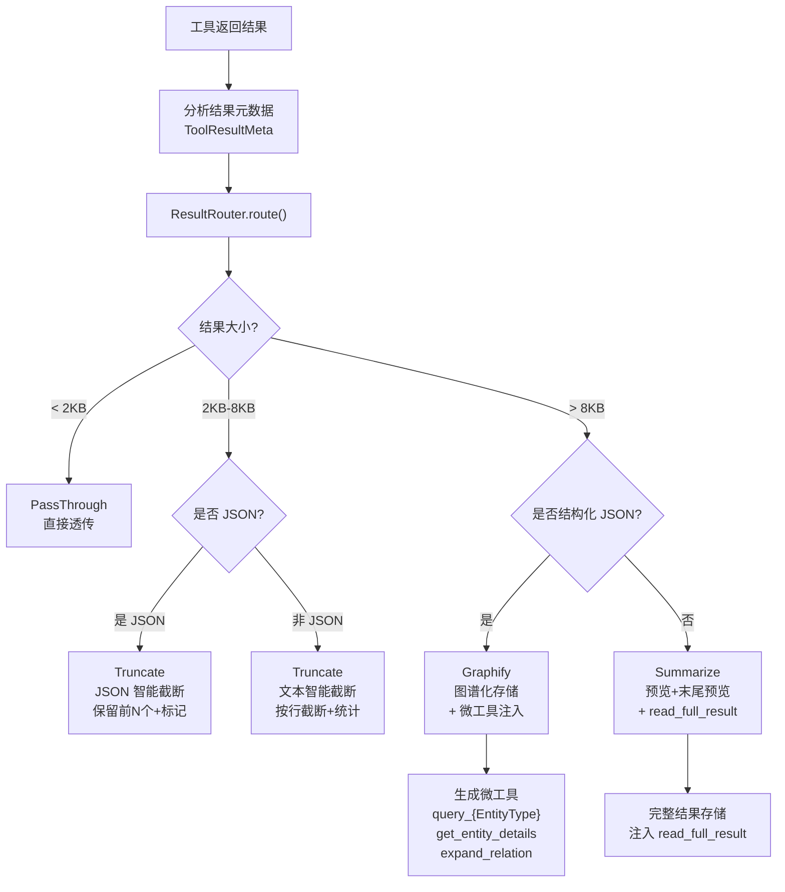
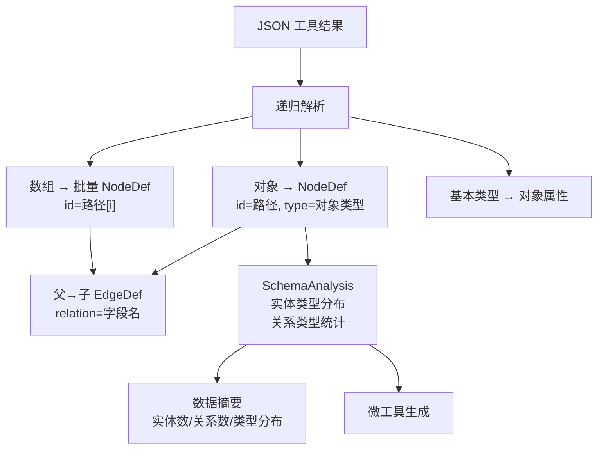
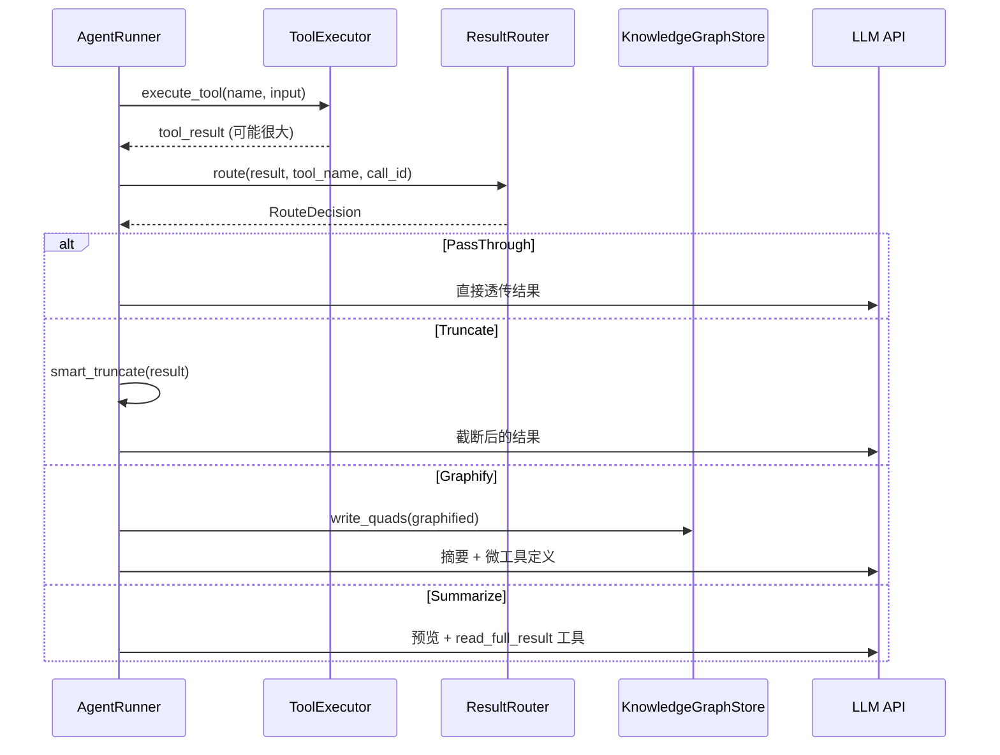

# 8. 工具结果智能路由

> *本文是 [08-result-router.md](08-result-router.md) 的中文翻译。*

> 当工具返回大结果时，自动选择最优处理策略，避免 Token 浪费

## 问题背景

LLM Agent 执行工具调用时，工具可能返回大量数据（如目录列表、搜索结果、代码文件内容）。直接将大结果塞入 LLM 上下文会导致：
- Token 消耗剧增
- 关键信息被淹没
- API 调用可能超限

## 路由决策流程



## 核心组件

### ResultRouter — 路由决策引擎

```rust
pub struct ResultRouter {
    settings: ToolResultRouterSettings,
}

pub enum RouteDecision {
    PassThrough,
    Truncate { max_chars: usize },
    Graphify { call_id: String, graph_name: String },
    Summarize { call_id: String, preview_size: usize },
}
```

### ToolResultRouterSettings

**配置文件**: `config.yaml` 中 `tool_result_router` 段

```yaml
tool_result_router:
  enabled: true
  threshold_small: 2048          # 小结果阈值（字节），小于此值直接透传
  threshold_large: 8192          # 大结果阈值（字节），超过此值考虑图谱化
  preview_size: 2000             # 摘要预览大小
  max_graph_entities: 500        # 图谱化最大实体数
  max_micro_tools: 5             # 最大微工具数
  sparql_query_timeout_ms: 100   # SPARQL 查询超时
  auto_cleanup: true             # 自动清理过期图谱
```

| 参数 | 默认值 | 说明 |
|------|--------|------|
| `threshold_small` | 2048 | 透传阈值（字节） |
| `threshold_large` | 8192 | 截断/图谱化阈值（字节） |
| `preview_size` | 2000 | 摘要预览大小 |
| `max_graph_entities` | 500 | 图谱化最大实体数 |
| `max_micro_tools` | 5 | 最大微工具数 |

### 智能截断策略

**JSON 截断**（`smart_truncate_json`）：
- 识别 JSON 数组 → 保留前 N 个元素 + `[截断: 共 M 个, 保留 N 个]`
- 识别 JSON 对象 → 保留前 N 个 key + 截断标记
- 非 JSON → 退回文本截断

**文本截断**（`smart_truncate_text`）：
- 按行截断，保留完整行
- 统计总行数和保留行数
- UTF-8 字符边界安全处理

### GraphifyEngine — 图谱化引擎

将 JSON 工具结果递归解析为知识图谱节点：



**SchemaAnalysis** 输出：
- `entity_types: Vec<(String, usize)>` — 实体类型及计数
- `relation_types: Vec<String>` — 关系类型列表
- `total_entities / total_relations` — 总计

### MicroToolGenerator — 微工具生成

根据图谱化结果动态生成查询工具，注入 LLM 上下文：

| 微工具类型 | 名称模式 | 说明 |
|-----------|---------|------|
| EntityTypeQuery | `query_{EntityType}` | 按实体类型查询 |
| EntityDetails | `get_entity_details` | 获取实体详情 |
| RelationTraversal | `expand_relation` | 遍历关系 |
| FullTextRead | `read_full_result` | 读取完整存储结果 |

```rust
pub enum MicroToolType {
    EntityTypeQuery { entity_type: String, graph_name: String },
    EntityDetails { graph_name: String },
    RelationTraversal { graph_name: String },
    FullTextRead { storage_key: String },
}
```

## 集成到 AgentRunner

工具结果路由在 `AgentRunner.route_tool_result()` 中自动执行：



### 微工具的作用域与生命周期（#311）

`ToolExecutor` 在进程内被所有 run、agent 和租户共用，因此生成的读取器
（`read_full_result_{call_id}`、`query_{type}`、`get_entity_details`、
`expand_relation`）以及它们读取的完整结果都有归属，而不是全局共享：

- **归属。** 每份存储结果和每个读取器都属于一个
  `MicroToolOwner { tenant_id, project_id, run_id, agent_id }`。tenant 和 project
  取自该 run 已验证的隔离 claims（没有 claims 时为空）；`run_id` 取自 run guard；
  `agent_id` 是正在运行的 agent。都不取自模型输出。
- **存储 key。** `iri://tool-result/{tenant}/{project}/{run_id}/{agent_id}/{call_id}`，
  每段都做百分号转义。模型看到的仍是短引用 `iri://tool-result/{call_id}`；
  模型提供方给的 call_id 在不同 run、不同租户之间重复也不会撞车。
- **可见性。** 读取器不再写进共享工具表。一个 run 的本轮 schema 只列出它自己的读取器
  （最新 5 个），读取器也只在同一归属方发起的受控调用里才能解析。其他调用方
  （包括同一 run 里的另一个 agent）得到的响应与调用一个从未存在的工具完全相同。
- **图谱化。** 只有带已验证 claims 时才做，写进由这些 claims 生成的图
  （`graphify_json_for_claims`）。没有 claims 时不做图谱化，改为截断，并注册
  `read_full_result_{call_id}` 读取器。本次写入的每条 quad 都按 run 记在内存里，
  其中包含 `prov/generatedByRun` 标记。run 结束时，只从 claims 图删除这些 quad。
  同一项目里其他来源、或其他 run 写入的三元组保留。记录在内存中，进程崩溃后这些
  三元组会留下，直到没有后续逻辑把它们当成自己的写入。
- **生命周期。** 完整结果只保存在内存中，不再写入 L0。run 结束时删除该 run 的
  读取器和结果。另有 TTL（默认 1 小时，`AGENTOS_MICRO_TOOL_TTL_SECS`）、按租户配额
  （读取器、结果各默认 256 条，`AGENTOS_MICRO_TOOL_TENANT_QUOTA`，硬上限 1024）和总量上限
  （读取器、结果各 1024 条）。超过该租户配额时，只淘汰该租户最旧的条目。总量上限是兜底，
  可能淘汰任意租户最旧的条目。
- 旧版本曾把完整结果以 `iri://tool-result/{call_id}` 写入 L0。读取会拒绝任何不是归属 key
  `iri://tool-result/{tenant}/{project}/{run}/{agent}/{call_id}` 的 tool-result IRI。
  可写打开时一次性删除这些无归属条目，并且只记录删除条数。无法判断归属，因此删除而不是改派。
  只读的历史库不会被改写；对它的读取同样拒绝该 key。

## UTF-8 安全处理

所有截断操作都确保在字符边界进行：

```rust
fn safe_slice(s: &str, max_len: usize) -> &str {
    if max_len >= s.len() { return s; }
    let mut end = max_len;
    while end > 0 && !s.is_char_boundary(end) {
        end -= 1;
    }
    &s[..end]
}
```
