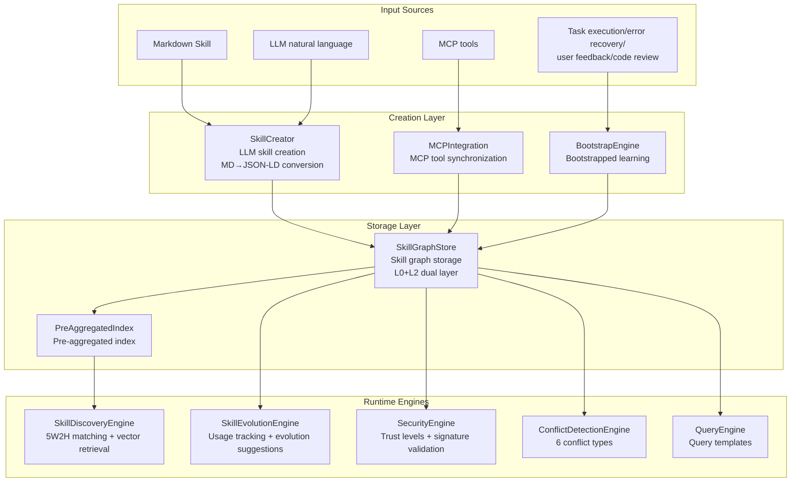

# 9. Skill Graph System

> *For the Chinese version, see [09-skill-graph.zh.md](09-skill-graph.zh.md).*

> A JSON-LD skill knowledge graph supporting 5W2H descriptions, skill discovery, evolution, conflict detection, and bootstrapped learning.

## Module Architecture

**Source directory**: `src/skill_graph/` (15 modules)


```mermaid
graph TB
    subgraph Input Sources
        MD["Markdown Skill"]
        LLM_IN["LLM natural language"]
        MCP_IN["MCP tools"]
        BOOT_IN["Task execution/error recovery/<br/>user feedback/code review"]
    end
    subgraph Creation Layer
        SC["SkillCreator<br/>LLM skill creation<br/>MD→JSON-LD conversion"]
        MCP_INT["MCPIntegration<br/>MCP tool synchronization"]
        BSE["BootstrapEngine<br/>Bootstrapped learning"]
    end
    subgraph Storage Layer
        SGS["SkillGraphStore<br/>Skill graph storage<br/>L0+L2 dual layer"]
        IDX["PreAggregatedIndex<br/>Pre-aggregated index"]
    end
    subgraph Runtime Engines
        SDE["SkillDiscoveryEngine<br/>5W2H matching + vector retrieval"]
        SEE["SkillEvolutionEngine<br/>Usage tracking + evolution suggestions"]
        SEC["SecurityEngine<br/>Trust levels + signature validation"]
        CFE["ConflictDetectionEngine<br/>6 conflict types"]
        QE["QueryEngine<br/>Query templates"]
    end
    MD --> SC
    LLM_IN --> SC
    MCP_IN --> MCP_INT
    BOOT_IN --> BSE
    SC --> SGS
    MCP_INT --> SGS
    BSE --> SGS
    SGS --> IDX
    IDX --> SDE
    SGS --> SEE
    SGS --> SEC
    SGS --> CFE
    SGS --> QE
```

## Module File List

| File | Component | Description |
|------|------|------|
| `types.rs` | SkillGraphNode, SkillNodeType, SkillLink, Skill5W2H | Core type definitions |
| `graph_store.rs` | SkillGraphStore | Skill graph storage (L0 + L2) |
| `index.rs` | PreAggregatedIndex | Pre-aggregated index |
| `discovery.rs` | SkillDiscoveryEngine | 5W2H skill discovery engine |
| `evolution.rs` | SkillEvolutionEngine | Skill evolution engine |
| `conflict.rs` | ConflictDetectionEngine | Conflict detection engine |
| `security.rs` | SecurityEngine | Security engine |
| `skill_creator.rs` | SkillCreator | LLM skill creation |
| `bootstrap.rs` | BootstrapEngine | Bootstrapped learning |
| `mcp_integration.rs` | MCPIntegration | MCP tool synchronization |
| `query_templates.rs` | QueryEngine | Query templates |
| `embedding.rs` | SkillEmbeddingEngine | Poincaré structural embedding computation |
| `graph_algorithms.rs` | GraphAlgorithmEngine | Graph algorithms (PageRank/betweenness centrality/community detection) |
| `verification.rs` | InvariantVerifier | Formal invariant validation (6 checks) |

## Core Types

### SkillGraphNode — Skill Node

`SkillGraphNode` contains `skill_iri`, `name`, `description`, `version`, `node_type`, `w2h`, `links`, `graph_meta`, optional `content` and `security_info`, `storage_tier`, and `to_json_ld() Value`.

`SkillNodeType` values are `Atomic`, `Composite`, `MOC`, `KnowledgeFragment`, `MCPTool`, and `Bootstrap`. `Skill5W2H` includes `what`, `why`, `who`, `when`, `where`, `how`, and optional `how_much`. Each `SkillLink` contains `target_iri`, `link_type`, optional `description`, and `confidence`; its types are `Prerequisite`, `Composition`, `Related`, `Alternative`, `Extends`, and `Generalization`.

### Storage Tiers

| Tier | Type | Description |
|------|------|------|
| `L0Permanent` | redb | Persistent storage for core skills |
| `L1Session` | Memory | Session-level temporary skills |
| `L2Blackboard` | Oxigraph | Shared blackboard visible across Agents |
| `L3Projection` | SPARQL | On-demand projection |

## Engines

### SkillDiscoveryEngine — Skill Discovery
`src/skill_graph/discovery.rs` uses 5W2H dimension matching (`what`/`why`/`who`/`when`/`where`) and vector-similarity retrieval, merges results, ranks them by confidence, and returns the Top-K skills.

### SkillEvolutionEngine — Skill Evolution
`src/skill_graph/evolution.rs` tracks skill usage and produces `AddLink`, `UpdateSuccessRate`, `CreateFragment`, `Deprecate`, `Merge`, and `Split` suggestions.

### ConflictDetectionEngine — Conflict Detection
`src/skill_graph/conflict.rs` detects six conflict types: `Resource` (resource contention), `Dependency` (dependency-version conflict), `Permission` (permission conflict), `Semantic` (semantic-definition conflict), `Temporal` (timing conflict), and `Version` (version conflict).

### SecurityEngine — Security Engine
`src/skill_graph/security.rs` checks a skill call's trust level and permission list, validates its Ed25519 signature, evaluates its risk score, then either allows execution, denies it, or asks the user for confirmation.

### SkillCreator and BootstrapEngine
`src/skill_graph/skill_creator.rs` supports natural-language creation (user requirements → LLM-generated JSON-LD skill definition) and Markdown conversion (`skill.md` → LLM-converted JSON-LD).

`src/skill_graph/bootstrap.rs` learns from task execution, error recovery, user feedback, code review, and knowledge extraction from documents. `Learn` creates a skill or enhances an existing one; `Reduce` simplifies an overly complex skill.

### MCPIntegration and MOC Navigation
`src/skill_graph/mcp_integration.rs` automatically synchronizes MCP tools as skill nodes in the skill graph. MOC (Map of Content) nodes are graph navigation entry points, for example Programming Skills → Rust/Python/Web Development and their associated subskills; related skills can link across branches.

## Advanced Features

### Poincaré Structural Embedding (`SkillEmbeddingEngine`)
`src/skill_graph/embedding.rs` derives geometric embedding vectors from graph topology: prerequisite depth, tag fingerprinting, and link-topology patterns. The embeddings support semantic-similarity search and structural clustering in Poincaré ball space.

### Graph Algorithms (`GraphAlgorithmEngine`)
`src/skill_graph/graph_algorithms.rs` provides PageRank for skill-importance ranking, betweenness centrality for critical-path bottlenecks, label-propagation community detection for automatic clustering, DFS prerequisite chains for complete dependency chains, and Tarjan SCC for circular-dependency detection.

### Formal Invariant Validation (`InvariantVerifier`)
`src/skill_graph/verification.rs` validates acyclicity, link existence (no dangling references), compositional reachability, absence of deprecated prerequisites, complete 5W2H metadata, and valid security levels (no unauthorized links). Operations that violate these checks are rejected before commit with a specific error.

### Skill Packages, Gate, and Publication

A distributable skill is a directory containing `skill.yaml`, a `SKILL.md` entrypoint, and
`tests/golden-input.json` plus `tests/golden-output.json`. The `package` section of
`skill.yaml` is versioned with `schema: agentos.dev/skill-package/v1` and must declare:

```yaml
package:
  schema: agentos.dev/skill-package/v1
  side_effect_level: none # none | read | write | execute
  visibility: tenant      # system | tenant | session
  entrypoint: SKILL.md
  golden_input: tests/golden-input.json
  golden_output: tests/golden-output.json
  judge_rules: judge.rules # optional deterministic JSON-pointer rules
```

Git import is the tenant publication channel. It validates the package manifest, existing
schema/signature/security checks, golden input/output contract, and optional deterministic
Judge rules before it persists or registers the skill. A `system` package declaration is
rejected; system skills are kernel-owned. Session authoring remains isolated and does not
silently promote a skill to tenant scope. LLM Judge execution is off by default, and imported
package scripts are never executed by the kernel gate.

The CI `skill-package-gate` job executes both a passing and intentionally failing fixture.
Run it locally with:

```bash
cargo test --lib skill_package_gate_ --verbose
```

### Published Skill MCP tools

An external MCP client uses `POST /mcp` for JSON-RPC (`initialize`,
`tools/list`, and `tools/call`). A tenant Skill appears only after its latest
admission run passed with `visibility: tenant` and a DA explicitly adds an
entry through `POST /api/v1/mcp/skill-exposures`. The exposure configuration is
tenant-local and defaults to deny; `iri://` kernel Skills are never eligible.

The MCP endpoint requires a verified Bearer JWT even in development mode. Tool
discovery is filtered by both tenant and the Skill's `allowed_roles`; calls
without an allowed role return HTTP 403. Arguments must be a JSON object and
are validated against the published `input_schema` before the call is accepted.
The response is a validated invocation envelope: package source is never
evaluated by the MCP HTTP layer. This preserves the package gate's
no-arbitrary-code-execution boundary while a runtime executor consumes the
envelope.

### Hypergraph Composition
The skill graph supports first-class hypergraph composition through `Hyperedge` and `CompositionType`: `Sequential`, `Parallel`, `Conditional`, `Optional`, and `Fallback`.

### Temporal Versioning
The graph supports snapshots and rollback: it automatically creates a snapshot before every graph operation, rolls back automatically when validation fails, and supports manually created baseline snapshots for releases.

### Oxigraph SPARQL Bridge
`SkillGraphStore` synchronizes bidirectionally with the unified Oxigraph RDF store: writes are synchronized through SPARQL INSERT to the `system:skills` named graph, external SPARQL updates synchronize back to the in-memory graph, and named-graph isolation prevents cross-subsystem data pollution.

### Enhanced Semantic Skill Discovery
`SkillDiscoveryEngine` integrates HyperspaceEngine vector storage: `suggest_links()` is upgraded from Jaccard tag overlap to HyperspaceStore cosine-similarity search; `find_skill_chain()` uses BFS path search; `get_skill_tree()` builds a composition tree; and hybrid text × structural search combines vectors with graph topology.

## Relationship to the Knowledge Graph

The skill graph and knowledge graph form complementary layers:

| Dimension | Skill Graph | Knowledge Graph |
|------|------|------|
| Storage | L0 redb + L2 Oxigraph | Oxigraph Memory (`Arc<Mutex>`) |
| Named graph | `graph:skill` | `graph:world` / `graph:code` |
| Description | 5W2H structure | RDF Quads |
| Discovery | 5W2H matching + HyperspaceEngine vector retrieval + graph algorithms | SPARQL + fuzzy search |
| Evolution | Usage tracking + evolution suggestions + formal validation | Incremental updates (SHA256) |
| Hypergraph | Hyperedge + CompositionType (sequential/parallel/conditional/optional/fallback) | — |
| Invariant validation | 6 validations (acyclic/reachability/no deprecation/security/5W2H) | — |
| Version control | Snapshots + rollback | — |
