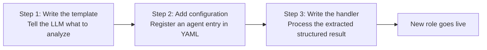
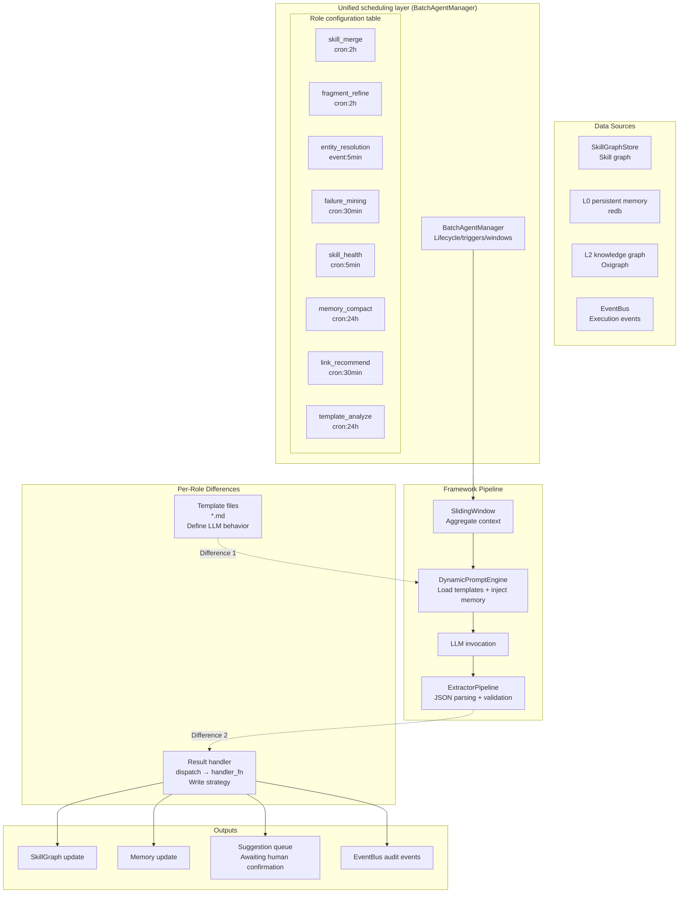
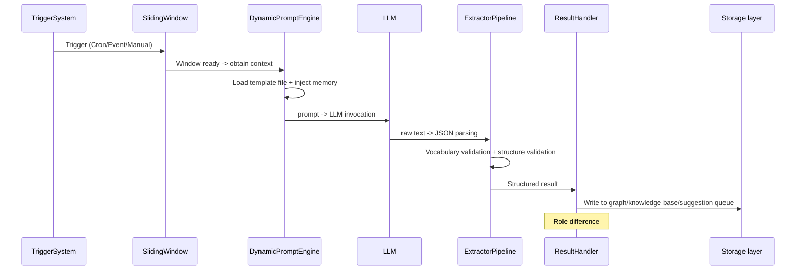

# 10. Batch Agent Background Intelligent Curation System Design

> *For the Chinese version, see [10-background-batch-agent.zh.md](10-background-batch-agent.zh.md).*

> Uses LLM capabilities to batch-curate the skill graph, knowledge memories, and execution traces in the background, continuously improving system intelligence.

## 1. Design Goals and Core Principles

### Current State

Wild AgentOS already provides:

- **Skill graph**: a 7,500+ LOC dynamic semantic network with 6 link types, Learn/Reduce bootstrapping, and conflict detection
- **Five-layer memory**: L0→L3 hierarchical storage using the MESI consistency protocol
- **Execution engine**: a PDCA cycle plus 10 types of perception triggers
- **Batch Agent framework**: sliding windows, template engine, extraction pipeline, and knowledge persistence (Phases 1–5 complete)

### Gap

The LLM's background curation capabilities have not been fully used. Skill merging/splitting/quality evaluation, knowledge-fragment refinement, cross-session memory consolidation, and failure-pattern mining still rely on simple rules or manual confirmation.

### Core Principle: Templates Are Roles

**Different “roles” are not separate code implementations.** All eight curation roles are configuration instances of the same `BatchAgentManager`. The only differences between roles are:

```
Role = 1 configuration-file entry + 1 template file + 1 result-handler function
       ↑ framework configuration    ↑ behavior definition (LLM) ↑ result-write logic
```

Framework reuse:

| Component | Reuse approach |
|------|----------|
| `BatchAgentManager` | Fully reused — manages registration/start/stop for every role |
| `SlidingWindow` | Fully reused — each role has an independent instance with different parameters |
| `TriggerSystem` | Fully reused — Cron/EventCount/Manual, with different configuration |
| `DynamicPromptEngine` | Fully reused — loads the corresponding template by template_name |
| `ExtractorPipeline` | Fully reused — LLM invocation plus JSON parsing |
| `OutputValidator` | Fully reused — vocabulary validation |
| `ContextCollector` | Fully reused — memory injection |
| **Template file (Template)** | **Role difference #1** — defines what the LLM analyzes in its role |
| **Result handler (Handler)** | **Role difference #2** — defines how extracted results are written to the graph/knowledge base |

### Add a New Role in Only Three Steps



No framework code changes, no new modules, and no recompilation are required.

---

## 2. Overall Architecture



### 2.1 Scheduling Strategy

| Period | Role | Trigger | Data scale |
|------|------|----------|----------|
| 5min | SkillHealthAgent | Cron | O(50) skills |
| 5min | EntityResolutionAgent | Cron | O(100) entities |
| 30min | FailureMineAgent | EventCount | O(50) failure records |
| 30min | LinkRecommendAgent | Cron | O(200) skill pairs |
| 2h | SkillMergeAgent | Conflict event | O(10) conflict pairs |
| 2h | FragmentRefineAgent | Cron | O(20) fragments |
| 24h | MemoryCompactAgent | Cron | O(1000) L0 entries |
| 24h | TemplateAnalyzeAgent | Cron | O(100) template invocations |

```mermaid
gantt
    title Batch Agent curation schedule
    dateFormat  HH:mm
    axisFormat  %H:%M
    
    section High frequency (every 5 minutes)
    Skill health inspection       :active, a1, 00:00, 5min
    Entity resolution             :a2, 00:05, 5min
    
    section Medium frequency (every 30 minutes)
    Failure-pattern mining        :b1, 00:00, 30min
    Link recommendations          :b2, 00:30, 30min
    
    section Low frequency (every 2 hours)
    Skill merge evaluation        :c1, 00:00, 120min
    Knowledge-fragment refinement :c2, 00:00, 120min
    
    section Daily (every 24 hours)
    Memory consolidation/compression :d1, 00:00, 24h
    Template effectiveness analysis  :d2, 00:00, 24h
```



### 2.2 Unified Configuration Template

All eight roles share the same configuration structure—**only field values differ**:

```yaml
batch_agents:
  - name: skill_merge_agent
    description: "分析语义相似的技能并建议合并"
    enabled: true
    window_type: Hybrid { max_messages: 20, max_seconds: 7200 }
    triggers:
      - trigger_type: Cron
        params: { expression: "0 */2 * * *" }
      - trigger_type: EventCount
        params: { event_type: "CONFLICT_DETECTED", threshold: 3 }
    # ↓ 这是角色差异点 #1 — 对应一个模板文件
    prompt_template_name: batch/skill_merge
    business_domain: "skill_graph_maintenance"
    entity_types:
      item_label: "技能"
      type_iri: "skill:Skill"
    relation_types:
      item_label: "合并建议"
      type_iri: "skill:MergeSuggestion"
      default_confidence: 0.6
    inject_user_reminders: true
    inject_context_summary: true
    inject_related_entities: true

  - name: failure_mine_agent
    description: "从执行事件中挖掘失败模式"
    triggers:
      - trigger_type: Cron
        params: { expression: "*/30 * * * *" }
    # ↓ 不同的角色 = 不同的模板
    prompt_template_name: batch/failure_mining
    business_domain: "failure_analysis"
    # ... 其他字段与上面结构相同，值不同
```

---

## 3. Unified Execution Flow

Regardless of its “identity,” every role follows the same complete pipeline when triggered:



---

## 4. Eight Core Roles

Each role is described with the following structure:

```
Template:       Defines LLM behavior (difference #1)
Pre-filtering:  Code filters first before sending to the LLM (reduces token usage)
Output:         The JSON structure the template requires the LLM to return
Result handler: Operations performed after parsing JSON (difference #2)
```

### 4.1 Skill Merge Specialist (SkillMergeAgent)

**Template**—defines what the LLM analyzes and its output format:

```markdown
你是一个技能合并分析专家。分析以下两个技能的相似度并给出合并建议。

## 技能 A
- 名称: {{skill_a.name}}
- 描述: {{skill_a.description}}
- 5W2H: {{skill_a.w2h_json}}
- 标签: {{skill_a.tags}}
- 步骤数: {{skill_a.step_count}}
- 成功率: {{skill_a.success_rate}}
- 使用次数: {{skill_a.usage_count}}

## 技能 B（同上结构）

请输出 JSON:
{
  "should_merge": bool,
  "confidence": 0.0~1.0,
  "merge_strategy": "keep_both|replace_a_with_b|create_composite|deprecate_b",
  "composite_name": "合并后的名称",
  "composite_description": "合并描述",
  "reasoning": "分析理由"
}
```

**Pre-filtering**: Process only skill pairs marked `SemanticDuplicate` by `ConflictDetectionEngine` with similarity > 0.7.

**Result handler** (difference #2):

```
confidence > 0.85:
  merge_strategy == "create_composite" → SkillGraphStore::create_composite_skill()
  merge_strategy == "replace_a_with_b" → SkillGraphStore::update_skill()
  merge_strategy == "deprecate_b"      → SkillGraphStore::deprecate_skill()
  → emit(BATCH_SKILL_MERGE_APPLIED)

0.6 ~ 0.85: Write to the suggestion queue (awaiting human confirmation)
< 0.6:      Discard
```

### 4.2 Knowledge Fragment Refinement (FragmentRefineAgent)

**Template**—goal: refine raw failure patterns into structured, reusable knowledge:

```markdown
你是一个知识提炼专家。将以下原始失败模式提炼为可重用的知识。

原始问题: {{problem}}
原始建议: {{recommendation}}
发现者: {{discoverer}}
关联技能: {{attached_skill}}

请输出 JSON:
{
  "refined_problem": "精炼后的问题描述",
  "root_cause": "根本原因分析",
  "generalized_pattern": "泛化的适用场景",
  "solution_steps": ["步骤1", "步骤2"],
  "related_skills": ["iri://skills/..."],
  "confidence": 0.0~1.0,
  "requires_human_review": bool
}
```

**Pre-filtering**: Process only fragments created in the last 24 hours, excluding those that already have a `generalized_pattern`.

**Result handler**:

```
confidence > 0.85 && !requires_human_review:
  → Write to the L2 knowledge graph + create Related links
otherwise:
  → Write to the suggestion queue
```

### 4.3 Entity Resolution/Merging (EntityResolutionAgent)

**Pre-filtering** (code only, to reduce LLM calls):

```rust
fn get_candidates(new: &ExtractedEntity) -> Vec<Entity> {
    // SPARQL: 按 label 模糊匹配
    // string_similarity Jaccard 过滤 > 0.3
    // 最多返回 5 个候选
}
```

**Template**—determines whether two entities represent the same real-world object:

```markdown
实体 A: {{entity_a.label}} ({{entity_a.description}})
实体 B: {{entity_b.label}} ({{entity_b.description}})

请输出 JSON:
{
  "same_entity": bool,
  "confidence": 0.0~1.0,
  "target_iri": "确认的 IRI",
  "reasoning": "判断理由",
  "properties_to_merge": ["field1", "field2"]
}
```

**Result handler**:

```
same_entity && confidence > 0.85: Write owl:sameAs → L2; emit an audit event
same_entity && confidence ≤ 0.85: Write to the conflict queue
!same_entity:                     Skip
```

### 4.4 Failure Pattern Mining (FailureMineAgent)

**Pre-filtering**: Pull `TASK_FAILED` / `CYCLE_FAILED` events from EventBus for the last 24 hours and group/count them by error_code.

**Template**—batch analysis of failure patterns:

```markdown
过去 24 小时共检测到 {{total_failures}} 次失败，分组如下：
{{#each groups}}
- error: {{error_code}}, 次数: {{count}}, 占比: {{percentage}}%
{{/each}}

请输出 JSON:
{
  "patterns": [
    {
      "error_signature": "错误签名",
      "frequency": 数值,
      "trend": "increasing|stable|decreasing",
      "root_cause": "根因",
      "suggested_action": "建议措施",
      "affected_skills": ["skill_iri"],
      "confidence": 0.0~1.0
    }
  ],
  "summary": "总结"
}
```

**Result handler**:

```
For each pattern:
  → If no fragment with the same signature exists and confidence > 0.7 → create_fragment()
  → High-frequency patterns (top 20%) → also generate an AdvisoryNode
```

### 4.5 Skill Health Inspection (SkillHealthAgent)

**Pre-filtering**: `SkillEvolutionEngine::analyze_skill_health()` filters skills with health < 0.6 before sending them to the LLM.

**Template**:

```markdown
技能名称: {{skill.name}}
成功率: {{success_rate}} ({{usage_count}} 次)
已知失败模式: {{failure_modes}}
链接数: {{links_count}}

请输出 JSON:
{
  "health_grade": "A|B|C|D",
  "issues": ["问题1"],
  "suggested_actions": ["建议1"],
  "affected_skills": ["iri"],
  "priority": "low|medium|high"
}
```

**Result handler**:

```
health_grade == "D": Write to the suggestion queue (priority handling)
health_grade == "C" && priority == "high": Write to the suggestion queue
otherwise: Record an audit log
```

### 4.6 Memory Consolidation and Compression (MemoryCompactAgent)

**Layered strategy** (most cases do not require an LLM):

| Type | Handling | LLM? |
|------|----------|------|
| `emphasis` tag | Retain high-importance items | No |
| Expired sessions (>7 days) | Summarize, then delete | Yes |
| `skill_graph` entries | Skip (managed by SkillGraph) | No |
| Duplicate content (same hash) | Deduplicate directly | No |
| Low-access entries | Evaluate whether to retain | Yes |

### 4.7 Link Recommendations (LinkRecommendAgent)

**Two-stage pre-filtering**:

```
Stage 1 (code): suggest_links() tag similarity + UsageRecord co-occurrence analysis → top-10 candidates
Stage 2 (LLM):  Evaluate the semantic relevance of the stage-1 candidates
```

### 4.8 Template Effectiveness Analysis (TemplateAnalyzeAgent)

**Statistical analysis only**: listens for `BATCH_EXTRACTION_COMPLETED` events and aggregates KPIs:

```yaml
template_name: batch/skill_merge
avg_confidence: 0.76
avg_parse_success: 0.92
failure_reasons: {"JSON parse error": 8, "Missing fields": 3}
```

The result → report is written to the suggestion queue, for developers to use when optimizing templates.

---

## 5. Adding a New Role: Complete Three-Step Example

> Assume the requirement is to check once a week whether skill descriptions are stale and automatically suggest updates.

### Step 1: Write the Template File

```markdown
# templates/prompts/batch/description_stale_check.md
你是一个技能维护专家。检查以下技能描述是否过时。

技能名称: {{skill.name}}
当前描述: {{skill.description}}
最近使用次数: {{usage_count}}
最后成功时间: {{last_success_time}}

请输出 JSON:
{
  "is_stale": bool,
  "confidence": 0.0~1.0,
  "suggested_update": "建议的新描述",
  "reasoning": "判断理由"
}
```

### Step 2: Add a Configuration Entry

```yaml
batch_agents:
  - name: description_stale_check_agent
    description: "检查技能描述是否过时"
    enabled: true
    triggers:
      - trigger_type: Cron
        params: { expression: "0 6 * * 1" }
    prompt_template_name: batch/description_stale_check
    business_domain: "skill_graph_maintenance"
```

### Step 3: Write the Result Handler

```rust
// src/batch/handlers/mod.rs
fn dispatch_handler(agent_name: &str, result: Value) -> Result<(), BatchError> {
    match agent_name {
        "skill_merge_agent" => handle_skill_merge(result),
        "failure_mine_agent" => handle_failure_mine(result),
        // ... 已有 8 个角色
        
        "description_stale_check_agent" => {
            if result["is_stale"].as_bool()? && result["confidence"].as_f64()? > 0.8 {
                let iri = result["skill_iri"].as_str()?;
                let new_desc = result["suggested_update"].as_str()?;
                skill_graph_store.update_description(iri, new_desc)?;
            }
            Ok(())
        }
        _ => Ok(()),
    }
}
```

**Done. No modules need to be added, no recompilation is needed, and the framework does not need to restart.**

---

## 6. Integration with Existing Systems

### 6.1 New EventBus Event Types

```rust
pub enum EventType {
    // ... 已有
    BatchSkillMergeSuggested,
    BatchSkillMergeApplied,
    BatchFragmentRefined,
    BatchEntityResolved,
    BatchEntityMergeConflict,
    BatchFailurePatternDetected,
    BatchHealthReportGenerated,
    BatchMemoryCompacted,
    BatchLinkRecommended,
    BatchLinkApplied,
    BatchTemplateAnalysisReady,
}
```

### 6.2 Configuration Extensions

```yaml
batch:
  maintenance_agents:
    skill_merge:
      enabled: true
      schedule: "0 */2 * * *"
      min_confidence_auto_apply: 0.85
    fragment_refine:
      enabled: true
      schedule: "0 */2 * * *"
      batch_size: 50
    entity_resolution:
      enabled: true
      schedule: "*/5 * * * *"
      max_candidates: 5
    failure_mining:
      enabled: true
      schedule: "*/30 * * * *"
      lookback_hours: 24
    skill_health:
      enabled: true
      schedule: "*/5 * * * *"
      llm_analysis_threshold: 0.6
    memory_compact:
      enabled: true
      schedule: "0 3 * * *"
      max_items_per_run: 500
    link_recommend:
      enabled: true
      schedule: "*/30 * * * *"
      max_suggestions_per_run: 20
    template_analyze:
      enabled: true
      schedule: "0 4 * * *"
      lookback_hours: 168
```

### 6.3 New SkillGraphStore Interface

```rust
// 所有角色共享的扩展接口
impl SkillGraphStore {
    pub fn bulk_read_skills(&self, iris: &[&str]) -> Vec<SkillGraphNode>;
    pub fn create_composite_skill(&self, name: &str, children: &[String]) -> Result<...>;
    pub fn deprecate_skill(&self, iri: &str, reason: &str) -> Result<(), BatchError>;
    pub fn batch_add_links(&self, links: &[BulkLinkInput]) -> Result<usize, BatchError>;
}
```

---

## 7. Risks and Mitigations

| Risk | Mitigation |
|------|------|
| LLM invocation latency causes background backlog | Set a 30-second timeout plus a retry queue for all calls; at most 50 LLM calls per run |
| Automated merging introduces errors | Automatically apply only when confidence > 0.85; send all others to the suggestion queue |
| L0 compression incorrectly deletes memories | Mark for deletion first; physically delete only after observing for 7 days |
| Duplicate processing between roles | Deduplicate using content_hash plus a 60-second window |
| Surging LLM token costs | Pre-filtering (code first filters 80% of cases that do not need an LLM) plus scheduling rate limits |
