[中文版](11-behavior-engineering-system.zh.md)

# 11. Behavior Engineering System Design: Root-Cause Engine and Methodology System

> **Document ID**: 11
> **Version**: v1.0
> **Scope**: Complete detailed design for the RootCauseEngine root-cause tracing module and the MethodologyGate methodology system
> **Purpose**: Built on the Constitution layer (L3), this system provides systematic engineering safeguards for Agent behavior.

---

## Contents

1. [System overview](#1-system-overview)
2. [Four-layer behavior-engineering architecture](#2-four-layer-behavior-engineering-architecture)
3. [Root-cause engine (RootCauseEngine)](#3-root-cause-engine-rootcauseengine)
4. [Methodology system](#4-methodology-system)
5. [Constitution bindings and coordination](#5-constitution-bindings-and-coordination)
6. [Self-evolution feedback loop](#6-self-evolution-feedback-loop)
7. [Integration with existing systems](#7-integration-with-existing-systems)
8. [Configuration and extension guide](#8-configuration-and-extension-guide)

---

## 1. System overview

Wild AgentOS's behavior-engineering system has **four layers**. From foundational behavioral principles through code-level hard enforcement, they form a complete constraint—guidance—execution—evolution loop:

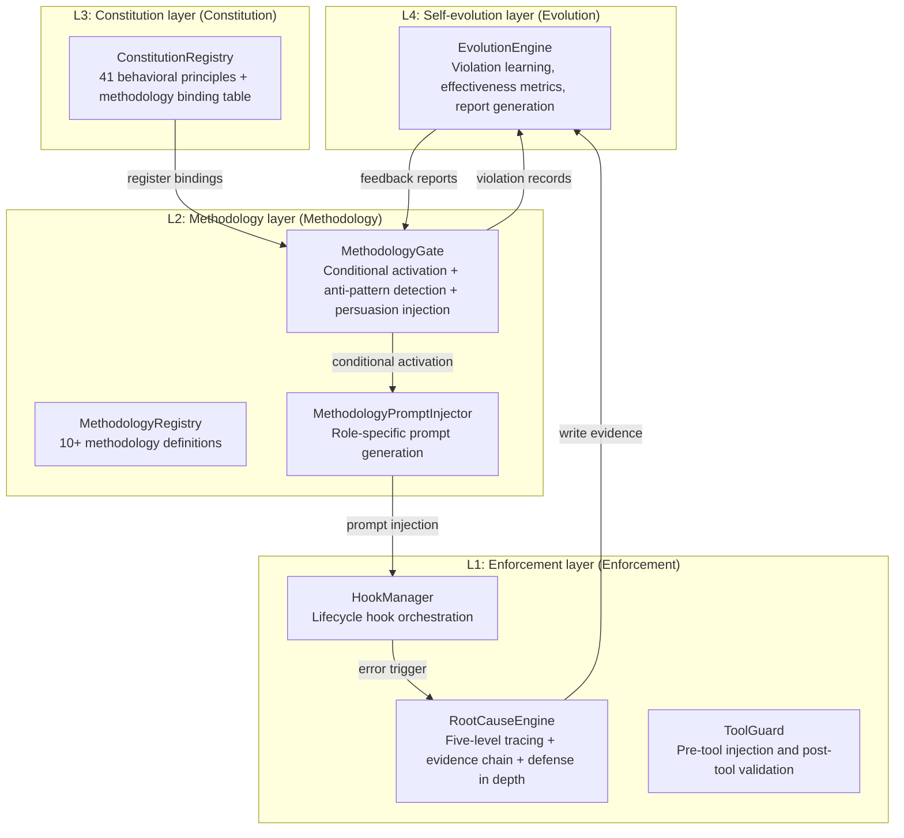
```mermaid
graph TB
    subgraph "L4: Self-evolution layer (Evolution)"
        E4["EvolutionEngine<br/>Violation learning, effectiveness metrics, report generation"]
    end
    subgraph "L3: Constitution layer (Constitution)"
        C1["ConstitutionRegistry<br/>41 behavioral principles + methodology binding table"]
    end
    subgraph "L2: Methodology layer (Methodology)"
        M1["MethodologyRegistry<br/>10+ methodology definitions"]
        M2["MethodologyGate<br/>Conditional activation + anti-pattern detection + persuasion injection"]
        M3["MethodologyPromptInjector<br/>Role-specific prompt generation"]
    end
    subgraph "L1: Enforcement layer (Enforcement)"
        E1["RootCauseEngine<br/>Five-level tracing + evidence chain + defense in depth"]
        E2["ToolGuard<br/>Pre-tool injection and post-tool validation"]
        H1["HookManager<br/>Lifecycle hook orchestration"]
    end
    C1 -->|"register bindings"| M2
    M2 -->|"conditional activation"| M3
    M3 -->|"prompt injection"| H1
    H1 -->|"error trigger"| E1
    E1 -->|"write evidence"| E4
    M2 -->|"violation records"| E4
    E4 -->|"feedback reports"| M2
```

| Layer | Name | Constraint strength | Lifecycle | Primary output |
|------|------|--------|---------|---------|
| L4 | **Self-evolution layer** | Data-driven, advisory | Continuously running | Violation-pattern reports, effectiveness ratings |
| L3 | **Constitution layer** | Always present; cannot be bypassed | Loaded at startup | Behavioral-principle text, methodology bindings |
| L2 | **Methodology layer** | On-demand, conditionally triggered | Activated when a task matches | Anti-pattern blocking, persuasion injection, prompts |
| L1 | **Enforcement layer** | Code-level hard blocking | Always running | Backward tracing, tool interception, hook scheduling |

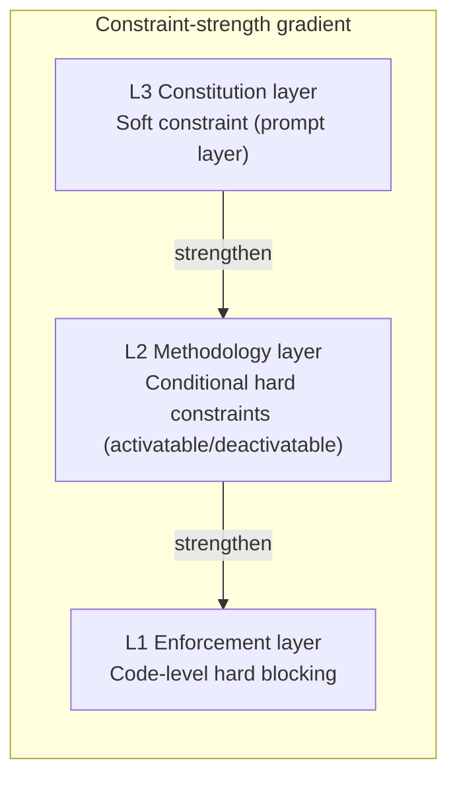
```mermaid
graph LR
    subgraph "Constraint-strength gradient"
        A["L3 Constitution layer<br/>Soft constraint (prompt layer)"] -->|"strengthen"| B
        B["L2 Methodology layer<br/>Conditional hard constraints (activatable/deactivatable)"] -->|"strengthen"| C
        C["L1 Enforcement layer<br/>Code-level hard blocking"]
    end
```

---

## 2. Four-layer behavior-engineering architecture

### 2.1 L3 — Constitution layer (Constitution)

The Constitution layer is the behavioral system's **foundational anchor**. Loaded from `ConstitutionRegistry` at startup, it contains 41 structured behavioral principles across three dimensions:

- **Perception**: complete reading, index first, real-time confirmation, ambiguity clarification
- **Verification**: automated verification, root-cause analysis, regression verification
- **Boundary**: least privilege, risk warnings, boundary refusal, staying within task scope

Each principle can bind to zero or more methodologies, creating an L3→L2 mapping. When a principle's trigger condition is met, its associated methodologies activate automatically.

### 2.2 L2 — Methodology layer (Methodology)

The methodology layer is the behavioral system's **conditionally programmable layer**. A methodology is a structured behavioral protocol:

```
MethodologyDefinition
├── id / name / description     # Identity
├── methodology_type            # Discipline | Guidance | Reference | Process
├── domain                      # "general" | "programming" | extensible
├── red_flags[]                 # Warning items: behavioral patterns to watch
│   ├── pattern                 # Matching pattern
│   ├── severity                # Critical / Warning / Info
│   └── rationalization_check   # Self-deception check text
├── anti_patterns[]             # Behavioral patterns to block
│   ├── gate_before             # Operation before which to trigger
│   ├── gate_ask                # Question the Agent should ask itself
│   └── gate_action             # STOP / ABORT / WARN
├── persuasion                  # Persuasion framework
│   ├── principles              # authority / commitment / social_proof, etc.
│   └── phrasing_examples       # Specific wording examples
├── activation                  # Activation condition
│   └── Always / OnToolCategory / OnHookPoint / OnPhaseEnd / OnTaskError / OnAgentRole
└── related[]                   # Related methodology IDs
```

| Type | Meaning | Prompt prefix | Example |
|------|---------|------|---------|
| **Discipline** | Hard rule, authoritative tone | 📜 [Strict discipline] | TDD: "YOU MUST test before code" |
| **Guidance** | Guidance, collaborative tone | 💡 [Guidance] | Complexity assessment: "Be honest about difficulty" |
| **Reference** | Reference information | 📖 [Reference] | Tool mappings, skill descriptions |
| **Process** | Multi-step process | 📋 [Process] | Brainstorming: "Let's explore before building" |

### 2.3 L1 — Enforcement layer (Enforcement)

The enforcement layer uses **HookManager** for unified orchestration and inserts execution logic at key points in the Agent lifecycle:

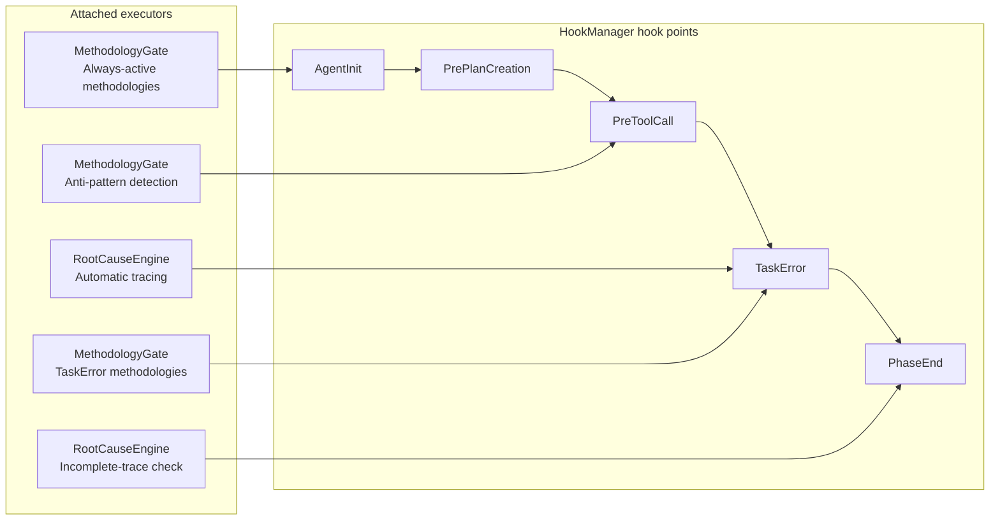
```mermaid
graph LR
    subgraph "HookManager hook points"
        A["AgentInit"] --> B["PrePlanCreation"]
        B --> C["PreToolCall"]
        C --> D["TaskError"]
        D --> E["PhaseEnd"]
    end
    subgraph "Attached executors"
        A1["MethodologyGate<br/>Always-active methodologies"] --> A
        C1["MethodologyGate<br/>Anti-pattern detection"] --> C
        D1["RootCauseEngine<br/>Automatic tracing"] --> D
        D2["MethodologyGate<br/>TaskError methodologies"] --> D
        E1["RootCauseEngine<br/>Incomplete-trace check"] --> E
    end
```

| Hook point | Trigger time | Executor | Behavior |
|--------|---------|--------|------|
| `AgentInit` | Agent initialization | MethodologyGate | Activates always-on methodologies |
| `PrePlanCreation` | Before plan creation | MethodologyGate | Activates brainstorming and similar methodologies |
| `SkillBefore` | Before a tool call | MethodologyGate | Detects anti-patterns and blocks violations |
| `TaskError` | Task error | RootCauseEngine | Automatically performs five-level backward tracing |
| `TaskError` | Task error | MethodologyGate | Activates systematic-debugging and similar methodologies |
| `PhaseEnd` | Phase end | RootCauseEngine | Checks for incomplete root-cause analyses |
| `PhaseEnd` | Phase end | MethodologyGate | Activates verification-before-completion and similar methodologies |

### 2.4 L4 — Self-evolution layer (Evolution)

The self-evolution layer collects L1 and L2 execution data, aggregates it, and produces feedback reports to guide system improvements. See section 6.

---

## 3. Root-cause engine (RootCauseEngine)

### 3.1 Design goals

RootCauseEngine provides structured error analysis:

1. **Systematic**: tracing is completed automatically through a fixed algorithm rather than intuition or experience.
2. **Verifiable**: every tracing level has supporting evidence, and the evidence chain is verifiable.
3. **Actionable**: results become defense recommendations that guide code improvements.
4. **Integrable**: HookManager triggers it automatically, without manual intervention.

### 3.2 Module structure

```
src/root_cause/
├── mod.rs          # RootCauseEngine entry point + TracedResult + Hook integration
├── config.rs       # Configuration validation tests
├── types.rs        # Core types (TraceChain, TraceLevel, Evidence, error types, etc.)
├── tracer.rs       # BackwardTracer — five-level algorithm + error-pattern matching
├── evidence.rs     # EvidenceChainManager — chain validation + confidence calculation
└── defense.rs      # DefenseInDepthManager — defense recommendations + targeted advice
```

### 3.3 Core algorithm: five-level backward tracing

Starting from the failure point, trace upward level by level until the original trigger is found. At every level, answer: “What called this?” and “What value was passed?”

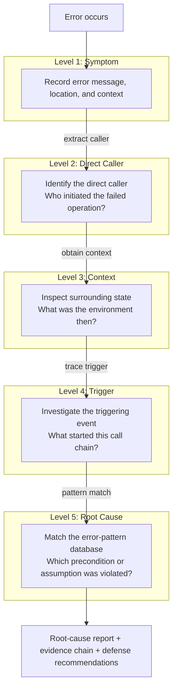
```mermaid
flowchart TB
    E["Error occurs"] --> L1
    subgraph "Level 1: Symptom"
        L1["Record error message, location, and context"]
    end
    L1 -->|"extract caller"| L2
    subgraph "Level 2: Direct Caller"
        L2["Identify the direct caller<br/>Who initiated the failed operation?"]
    end
    L2 -->|"obtain context"| L3
    subgraph "Level 3: Context"
        L3["Inspect surrounding state<br/>What was the environment then?"]
    end
    L3 -->|"trace trigger"| L4
    subgraph "Level 4: Trigger"
        L4["Investigate the triggering event<br/>What started this call chain?"]
    end
    L4 -->|"pattern match"| L5
    subgraph "Level 5: Root Cause"
        L5["Match the error-pattern database<br/>Which precondition or assumption was violated?"]
    end
    L5 --> R["Root-cause report + evidence chain + defense recommendations"]
```

#### Algorithm pseudocode

```
function trace_backward(error, context):
    // Level 1: 症状
    chain.add(symptom_level(error.message, error.location))
    // Level 2: 直接调用者
    caller_info = extract_caller(error.message, error.location)
    chain.add(caller_level(caller_info))
    // Level 3: 上下文
    chain.add(context_level(context.task_type, context.logs))
    // Level 4: 触发事件
    chain.add(trigger_level(context.task_type))
    // Level 5: 模式匹配 → 根因
    for pattern in pattern_db:
        if error.message matches pattern:
            chain.add(root_cause_level(pattern))
            break
    if chain.root_confidence < min_confidence:
        return FAIL("证据置信度不足")
    return chain
```

#### Concrete implementation (key Rust structures)

```rust
// 5 级回溯追踪器
pub struct BackwardTracer {
    config: RootCauseConfig,
    active_traces: RwLock<HashMap<String, TraceChain>>,
    pattern_db: Vec<ErrorPattern>,
}

// 错误模式（内置 7 种常见模式）
pub struct ErrorPattern {
    pub pattern: &'static str,              // "connection refused|connection reset|timeout"
    pub root_cause_label: &'static str,     // "network_error"
    pub root_cause_description: &'static str, // "网络连接失败..."
    pub confidence: f64,                    // 0.9
}
```

**Built-in error-pattern database**:

| Pattern | Label | Confidence | Description |
|------|------|--------|------|
| `connection refused\|connection reset\|timeout` | network_error | 0.9 | Network connection failure |
| `not found\|no such file\|enoent` | resource_not_found | 0.85 | Resource does not exist |
| `permission denied\|access denied\|eacces` | permission_error | 0.9 | Insufficient permission |
| `syntax error\|parse error\|invalid syntax` | syntax_error | 0.8 | Syntax error |
| `out of memory\|oom\|disk full` | resource_exhausted | 0.9 | Resource exhaustion |
| `null pointer\|undefined\|unwrap.*none` | null_reference | 0.85 | Null reference |
| `invalid argument\|bad request\|400` | invalid_input | 0.8 | Invalid input |

### 3.4 Evidence-chain validation (EvidenceChainManager)

The result at each level forms an evidence node; these nodes form an evidence chain. A valid chain requires:

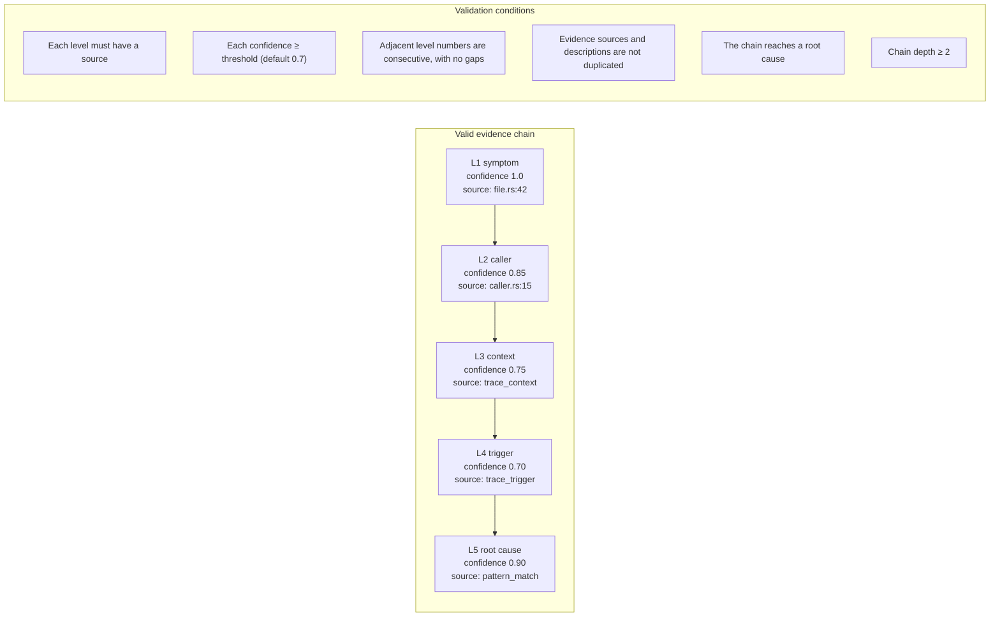
```mermaid
graph LR
    subgraph "Valid evidence chain"
        L1["L1 symptom<br/>confidence 1.0<br/>source: file.rs:42"] --> L2["L2 caller<br/>confidence 0.85<br/>source: caller.rs:15"] --> L3["L3 context<br/>confidence 0.75<br/>source: trace_context"] --> L4["L4 trigger<br/>confidence 0.70<br/>source: trace_trigger"] --> L5["L5 root cause<br/>confidence 0.90<br/>source: pattern_match"]
    end
    subgraph "Validation conditions"
        V1["Each level must have a source"]
        V2["Each confidence ≥ threshold (default 0.7)"]
        V3["Adjacent level numbers are consecutive, with no gaps"]
        V4["Evidence sources and descriptions are not duplicated"]
        V5["The chain reaches a root cause"]
        V6["Chain depth ≥ 2"]
    end
```

#### Confidence calculation

Overall confidence uses the **geometric mean**:

```
chain_confidence = ( ∏ confidence_i ) ^ (1 / n)
```

Any low-confidence level significantly lowers the result, preventing “a high single score from masking a weak link.”

#### Evidence-report generation

After validation, `evidence_report()` generates a human-readable report:

```
===== Evidence Chain Report [trace_abc123] =====
Agent: agent_1 | Task: GET /api/users failed

  L1 symptom
    Description: Error occurred: connection refused: failed to connect to 127.0.0.1:8080
    Source: src/http/client.rs:42
    Confidence: 1.00

  L2 intermediate
    Description: Caller: network_operation (call location: src/http/client.rs:42:0)
    Source: src/http/client.rs:42:0
    Confidence: 0.85
  ...

Overall confidence: 0.82
Status: Root cause located
```

### 3.5 Defense-in-depth recommendations (DefenseInDepthManager)

The root-cause result produces four layers of recommendations:

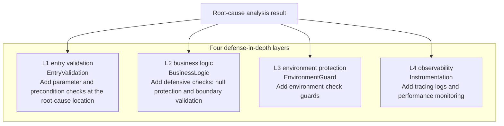
```mermaid
graph TB
    subgraph "Four defense-in-depth layers"
        L1["L1 entry validation<br/>EntryValidation<br/>Add parameter and precondition checks at the root-cause location"]
        L2["L2 business logic<br/>BusinessLogic<br/>Add defensive checks: null protection and boundary validation"]
        L3["L3 environment protection<br/>EnvironmentGuard<br/>Add environment-check guards"]
        L4["L4 observability<br/>Instrumentation<br/>Add tracing logs and performance monitoring"]
    end
    ROOT["Root-cause analysis result"] --> L1 & L2 & L3 & L4
```

Known patterns receive targeted rather than generic recommendations:

| Root-cause type | Recommendation 1 | Recommendation 2 |
|---------|--------|--------|
| network_error | Exponential-backoff retries | Network health check before connecting |
| resource_not_found | Verify that the path exists before access | Provide a fallback |
| permission_error | Check permission before operation | Provide an elevation recommendation |
| null_reference | Check null before dereferencing | Provide a default value |
| resource_exhausted | Check resource utilization before operation | Rate limiting and circuit breaking |
| invalid_input | Fully validate parameters at entry | Record key parameter values |
| syntax_error | Validate format before parsing | Provide a clear error message |

### 3.6 Hook integration

RootCauseEngine registers two synchronous hooks through HookManager:

```
Hook 1: TaskError @ priority 90
  Behavior: automatically trigger five-level tracing
  Input: error.message, source_location, HookContext
  Output: TracedResult (stored in engine.active_traces)
  Exception: a tracing failure is only logged; execution is not blocked

Hook 2: PhaseEnd(DO) @ priority 50
  Behavior: check for incomplete root-cause analyses
  Condition: the current phase is DO and task_id has an unresolved trace
  Blocking: incomplete trace detected → set ctx.error → HookResult::Abort
  Message: "Behavioral-principle violation: repair attempted before root-cause analysis is complete"
```

---

## 4. Methodology system

### 4.1 System composition

Four subsystems respectively define, trigger, inject, and evolve methodologies:

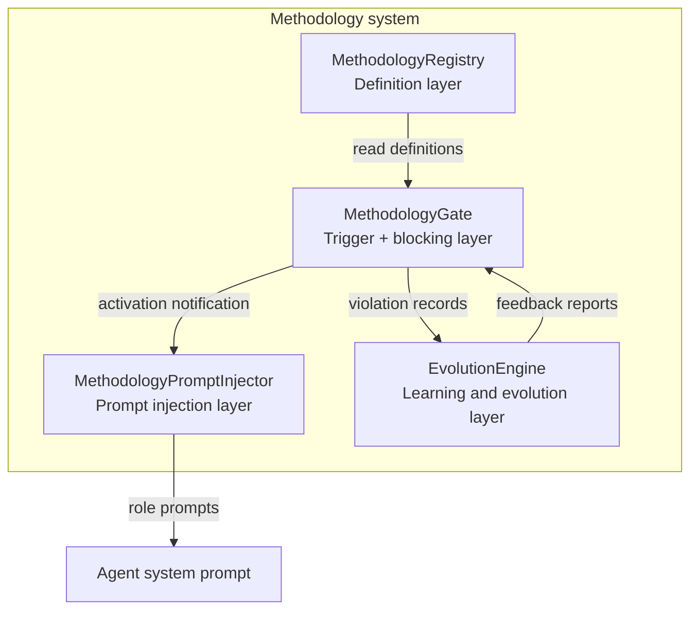
```mermaid
graph TB
    subgraph "Methodology system"
        REG["MethodologyRegistry<br/>Definition layer"]
        GATE["MethodologyGate<br/>Trigger + blocking layer"]
        INJECT["MethodologyPromptInjector<br/>Prompt injection layer"]
        EVOLVE["EvolutionEngine<br/>Learning and evolution layer"]
    end
    REG -->|"read definitions"| GATE
    GATE -->|"activation notification"| INJECT
    GATE -->|"violation records"| EVOLVE
    EVOLVE -->|"feedback reports"| GATE
    INJECT -->|"role prompts"| AGENT["Agent system prompt"]
```

### 4.2 MethodologyRegistry — definition layer

Definitions reside in `MethodologyDefinition` and are initialized by `builtin_methodologies()`. The current ten built-in methodologies are:

| ID | Name | Type | Domain | Activation condition |
|----|------|------|------|---------|
| `index-priority` | Index-first strategy | Discipline | general | OnToolCategory(file_search) |
| `cost-awareness` | Cost-awareness protocol | Discipline | general | OnHookPoint(PreToolCall) |
| `least-privilege` | Least-privilege protocol | Discipline | general | OnToolCategory(shell, file_write, network) |
| `complexity-assessment` | Honest complexity assessment | Guidance | general | OnAgentRole(SA, PA) |
| `boundary-enforcement` | Boundary enforcement | Discipline | general | Always |
| `using-superpowers` | Skill-use methodology | Discipline | general | Always |
| `brainstorming` | Brainstorming methodology | Process | general | OnHookPoint(PrePlanCreation) |
| `test-driven-development` | Test-driven development | Discipline | programming | OnToolCategory(file_write, code_generation) |
| `systematic-debugging` | Systematic debugging | Process | programming | OnTaskError |
| `verification-before-completion` | Pre-completion verification | Discipline | general | OnPhaseEnd(ACT) |

Design principles: methodologies with `domain: "general"` work across domains; `domain: "programming"` expands through the `Methodology Skill Graph`; core flows (brainstorming → planning → execution → review → verification) apply to programming, writing, design, and other tasks; specialized domains expand independently through `Wild AgentOS Skills`, without being mixed into core methodologies.

### 4.3 MethodologyGate — trigger and blocking layer

MethodologyGate maintains the **currently active methodology set**, determines whether to activate methodologies at each hook point, and checks anti-patterns before tool calls.

```mermaid
sequenceDiagram
    participant Hook as HookManager
    participant Gate as MethodologyGate
    participant Registry as MethodologyRegistry
    Hook->>Gate: on_hook_trigger(point, context)
    loop each methodology
        Gate->>Registry: iterate all methodologies
        Registry-->>Gate: MethodologyDefinition
        alt already active
            Gate->>Gate: skip (avoid duplicate activation)
        else condition matches
            Gate->>Gate: create ActivatedMethodology
            note right: record trigger source and timestamp
            alt below limit
                Gate->>Gate: add to active list
                Gate-->>Hook: return newly active list
            end
        end
    end
    loop each registered Constitution binding
        Gate->>Gate: evaluate Constitution trigger condition
        alt matched and inactive
            Gate->>Gate: add to active list
        end
    end
```

| Condition type | Evaluation |
|---------|---------|
| `Always` | Activate unconditionally |
| `OnToolCategory(categories)` | Compare tool name with the category mapping |
| `OnHookPoint(hook)` | Exact match of hook-point name |
| `OnPhaseEnd(phase)` | PhaseEnd hook plus matching phase data |
| `OnTaskError` | TaskError hook plus an existing error |
| `OnAgentRole(roles)` | Case-insensitive Agent-role name match |

At `SkillBefore`, for every anti-pattern of an active methodology: first check whether `gate_before` matches the current tool name. If it matches and `gate_action` is STOP or ABORT, set `ctx.error` to the anti-pattern description and return `HookResult::Abort`; otherwise, for WARN, record it in `ctx.metadata` and continue.

On blocking, the message format is:

```
⚠️ Anti-pattern [methodology name]: anti-pattern name — detailed description
Ask yourself: [gate_ask question]
Action: [STOP / ABORT / WARN]
```

Persuasion text is collected and formatted for prompt injection:

```
📜 [Strict discipline] Always verify before claiming done (pre-completion verification)
💡 [Guidance] Be honest about difficulty (honest complexity assessment)
📋 [Process] Let's explore before building (brainstorming methodology)
```

`persuasive_directives()` collects it, and `MethodologyPromptInjector` ultimately injects it into the Agent's system prompt.

### 4.4 MethodologyPromptInjector — prompt-injection layer

Role-specific methodology prompt fragments are generated and injected together with the Constitution's behavioral principles.

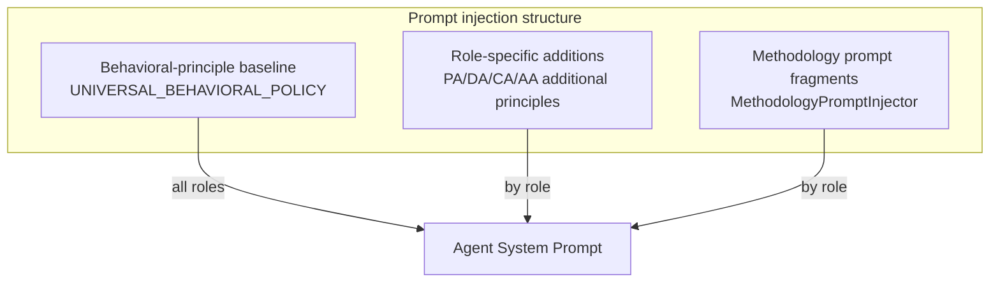
```mermaid
graph TB
    subgraph "Prompt injection structure"
        BASE["Behavioral-principle baseline<br/>UNIVERSAL_BEHAVIORAL_POLICY"]
        ROLE["Role-specific additions<br/>PA/DA/CA/AA additional principles"]
        METHOD["Methodology prompt fragments<br/>MethodologyPromptInjector"]
    end
    BASE -->|"all roles"| SYSTEM_PROMPT["Agent System Prompt"]
    ROLE -->|"by role"| SYSTEM_PROMPT
    METHOD -->|"by role"| SYSTEM_PROMPT
```

| Role | Methodology level | Injected content |
|------|-----------|---------|
| **PA (Plan)** | Detailed | Step-granularity checks + complexity matching + boundary checks |
| **DA (Do)** | None | Constitution baseline only; no additional methodology |
| **CA (Check)** | Detailed | Two-stage audit (output validation + methodology compliance) + anti-pattern detection + evidence requirements |
| **AA (Act)** | Detailed | Stress-test protocol + meta-test protocol + decision accountability |
| **SA (Supervisor)** | Complete | Always-active methodology list + role-trigger list + plan-generation requirements |

Example PA fragment:

```
## 📋 Methodology discipline — plan-review gate
As the planning Agent, you must follow these methodology disciplines:

### 1. Step-granularity check
For every plan step, assess whether its granularity is appropriate:
- ✅ Too coarse: one step contains multiple unrelated operations → split it
- ✅ Too fine: one step contains only an atomic operation → combine it
- ✅ Standard: one step contains a related group of operations with clear inputs and outputs

### 2. Complexity matching
The selected complexity level must match actual task needs. Do not:
- Downgrade for convenience: choose a level below actual needs to save effort
- Upgrade for showmanship: choose a level above actual needs to show off

### 3. Boundary checks
The plan must not contain out-of-bounds operations:
- Check whether each step's responsibility is within Agent permissions
- If a boundary violation is found, mark it and recommend a correction
```

---

## 5. Constitution bindings and coordination

The Constitution layer (L3) and methodology layer (L2) coordinate through a **binding table**. Each Constitution principle can bind zero or more methodologies and specify a trigger condition.

### 5.1 Binding structure

```rust
pub struct ConstitutionMethodologyBinding {
    pub constitution_id: String,    // e.g. "uni-verification-2"
    pub methodology_id: String,     // e.g. "methodology:systematic-debugging"
    pub condition: TriggerCondition,  // Trigger condition
}
```

### 5.2 Key binding examples

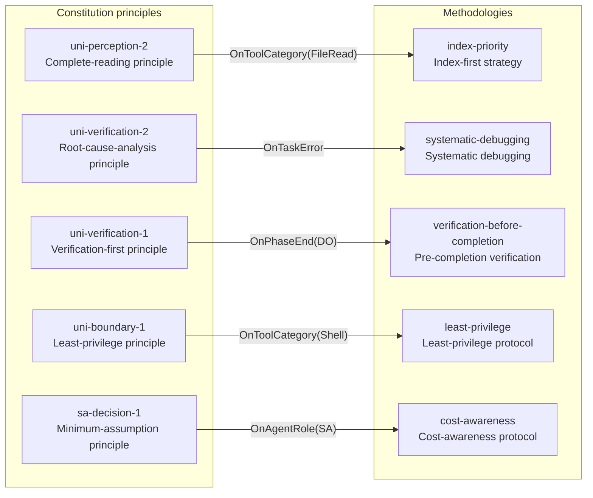
```mermaid
graph LR
    subgraph "Constitution principles"
        C1["uni-perception-2<br/>Complete-reading principle"]
        C2["uni-verification-2<br/>Root-cause-analysis principle"]
        C3["uni-verification-1<br/>Verification-first principle"]
        C4["uni-boundary-1<br/>Least-privilege principle"]
        C5["sa-decision-1<br/>Minimum-assumption principle"]
    end
    subgraph "Methodologies"
        M1["index-priority<br/>Index-first strategy"]
        M2["systematic-debugging<br/>Systematic debugging"]
        M3["verification-before-completion<br/>Pre-completion verification"]
        M4["least-privilege<br/>Least-privilege protocol"]
        M5["cost-awareness<br/>Cost-awareness protocol"]
    end
    C1 -->|"OnToolCategory(FileRead)"| M1
    C2 -->|"OnTaskError"| M2
    C3 -->|"OnPhaseEnd(DO)"| M3
    C4 -->|"OnToolCategory(Shell)"| M4
    C5 -->|"OnAgentRole(SA)"| M5
```

When a Constitution principle's condition is met: `MethodologyGate.on_hook_trigger()` is called; all registered Constitution bindings are evaluated; matched bindings activate the corresponding methodology; active methodologies generate persuasion text for `MethodologyPromptInjector`; and PolicyAgent generates an Agent plan containing methodology disciplines.

---

## 6. Self-evolution feedback loop

### 6.1 Data flow

EvolutionEngine collects violation data from MethodologyGate and RootCauseEngine and aggregates it:

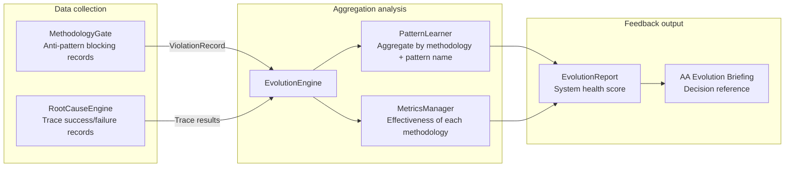
```mermaid
flowchart LR
    subgraph "Data collection"
        MG["MethodologyGate<br/>Anti-pattern blocking records"]
        RC["RootCauseEngine<br/>Trace success/failure records"]
    end
    subgraph "Aggregation analysis"
        EE["EvolutionEngine"]
        PL["PatternLearner<br/>Aggregate by methodology + pattern name"]
        MM["MetricsManager<br/>Effectiveness of each methodology"]
    end
    subgraph "Feedback output"
        RP["EvolutionReport<br/>System health score"]
        AB["AA Evolution Briefing<br/>Decision reference"]
    end
    MG -->|"ViolationRecord"| EE
    RC -->|"Trace results"| EE
    EE --> PL
    EE --> MM
    PL --> RP
    MM --> RP
    RP --> AB
```

### 6.2 Core data structures

```rust
// 违规记录
pub struct ViolationRecord {
    pub methodology_id: String,   // 哪个方法论被违反
    pub pattern_type: PatternType, // RedFlag | AntiPattern
    pub pattern_name: String,     // 模式名称
    pub severity: RedFlagSeverity, // Critical | Warning | Info
    pub agent_role: String,       // 哪个角色触发
    pub blocked: bool,            // 是否阻断
    pub timestamp: u64,           // 发生时间
    pub task_id: Option<String>,  // 关联任务
}
// 学习到的模式
pub struct LearnedPattern {
    pub pattern_description: String,
    pub methodology_id: String,
    pub frequency: u64,            // 观察次数
    pub first_seen: u64,
    pub last_seen: u64,
    pub severity: RedFlagSeverity,
    pub frequent_roles: Vec<String>, // 最常见角色
}
// 方法论有效性指标
pub struct MethodologyMetrics {
    pub methodology_id: String,
    pub activation_count: u64,
    pub total_violations: u64,
    pub pass_count: u64,           // 无违规通过次数
    pub effectiveness_score: f64,  // 0.0~1.0
}
```

### 6.3 Effectiveness calculation

```
effectiveness = (passes + 1) / (activations + violations + passes + 1)

Critical violation → effectiveness *= 0.8
Warning violation  → effectiveness *= 0.9
Info violation     → effectiveness *= 0.95
```

The **health score** is the arithmetic mean of all methodology `effectiveness_score` values.

### 6.4 Ring buffer

EvolutionEngine retains at most 10,000 violation records by default. The oldest record is deleted when this limit is exceeded:

```
[record_0] → [record_1] → ... → [record_9999]
  ↑                              ↑
deleted                        new record written
```

### 6.5 AA evolution briefing

EvolutionEngine can generate an AA-consumable evolution briefing summarizing system health:

```
## 📊 Methodology Evolution Report
System health score: 85.3%
Total recorded violations: 47
Active methodologies: 8

### High-frequency violation patterns
1. 🔴 methodology:index-priority — full traversal (frequency: 12, roles: DA, PA)
2. 🟡 methodology:cost-awareness — no alternative comparison (frequency: 8, role: PA)
3. 🔵 methodology:verification-before-completion — claim without evidence (frequency: 5, role: DA)

### Methodology effectiveness
✅ methodology:using-superpowers — effectiveness: 95.0% (50 activations / 1 violation / 120 passes)
⚠️ methodology:index-priority — effectiveness: 62.0% (30 activations / 12 violations / 45 passes)
🔴 methodology:cost-awareness — effectiveness: 45.0% (20 activations / 8 violations / 10 passes)
```

### 6.6 Complete feedback loop

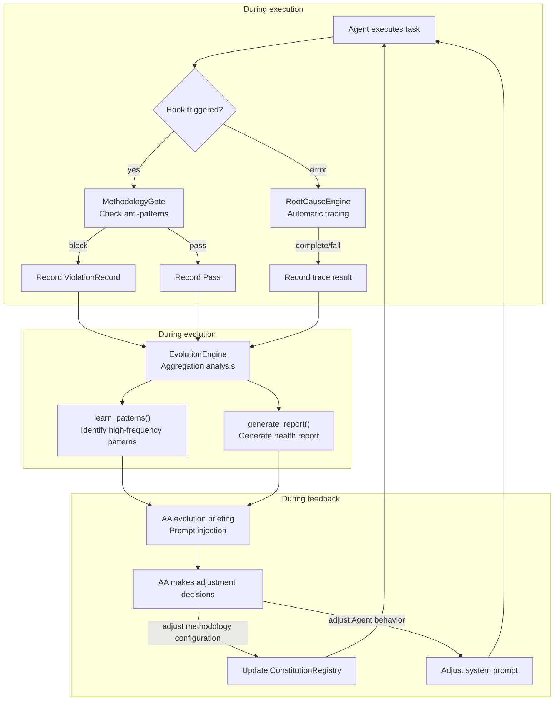
```mermaid
flowchart TB
    subgraph "During execution"
        A["Agent executes task"] --> B{"Hook triggered?"}
        B -->|"yes"| C["MethodologyGate<br/>Check anti-patterns"]
        C -->|"block"| D["Record ViolationRecord"]
        C -->|"pass"| E["Record Pass"]
        B -->|"error"| F["RootCauseEngine<br/>Automatic tracing"]
        F -->|"complete/fail"| G["Record trace result"]
    end
    subgraph "During evolution"
        D --> H["EvolutionEngine<br/>Aggregation analysis"]
        E --> H
        G --> H
        H --> I["learn_patterns()<br/>Identify high-frequency patterns"]
        H --> J["generate_report()<br/>Generate health report"]
    end
    subgraph "During feedback"
        I --> K["AA evolution briefing<br/>Prompt injection"]
        J --> K
        K --> L["AA makes adjustment decisions"]
        L -->|"adjust methodology configuration"| M["Update ConstitutionRegistry"]
        L -->|"adjust Agent behavior"| N["Adjust system prompt"]
    end
    M --> A
    N --> A
```

---

## 7. Integration with existing systems

### 7.1 ToolGuard integration

ToolGuard injects and validates before and after tool calls. The behavior-engineering system enhances it as follows:

| Component | Enhancement | Integration point |
|------|---------|--------|
| MethodologyGate | Anti-pattern detection (`SkillBefore` hook) | `check_anti_patterns_for_tool()` |
| MethodologyPromptInjector | Persuasion-text injection | Prompt formatting and role mapping |
| ConstitutionRegistry | Behavioral-principle pre-injection | `build_constitution_prompt()` |

### 7.2 EventBus integration

The system publishes these EventBus events:

| Event | Publisher | Consumer |
|------|--------|--------|
| `root_cause_trace_complete` | RootCauseEngine | Monitoring system, logs |
| `methodology_activated` | MethodologyGate | EvolutionEngine |
| `methodology_violation` | MethodologyGate | EvolutionEngine |
| `defense_recommendation` | RootCauseEngine | Knowledge-graph storage |

### 7.3 Knowledge-graph integration

Behavior-engineering data can be serialized as JSON-LD and stored in the Oxigraph knowledge graph:

```rust
// MethodologyDefinition → JSON-LD 节点
impl MethodologyDefinition {
    pub fn to_json_ld(&self) -> serde_json::Value {
        // 生成包含 @context, @id, @type 的标准 JSON-LD
        // 包含: redFlags, antiPatterns, persuasion, related
    }
}
```

This enables SPARQL queries for cross-methodology relationship analysis, graph queries of methodology-use patterns, and relationship discovery for Constitution→methodology bindings.

### 7.4 MCP integration

MethodologyGate can expose external tool interfaces through MCP (Model Context Protocol):

```rust
// 伪代码: 通过 MCP 暴露方法论查询
"tools": [
    {
        "name": "get_active_methodologies",
        "description": "Query currently active methodologies and anti-patterns"
    },
    {
        "name": "report_methodology_violation",
        "description": "Report a methodology violation and trigger self-evolution learning"
    },
    {
        "name": "query_root_cause_trace",
        "description": "Query the root-cause analysis result for a specified trace_id"
    }
]
```

---

## 8. Configuration and extension guide

### 8.1 RootCauseEngine configuration

```rust
pub struct RootCauseConfig {
    /// 最大回溯深度 (默认 5)
    pub max_trace_depth: u8,
    /// 最低置信度阈值 (默认 0.7)
    pub min_confidence: f64,
    /// 是否启用自动回溯 (默认 true)
    pub enable_auto_trace: bool,
    /// 是否启用防御建议 (默认 true)
    pub enable_defense_recommendations: bool,
    /// 回溯超时毫秒 (默认 30000)
    pub trace_timeout_ms: u64,
}
```

### 8.2 Extending methodologies

To add a methodology:

1. Add a `MethodologyDefinition` to `builtin_methodologies()` in `src/methodology/mod.rs`.

```rust
MethodologyDefinition {
    id: "methodology:my-new-method",
    name: "我的新方法论",
    description: "描述这个方法论的目的和行为协议",
    methodology_type: MethodologyType::Discipline,  // Guidance | Process | Reference
    domain: "general",                                // 或 "programming"
    source: "团队约定 / 实践总结 / 文档来源",
    red_flags: &[
        RedFlagEntry {
            pattern: "要警惕的行为描述",
            severity: RedFlagSeverity::Warning,       // Critical | Info
            rationalization_check: Some("自欺欺人时的心理活动"),
        },
    ],
    anti_patterns: &[
        AntiPatternEntry {
            name: "反模式名称",
            description: "详细描述",
            gate_before: "在什么操作前触发检查",
            gate_ask: "Agent 应自问的问题",
            gate_action: "STOP — 阻断并说明原因",      // STOP | ABORT | WARN
        },
    ],
    persuasion: PersuasionProfile {
        principles: &["authority"],                    // authority | commitment | social_proof | etc.
        phrasing_examples: &["YOU MUST follow this rule"],
    },
    activation: ActivationCondition::OnHookPoint("PreToolCall"),  // 选择激活条件
    related: &["methodology:existing-method"],          // 关联方法论
}
```

2. Optionally, reference the methodology in `MethodologyPromptInjector` to generate role-specific prompts.

### 8.3 Extending error patterns

Add an `ErrorPattern` in `BackwardTracer::default_patterns()`:

```rust
ErrorPattern {
    pattern: "custom error pattern|another pattern",
    root_cause_label: "my_custom_error",
    root_cause_description: "描述此错误的根因含义和修复方向",
    confidence: 0.85,
}
```

### 8.4 Activation-condition reference

| Condition | Appropriate use | Example |
|------|---------|------|
| `Always` | Methodology always needed | boundary-enforcement, using-superpowers |
| `OnToolCategory(["shell"])` | Methodology related to a particular tool | least-privilege |
| `OnHookPoint("PrePlanCreation")` | Trigger before plan creation | brainstorming |
| `OnPhaseEnd("ACT")` | Trigger when a particular phase ends | verification-before-completion |
| `OnTaskError` | Trigger on error | systematic-debugging |
| `OnAgentRole(&[Supervisor])` | Activate for a particular role | complexity-assessment |

### 8.5 Configuration recommendations

| Scenario | max_trace_depth | min_confidence | enable_defense | max_active |
|------|----------------|---------------|----------------|-----------|
| General development | 5 | 0.7 | true | 20 |
| Production environment | 5 | 0.8 | true | 15 |
| Low-frequency debugging | 7 | 0.6 | true | 25 |
| Performance first | 3 | 0.5 | false | 10 |
| Teaching environment | 5 | 0.3 | true | 30 |

---

> **Design-principle summary**: The behavior-engineering system uses a layered design: the Constitution layer provides non-bypassable behavioral anchoring; the methodology layer provides conditionally programmable behavioral protocols; the enforcement layer provides code-level hard blocking; and the self-evolution layer provides data-driven continuous improvement. Together, the four layers form a complete loop from constraints to feedback, without being limited to any particular domain.
