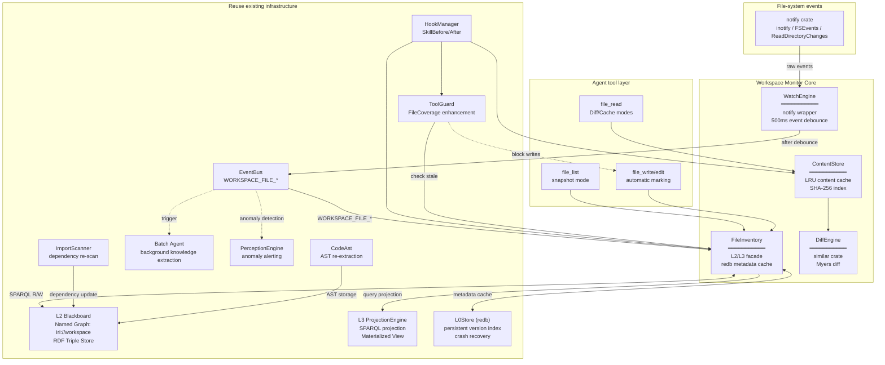
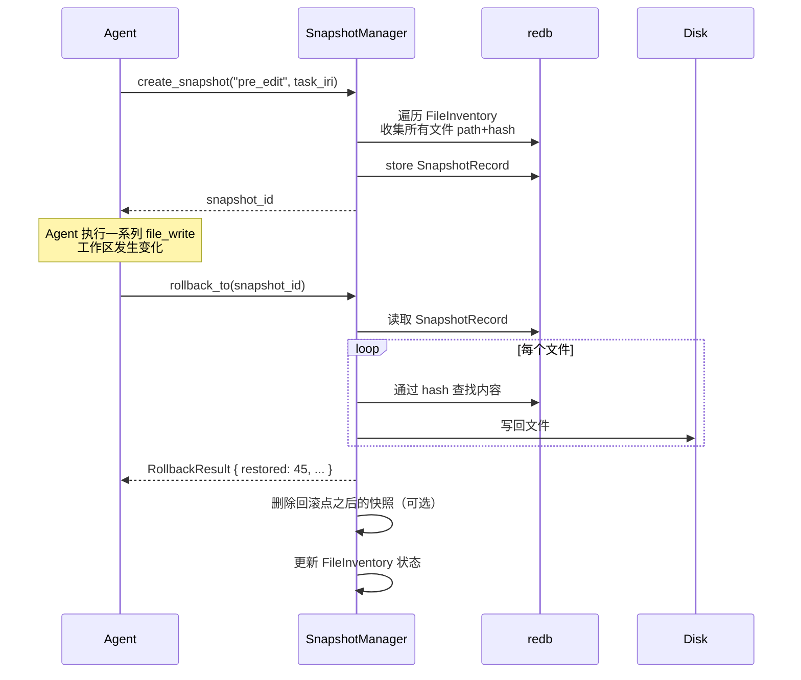
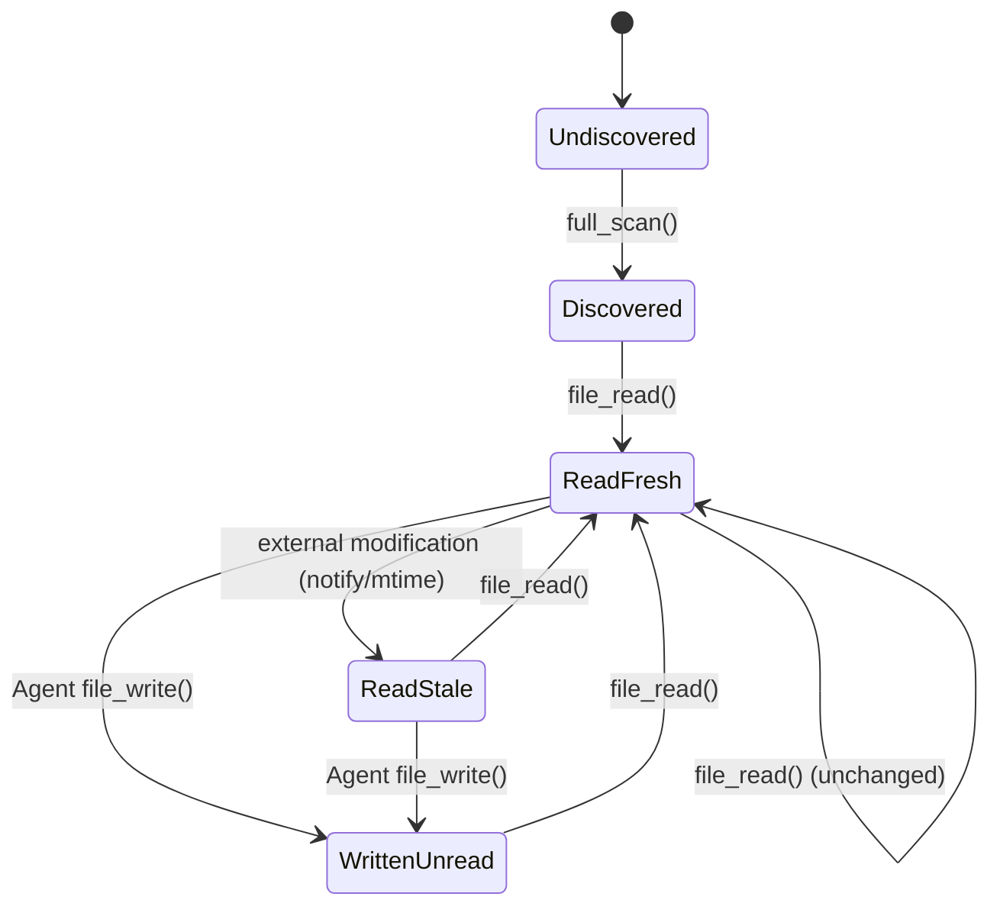
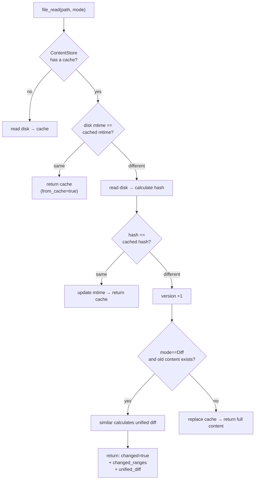

# 12. Workspace File-System Monitoring and Content Management

> *For the Chinese translation, see [12_workspace-filesystem-monitor.zh.md](12_workspace-filesystem-monitor.zh.md).*

## 12.1 Background

### Current pain points

wildcode currently has the following problems with file-system operations:

1. **Repeated reads**: Agents repeatedly `file_read` the same file without knowing which files they have already read.
2. **Blind ls**: Agents repeatedly use `file_list` to explore the directory structure because there is no workspace snapshot.
3. **Change unawareness**: Agents do not know whether a file was modified between two reads (the previous read versus its current state).
4. **Full rereads**: Even when only a few lines change, the entire file must be reread; no diff capability exists.
5. **Undiscovered files**: Agents do not know which files in the workspace have not yet been discovered or read.
6. **Stateless context**: All file-state knowledge in the LLM context window relies entirely on the LLM's own memory.

### Existing reusable infrastructure

| System | File | Reusable capability |
|------|------|-----------|
| **redb** | Already depends on `redb = "4.1"` | Embedded KV database and ACID transactions for persistent file metadata and version indexes |
| **walkdir** | Already depends on `walkdir = "2.4"` | Efficient recursive directory traversal |
| **sha2** | Already depends on `sha2 = "0.10"` | SHA-256 content hashing |
| **Oxigraph / L2** | `src/memory/l2_blackboard.rs` | RDF Triple Store + SPARQL 1.1 + Named Graph isolation |
| **L3 Projection** | `src/memory/l3_projection.rs` | SPARQL projection + Materialized View + token-budget control |
| **EventBus** | `src/core/event_bus.rs` | O(1) bitmap routing + broadcast channel + spawn_consumer |
| **HookManager** | `src/tools/hooks.rs` | 18 HookPoints and SkillBefore/After tool interception |
| **ToolGuard** | `src/tools/tool_guard.rs` | FileCoverage line-range tracking + Pre/Post validation hooks |
| **ImportScanner** | `src/tools/import_scanner.rs` | Import parsing for 6 languages (Rust/TS/JS/Py/Go/Java/C) |
| **CodeAst** | `src/knowledge_graph/code_ast.rs` | tree-sitter AST + content-hash cache + `file:` IRI mapping |
| **PerceptionEngine** | `src/perception/proactive_engine.rs` | 10 triggers + anomaly deduplication + EventBus consumption |
| **Batch Agent** | `src/batch/manager.rs` | Background knowledge extraction + entity/relation detection + self-evolution |
| **L0Store** | `src/memory/l0_store.rs` | Persistent storage + MESI state + prefix scan |
| **MCP Client** | `src/tools/mcp_client.rs` | External tool discovery (can pass file state through to MCP tools) |

**Already included among existing dependencies**: `redb`, `walkdir`, `sha2`.
**Must be added**: `notify`, `notify-debouncer-mini`, `similar`, `lru`.
**gix is not needed**: see the analysis in section 12.3.4 below.

---

## 12.2 Improvements to Existing Systems

### 12.2.1 Qualitative change in perception

The current system depends on Agents **actively querying** (`glob_search`, `grep_search`, `file_list`). The file-monitoring system can **push passively**:

| Dimension | Current (active polling) | New system (passive push) |
|------|-----------------|-------------------|
| Timeliness | Agent must repeatedly inspect with file_list | notify event-driven, millisecond-level awareness |
| Completeness | Only knows listed files; blind spots remain | `full_scan()` builds a complete inventory; every file has state |
| Context refresh | Agent must decide whether to reread | Change event → L2 marks stale → L3 projection automatically reflects the latest state |
| Blind-spot elimination | Files exist on disk but are unknown to the Agent | FileInventory records every file with `discovered_unread` state |

### 12.2.2 More precise context management

| Capability | Mechanism |
|------|------|
| **Read/unread state** | `ws:state` on the L2 Node: `read_fresh` / `read_stale` / `discovered_unread` / `written_unread` |
| **Staleness detection** | `ws:lastReadVersion < ws:currentVersion` → prompts the Agent: “File X has changed; reread it?” |
| **Diff reads** | ContentStore caches the old version + DiffEngine generates a unified diff → returns only changed lines |
| **Version binding** | Each read records a version number; context references can be traced to a specific version |

### 12.2.3 Tool-execution efficiency and safety

| Enhancement | Implementation |
|------|------|
| **ToolGuard hard block** | Agent attempts to `file_edit` a `read_stale` file → HookManager SkillBefore returns Abort |
| **ImportScanner automatic refresh** | File change → automatically re-scan imports → update `ws:dependsOn` relations in L2 |
| **Dependency-graph awareness** | `ws:importedBy` / `ws:dependsOn` relations between files in L2 → changing one file prompts review of related files |
| **file_read intelligent modes** | `ReadMode::Diff` returns an increment when a file changes; `ReadMode::Full` is for initial reads or invalid caches |

### 12.2.4 Background organization and self-evolution

| Enhancement | Implementation |
|------|------|
| **Batch Agent trigger** | `WORKSPACE_FILE_MODIFIED` event → triggers knowledge extraction / memory compression |
| **Experience learning** | Statistics for frequently read/modified files → feedback to Prompt templates / Skill Graph |
| **Automatic AST re-extraction** | File change → CodeAst re-parses → updates code entities in the Knowledge Graph |

---

## 12.3 Overall architecture


```mermaid
flowchart TB
    subgraph FS["File-system events"]
        NOTIFY["notify crate<br/>inotify / FSEvents / ReadDirectoryChanges"]
    end

    subgraph CORE["Workspace Monitor Core"]
        WE["WatchEngine<br/>━━━━━━━━━━━<br/>notify wrapper<br/>500ms event debounce"]
        FI["FileInventory<br/>━━━━━━━━━━━<br/>L2/L3 facade<br/>redb metadata cache"]
        CS["ContentStore<br/>━━━━━━━━━━━<br/>LRU content cache<br/>SHA-256 index"]
        DE["DiffEngine<br/>━━━━━━━━━━━<br/>similar crate<br/>Myers diff"]
    end

    subgraph EXISTING["Reuse existing infrastructure"]
        EB["EventBus<br/>WORKSPACE_FILE_*"]
        L2["L2 Blackboard<br/>Named Graph: iri://workspace<br/>RDF Triple Store"]
        L3["L3 ProjectionEngine<br/>SPARQL projection<br/>Materialized View"]
        L0["L0Store (redb)<br/>persistent version index<br/>crash recovery"]
        HM["HookManager<br/>SkillBefore/After"]
        TG["ToolGuard<br/>FileCoverage enhancement"]
        IS["ImportScanner<br/>dependency re-scan"]
        BA["Batch Agent<br/>background knowledge extraction"]
        PE["PerceptionEngine<br/>anomaly alerting"]
        CA["CodeAst<br/>AST re-extraction"]
    end

    subgraph AGENT["Agent tool layer"]
        FR["file_read<br/>Diff/Cache modes"]
        FL["file_list<br/>snapshot mode"]
        FW["file_write/edit<br/>automatic marking"]
    end

    NOTIFY -->|raw events| WE
    WE -->|after debounce| EB
    EB -->|WORKSPACE_FILE_*| FI
    EB -.->|trigger| BA
    EB -.->|anomaly detection| PE

    FI <-->|SPARQL R/W| L2
    FI -->|query projection| L3
    FI <-->|metadata cache| L0

    HM --> FI
    HM --> TG
    HM --> CS

    TG -->|check stale| FI
    TG -.->|block writes| FW
    IS -->|dependency update| L2
    CA -->|AST storage| L2

    FR --> CS --> DE
    FL --> FI
    FW --> FI
```

---

## 12.4 Core design

### 12.4.1 Storage architecture — two-layer model

**Design principle**: file **metadata** goes through L2 + redb; file **content** goes through ContentStore. Do not mix them.

```
Query paths:
  Agent file_list → FileInventory → redb (hot cache) → L2 SPARQL
  Agent file_read → ContentStore → LRU in-memory cache → disk
  L3 projection query → L2 SPARQL → MaterializedView

Write paths:
  notify event → EventBus → FileInventory → redb + L2 SPARQL UPDATE
  Agent file_write → HookManager → ContentStore.invalidate() + FileInventory.mark_written()
```

#### Why not gix? — rollback-capability analysis

| Comparison | gix | redb + SnapshotManager | Assessment |
|----------|-----|----------------------|------|
| Compile time | ~60s | 0s (already compiled) | redb wins |
| Binary size | +~2MB | 0 (already included) | redb wins |
| Single-file version storage | blob + tree | redb key: `version:{hash}` → content | Equivalent |
| **Workspace snapshot** | commit (consistent snapshot of all files) | Store `SnapshotRecord { path→hash map }` in redb | Equivalent |
| **Workspace rollback** | checkout commit | Traverse snapshot → write back each file | Equivalent |
| Diff | git diff | similar crate (lighter) | redb is lighter |
| Branches/merges | ✅ | ❌ Not needed | Not needed by Agents |
| Incremental commits | ✅ (automatic) | ✅ (only changed files update the snapshot) | Equivalent |

**Rollback implementation** (redb approach):

```rust
/// 工作区快照管理器
pub struct SnapshotManager {
    db: Arc<redb::Database>,
}

#[derive(Debug, Clone, Serialize, Deserialize)]
pub struct WorkspaceSnapshot {
    pub snapshot_id: String,
    pub created_at: i64,
    pub reason: String,         // "task_start", "pre_edit", "manual"
    pub task_iri: Option<String>,
    /// 文件路径 → 内容 hash
    pub files: Vec<SnapshotFileEntry>,
}

pub struct SnapshotFileEntry {
    pub path: String,
    pub hash: String,
    pub size: u64,
}

impl SnapshotManager {
    /// 创建当前工作区的完整快照
    pub fn create_snapshot(&self, reason: &str, task_iri: Option<&str>) -> Result<String>;

    /// 回滚整个工作区到指定快照
    /// 1. 遍历 snapshot.files
    /// 2. 对每个文件，从 redb 中通过 hash 查找内容
    /// 3. 写回磁盘
    pub fn rollback_to(&self, snapshot_id: &str) -> Result<RollbackResult>;

    /// 回滚单个文件到指定版本
    pub fn restore_file(&self, path: &str, hash: &str) -> Result<()>;

    /// 列出可用快照
    pub fn list_snapshots(&self, limit: usize) -> Vec<WorkspaceSnapshot>;
}

pub struct RollbackResult {
    pub snapshot_id: String,
    pub files_restored: usize,
    pub files_created: usize,
    pub files_deleted: usize,      // 在 snapshot 之后新增的文件
    pub failed: Vec<String>,
}
```

**Rollback flow**:


```mermaid
sequenceDiagram
    participant Agent
    participant SM as SnapshotManager
    participant redb
    participant Disk

    Agent->>SM: create_snapshot("pre_edit", task_iri)
    SM->>redb: 遍历 FileInventory<br/>收集所有文件 path+hash
    SM->>redb: store SnapshotRecord
    SM-->>Agent: snapshot_id

    Note over Agent: Agent 执行一系列 file_write<br/>工作区发生变化

    Agent->>SM: rollback_to(snapshot_id)
    SM->>redb: 读取 SnapshotRecord
    loop 每个文件
        SM->>redb: 通过 hash 查找内容
        SM->>Disk: 写回文件
    end
    SM-->>Agent: RollbackResult { restored: 45, ... }

    SM->>SM: 删除回滚点之后的快照（可选）
    SM->>SM: 更新 FileInventory 状态
```

**Conclusion**: redb + SnapshotManager supports workspace-level snapshots and rollback without Git's DAG model. The Agent scenario does not need branches, merges, tags, or remote synchronization; a simple timeline of snapshots is sufficient. The key implementation is about 150 lines of code.

### 12.4.2 FileInventory — L2/L3 facade

**Design principle**: FileInventory is a thin facade. The primary data store is L2 (RDF Triple Store), with redb as the hot cache.

#### RDF data model (L2 Named Graph: `iri://workspace`)

```jsonld
{
  "@context": {
    "ws": "https://wildagentos.org/ontology/workspace#",
    "rdf": "http://www.w3.org/1999/02/22-rdf-syntax-ns#"
  },
  "@id": "iri://workspace/file/src/main.rs",
  "@type": ["ws:File"],
  "ws:filePath": "src/main.rs",
  "ws:fileSize": 12345,
  "ws:fileExt": "rs",
  "ws:language": "rust",
  "ws:mtime": 1718540000000,
  "ws:contentHash": "sha256:abc123...",
  "ws:state": "read_fresh",
  "ws:lastReadAt": 1718540010000,
  "ws:lastReadVersion": 3,
  "ws:currentVersion": 3,
  "ws:readCount": 5,
  "ws:parentDir": "iri://workspace/dir/src/",
  "ws:imports": ["iri://workspace/file/src/lib.rs"],
  "ws:importedBy": ["iri://workspace/file/src/app.rs"]
}
```

#### FileState state machine


```mermaid
stateDiagram-v2
    [*] --> Undiscovered
    Undiscovered --> Discovered: full_scan()
    Discovered --> ReadFresh: file_read()
    ReadFresh --> ReadStale: external modification (notify/mtime)
    ReadFresh --> ReadFresh: file_read() (unchanged)
    ReadStale --> ReadFresh: file_read()
    ReadFresh --> WrittenUnread: Agent file_write()
    WrittenUnread --> ReadFresh: file_read()
    ReadStale --> WrittenUnread: Agent file_write()
```

#### SPARQL operation examples

```sparql
-- List all files and their state under a directory
PREFIX ws: <https://wildagentos.org/ontology/workspace#>
SELECT ?path ?size ?state ?lastRead ?lang
WHERE {
  GRAPH <iri://workspace> {
    ?file a ws:File ;
          ws:filePath ?path ;
          ws:state ?state .
    OPTIONAL { ?file ws:fileSize ?size }
    OPTIONAL { ?file ws:lastReadAt ?lastRead }
    OPTIONAL { ?file ws:language ?lang }
    FILTER(STRSTARTS(?path, "src/"))
  }
} ORDER BY ?path

-- Query a file's dependency relations
PREFIX ws: <https://wildagentos.org/ontology/workspace#>
SELECT ?importedBy ?importedByState
WHERE {
  GRAPH <iri://workspace> {
    <iri://workspace/file/src/lib.rs> ws:importedBy ?importedBy .
    ?importedBy ws:state ?importedByState .
  }
}

-- Count the distribution of file states
PREFIX ws: <https://wildagentos.org/ontology/workspace#>
SELECT ?state (COUNT(?file) as ?count) (SUM(?size) as ?totalBytes)
WHERE {
  GRAPH <iri://workspace> {
    ?file a ws:File ; ws:state ?state ; ws:fileSize ?size .
  }
} GROUP BY ?state
```

#### L3 predefined projection frames

```rust
// 在 ProjectionEngine 中新增的帧
fn load_workspace_frames() -> Vec<ProjectionFrame> {
    vec![
        // 帧 1: 目录列表
        ProjectionFrame {
            name: "workspace_dir_list".into(),
            target_role: "Do,Plan".into(),
            sparql_template: Some(/* SPARQL 如上 */),
            max_nodes: 200,
            max_size: 4096,
            ..
        },
        // 帧 2: 状态总览
        ProjectionFrame {
            name: "workspace_state_summary".into(),
            target_role: "All".into(),
            sparql_template: Some(/* 聚合查询 */),
            max_nodes: 10,
            max_size: 2048,
            ..
        },
        // 帧 3: 过期文件列表
        ProjectionFrame {
            name: "workspace_stale_files".into(),
            target_role: "Do".into(),
            sparql_template: Some(/* FILTER state IN (read_stale, ...)  */),
            max_nodes: 20,
            max_size: 4096,
            ..
        },
        // 帧 4: 依赖图（受影响的文件）
        ProjectionFrame {
            name: "workspace_affected_files".into(),
            target_role: "Do,Check".into(),
            sparql_template: Some(/* 变更文件的 importedBy 闭包 */),
            max_nodes: 50,
            max_size: 8192,
            ..
        },
    ]
}
```

### 12.4.3 ContentStore — content cache and diffs

**Design principle**: Independent from L2 (content is too large for RDF); use an LRU in-memory cache + persistent redb disk storage.

```rust
pub struct ContentStore {
    /// 内存 LRU 缓存（文件路径 → 行数组）
    lines_cache: LruCache<String, CachedContent>,
    /// 文件路径 → 当前版本号
    version_index: HashMap<String, u64>,
    /// redb 持久化存储（用于历史版本内容）
    version_store: Option<redb::Database>,
    /// 缓存大小限制
    max_cache_bytes: usize,
    current_cache_bytes: usize,
}

struct CachedContent {
    lines: Vec<String>,
    hash: String,
    mtime: i64,
    version: u64,
}

pub enum ReadMode {
    /// 全量读取（首次或强制刷新）
    Full,
    /// 差分模式：文件变化时返回 unified diff
    Diff,
    /// 强制重读（忽略所有缓存）
    ForceRefresh,
}

pub struct ReadResult {
    pub path: String,
    pub lines: Vec<String>,
    pub total_lines: usize,
    pub changed: bool,
    pub changed_ranges: Option<Vec<(usize, usize)>>,
    pub unified_diff: Option<String>,
    pub from_cache: bool,
    pub version: u64,
}
```

**Change-detection algorithm**:


```mermaid
flowchart TD
    Start["file_read(path, mode)"] --> InCache{"ContentStore<br/>has a cache?"}
    InCache -->|no| ReadDisk["read disk → cache"]
    InCache -->|yes| CheckMtime{"disk mtime ==<br/>cached mtime?"}
    CheckMtime -->|same| Hit["return cache<br/>(from_cache=true)"]
    CheckMtime -->|different| ReadNew["read disk → calculate hash"]
    ReadNew --> CheckHash{"hash ==<br/>cached hash?"}
    CheckHash -->|same| UpdateMtime["update mtime → return cache"]
    CheckHash -->|different| BumpVer["version +1"]
    BumpVer --> CheckMode{"mode==Diff<br/>and old content exists?"}
    CheckMode -->|yes| CalcDiff["similar calculates unified diff"]
    CheckMode -->|no| FullReturn["replace cache → return full content"]
    CalcDiff --> DiffReturn["return: changed=true<br/>+ changed_ranges<br/>+ unified_diff"]
```

### 12.4.4 DiffEngine — diff engine

Based on the `similar` crate (a pure Rust Myers algorithm, cross-platform):

```rust
pub struct DiffEngine;

impl DiffEngine {
    /// 计算 unified diff（返回人类可读的差异文本）
    pub fn unified_diff(
        old_lines: &[String],
        new_lines: &[String],
        file_path: &str,
        old_version: u64,
        new_version: u64,
    ) -> String;

    /// 计算变更行范围（返回变更的行号区间）
    pub fn changed_ranges(
        old_lines: &[String],
        new_lines: &[String],
    ) -> Vec<(usize, usize)>;
}
```

### 12.4.5 WatchEngine — file-system monitoring

A thin wrapper around `notify` (Linux inotify / macOS FSEvents / Windows ReadDirectoryChangesW); events are broadcast through EventBus:

```rust
pub struct WatchEngine {
    /// notify debouncer（500ms 窗口合并）
    debouncer: notify_debouncer_mini::Debouncer<notify::INotifyWatcher>,
    /// 降级轮询 abort handle
    polling_handle: Option<tokio::task::AbortHandle>,
}

impl WatchEngine {
    pub async fn start(
        config: &WorkspaceMonitorConfig,
        event_bus: Arc<EventBus>,
    ) -> Result<Self, Error>;
}
```

**Event → EventType mapping**:

| notify EventKind | EventBus EventType |
|-----------------|-------------------|
| `Create(_)` | `WorkspaceFileCreated` |
| `Modify(_)` | `WorkspaceFileModified` |
| `Remove(_)` | `WorkspaceFileRemoved` |
| Full scan complete | `WorkspaceScanCompleted` |
| A read discovers staleness | `WorkspaceFileStale` |

**Fallback strategy**: When notify is unavailable (containers/restricted environments), automatically fall back to polling mode (scan workspace mtime every 5 seconds by default).

**Debounce configuration**:
- Time window: 500ms (coalesces rapid consecutive writes)
- Maximum wait: 5s (prevents indefinite postponement)
- Excluded directories: `node_modules/`, `target/`, `.git/`, `dist/`, `build/`, `__pycache__/`

---

## 12.5 Integration with existing systems

### 12.5.1 EventBus integration

```rust
// WatchEngine 启动时注册的消费者
event_bus.spawn_consumer(
    vec![
        "WORKSPACE_FILE_CREATED".to_string(),
        "WORKSPACE_FILE_MODIFIED".to_string(),
        "WORKSPACE_FILE_REMOVED".to_string(),
    ],
    move |event: Event| {
        let inv = inventory.clone();
        let cs = content_store.clone();
        async move {
            let payload: Value = serde_json::from_str(&event.payload).unwrap_or_default();
            let path = payload["path"].as_str().unwrap_or("");
            match event.event_type.as_str() {
                "WORKSPACE_FILE_CREATED" => inv.add_or_update(path).await,
                "WORKSPACE_FILE_MODIFIED" => {
                    inv.mark_stale(path).await;
                    cs.invalidate(path);
                    // 🆕 触发 ImportScanner 重新扫描
                    trigger_import_rescan(path);
                    // 🆕 触发 CodeAst 重新提取
                    trigger_ast_reextract(path);
                }
                "WORKSPACE_FILE_REMOVED" => {
                    inv.remove(path).await;
                    cs.invalidate(path);
                }
                _ => {}
            }
        }
    },
);
```

### 12.5.2 HookManager integration

WorkspaceMonitor registers three hooks with HookManager, running alongside ToolGuard:

| Hook | HookPoint | Priority | Purpose |
|------|-----------|--------|------|
| `workspace::file_awareness` | SkillBefore | 85 | Inject a workspace-state snapshot into skill metadata |
| `workspace::file_read_tracker` | SkillAfter | 85 | Update ContentStore cache + mark the FileInventory entry as read |
| `workspace::file_write_invalidator` | SkillAfter | 85 | Mark files as `written_unread` after file_write/edit/bash |

### 12.5.3 ToolGuard enhancement — pre-write check

```rust
// 在 ToolGuard 的 SkillBefore hook 中新增
fn check_stale_write(ctx: &HookContext) -> HookResult {
    let tool_name = ctx.data.get("tool_name")
        .and_then(|v| v.as_str()).unwrap_or("");
    if !matches!(tool_name, "file_write" | "file_edit") {
        return HookResult::Continue;
    }

    let path = ctx.data.get("path").and_then(|v| v.as_str()).unwrap_or("");
    if let Some(monitor) = WORKSPACE_MONITOR.get() {
        let inv = monitor.inventory();
        if let Some(entry) = inv.get_entry(path) {
            if entry.state == FileState::ReadStale {
                ctx.error = Some(format!(
                    "ToolGuard: 文件 '{}' 在外部被修改，请先 file_read(\"{}\") 获取最新内容后再编辑。",
                    path, path
                ));
                return HookResult::Abort;
            }
        }
    }
    HookResult::Continue
}
```

### 12.5.4 ImportScanner integration

Automatically trigger dependency re-scanning when files change, updating `ws:imports` / `ws:importedBy` relations in L2:

```rust
async fn trigger_import_rescan(path: &str) {
    if let Some(content) = ContentStore::try_get_cached(path) {
        let imports = scan_imports(path, &content);
        // 更新 L2 中该文件的 ws:imports 属性
        FileInventory::update_imports(path, &imports).await;
    }
}
```

### 12.5.5 Batch Agent trigger

File-change events can trigger background knowledge processing:

```rust
// Batch Agent 订阅 WORKSPACE_FILE_MODIFIED 事件
event_bus.spawn_consumer(
    vec!["WORKSPACE_FILE_MODIFIED".to_string()],
    move |event: Event| {
        // 当大量文件变更时，批量触发知识抽取/记忆压缩
        let count = recent_changes_count(60); // 最近 60 秒变更数
        if count > 10 {
            BatchManager::trigger_extraction("workspace_change_burst");
        }
    }
);
```

### 12.5.6 PerceptionEngine integration

The perception engine can subscribe to file-change events for anomaly detection:

```rust
// PerceptionEngine 订阅 WORKSPACE_FILE_MODIFIED
// 触发条件：外部大量修改文件（可能是不安全的自动化操作）
PerceptionTrigger::ResourceConflict → "检测到外部进程大量修改工作区文件"
```

---

## 12.6 Performance design

### 12.6.1 Memory budget

| Item | Estimate |
|----|------|
| redb hot cache (metadata) | ~5MB (10,000 files × 500 bytes/entry) |
| ContentStore LRU cache | Configurable; 64MB by default |
| L2 Oxigraph memory | About 50MB (already present; the new workspace graph is very small) |
| DiffEngine temporary buffer | < 4MB per operation |
| notify watcher overhead | < 1MB |
| **Total additional memory** | **< 75MB** |

### 12.6.2 Performance-critical paths

| Operation | Path | Expected latency |
|------|------|---------|
| file_read cache hit | LRU memory → return directly | < 0.1ms |
| file_read cache miss | Read disk + calculate hash + diff | 1–50ms (depends on file size) |
| file_list | redb hot cache | < 1ms |
| file_list fallback | L2 SPARQL query | 2–5ms |
| notify event → state update | EventBus → redb write + L2 SPARQL UPDATE | < 5ms |
| Full scan (10,000 files) | walkdir + redb batch write | < 3s (asynchronously in background) |
| ImportScanner re-scan | Read cache + regex parsing | < 10ms/file |

### 12.6.3 Preventing event storms

```
1. notify-debouncer coalesces in a 500ms window (primary defense)
2. .gitignore rules automatically exclude node_modules, target, .git, and similar paths
3. Five consecutive Modify events for the same file → fall back to a 2s cooldown window
4. Event rate exceeds 1000/s → automatically switch to polling mode (5s interval)
```

### 12.6.4 Cross-platform strategy

| Platform | Monitoring backend | Fallback |
|------|---------|------|
| Linux | inotify (kernel-level, zero overhead) | Polling (5s) |
| macOS | FSEvents (system-level) | Polling (5s) |
| Windows | ReadDirectoryChangesW | Polling (5s) |
| Container/restricted | Automatic detection → polling (5s) | — |

---

## 12.7 New dependencies

```toml
[dependencies]
# 文件系统监控（跨平台）
notify = "8"
notify-debouncer-mini = "0.6"

# 内容缓存（LRU 淘汰）
lru = "0.12"

# 文本差分（Myers 算法）
similar = "2"
```

**No additions needed:**
- `redb = "4.1"` — already a dependency
- `walkdir = "2.4"` — already a dependency
- `sha2 = "0.10"` — already a dependency
- `gix` — not needed (`redb` + L2 + `similar` cover every requirement)

---

## 12.8 File structure

```
src/
├── core/
│   └── event_bus.rs              # 🆕 EventType: WorkspaceFileCreated/Modified/Removed/ScanCompleted/Stale
├── tools/
│   ├── workspace_monitor/
│   │   ├── mod.rs                # WorkspaceMonitor 初始化 + 全局单例 + Hooks 注册
│   │   ├── inventory.rs          # FileInventory (L2/L3 facade + redb 热缓存)
│   │   ├── content_store.rs      # ContentStore (LRU 缓存 + SHA-256 + redb 版本)
│   │   ├── diff_engine.rs        # DiffEngine (similar crate 封装)
│   │   ├── snapshot.rs           # SnapshotManager (workspace 快照 + 回滚)
│   │   └── watch_engine.rs       # WatchEngine (notify → EventBus 封装)
│   ├── hooks.rs                  # 已存在，无需修改（通用框架）
│   ├── tool_guard.rs             # 🆕 增强：写入前 stale 检查 + FileCoverage → FileState 演进
│   ├── import_scanner.rs         # 🆕 增强：文件变更时自动重扫描
│   └── tool_executor/
│       └── builtins.rs           # 🆕 file_read (Diff/Cache) + file_list (快照) 增强
├── memory/
│   ├── l2_blackboard.rs          # 已存在，无需修改
│   └── l3_projection.rs          # 🆕 新增 workspace_* 投影帧
├── knowledge_graph/
│   └── code_ast.rs               # 🆕 增强：事件驱动的 AST 重提取
├── batch/
│   └── manager.rs                # 🆕 增强：WORKSPACE_FILE_MODIFIED 触发
└── perception/
    └── proactive_engine.rs       # 🆕 增强：ResourceConflict 触发检查
```

---

## 12.9 Summary of key design decisions

| Decision | Rationale |
|------|------|
| **Do not use gix** | redb + sha2 + similar cover version storage and diffs, with far less compile-time/binary overhead than gix |
| **Use L2 + redb for metadata** | L2 supplies SPARQL query capability; redb supplies a microsecond-scale hot cache |
| **Use a separate ContentStore for content** | File content is too large for RDF storage; an LRU in-memory cache is more efficient |
| **Do not use gix** | redb + sha2 + similar cover all versioning requirements and avoid a heavyweight dependency |
| **WatchEngine does not reuse mpsc** | Use EventBus broadcast directly so PerceptionEngine/Batch Agent can subscribe freely |
| **Hooks reuse HookManager** | Unified lifecycle with ToolGuard and unified AgentRunner management |
| **FileInventory is a facade** | It does not maintain an independent data structure; L2 + redb are the primary stores |
| **redb + sha2 + similar cover all versioning requirements and avoid a heavyweight dependency** | — |
| **WatchEngine does not reuse mpsc** | Use EventBus broadcast directly so PerceptionEngine/Batch Agent can subscribe freely |
| **Hooks reuse HookManager** | Unified lifecycle with ToolGuard and unified AgentRunner management |
| **FileInventory is a facade** | It does not maintain an independent data structure; L2 + redb are the primary stores |
| **redb only serves as a hot cache** | L2 is the authoritative source; redb is an acceleration layer (it can be rebuilt from L2 after a crash) |
