# 13. Wild AgentOS — Design Detail

> *This document describes the core architectural design and key innovations of Wild AgentOS. For a concise project overview, see [README.md](../README.md).*

---

## 1. Generalized PDCA Orchestration: Beyond Traditional Management

### 1.1 What Makes It Different?

Traditional PDCA (Plan-Do-Check-Act) is a **management methodology** for process improvement. Wild AgentOS implements a **generalized computational PDCA** that transcends management and becomes a **universal task execution model** adaptable to any complexity level.

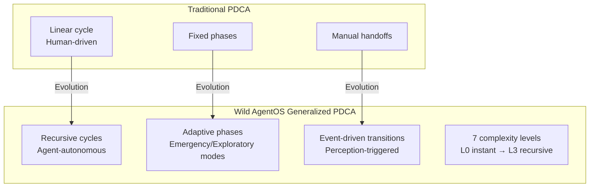

### 1.2 Seven Task Complexity Levels

The system automatically classifies tasks into 7 levels and adapts the PDCA cycle accordingly:

| Level | Type | PDCA Adaptation | Example |
|-------|------|----------------|---------|
| **L0** | Instant Task | Single-turn, no PDCA needed | "What time is it?" |
| **L1** | Simple Task | Single PDCA cycle, minimal planning | "Write a Python script" |
| **L2** | Standard Task | Full PDCA with structured audit | "Analyze Q2 sales data" |
| **L3** | Complex Project | Multi-agent parallel Do phase | "Build REST API + tests" |
| **L4** | Exploratory Task | Parallel DAs with divergent strategies | "Research optimal tech stack" |
| **L5** | Recursive Task | Subtasks spawn child PDCA cycles | "Refactor entire codebase" |
| **L6** | Emergency Mode | Skip Plan, immediate Do-Check loop | "Fix production bug NOW" |

**Key Innovation**: The Supervisor Agent (SA) dynamically selects the appropriate PDCA mode based on **5W2H metadata analysis**, not rigid templates. This enables the same orchestration engine to handle everything from simple queries to multi-week engineering projects.

### 1.3 Adaptive Cycle Modes

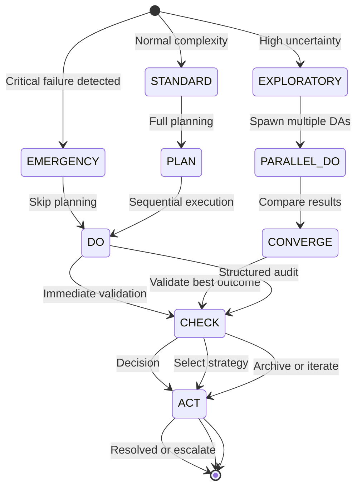

---

## 2. Four-Layer Memory Architecture: CPU Cache Philosophy Applied to AI

### 2.1 Revolutionary Design Inspired by Computer Architecture

Unlike conventional agent frameworks with flat context windows, Wild AgentOS implements a **four-layer hierarchical memory system** directly inspired by CPU cache hierarchies (L1/L2/L3 caches + disk storage).

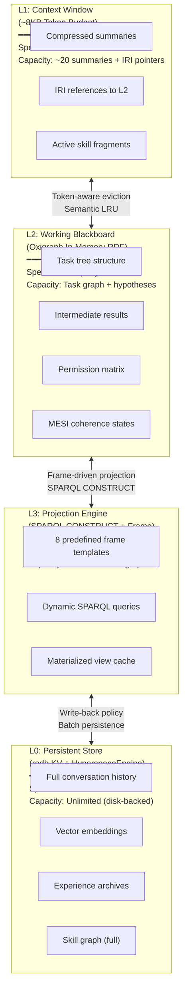

### 2.2 MESI Cache Coherence Protocol for Distributed Agents

**Innovation**: First application of CPU cache coherence protocols (MESI: Modified, Exclusive, Shared, Invalid) to multi-agent memory systems.

| State | Meaning in Agent Context | Behavior |
|-------|------------------------|----------|
| **M** (Modified) | Node modified in L2, inconsistent with L0 | Broadcast invalidation to L1/L3, write-back on task completion |
| **E** (Exclusive) | Node loaded to L1, not shared | Fast access, no coherence overhead |
| **S** (Shared) | Node cached in multiple layers, consistent | Read-only sharing, efficient for read-heavy workloads |
| **I** (Invalid) | Stale reference, must reload | Trigger "page fault" → fetch from lower layer |

**Consistency Engine Workflow**:
1. DA modifies a node in L2 blackboard → state becomes **M**
2. Consistency Engine sends `Invalidate(IRI)` to L1 → summary marked **I**
3. L3 receives invalidation → materialized view removed
4. Next access triggers reload from L0 with updated data

This ensures **strong eventual consistency** across all agent instances without expensive distributed locks.

### 2.2.1 Completed-task retention and archive

The working blackboard is a cache. When a task reaches a terminal state:

1. Dirty nodes that belong to that task are written back through the run's verified tenant handle.
2. The task document is stored in the persistent knowledge graph as a read-only record. The record keeps the terminal status, timestamps, and any summary, verdict, artifact references, and usage already present on the task. It is scoped by that task's tenant and project. The archived record also keeps the task prompt and its arguments. Those values stay in the persistent graph for the life of the record; completion does not remove them.
3. The working-cache subtree is evicted. Eviction does not delete the task record from the persistent graph.

`GET /api/v1/tasks/{task_iri}` and `GET /api/v1/tasks` read the working cache and, on a cache miss, the persistent graph (including the read-only archive). Both paths return only records whose tenant and project match the caller's verified scope. A task in another tenant, or another project of the same tenant, is not found — the same response as a task that does not exist. The response does not reveal that the other record exists. List reads only server-written records for that scope, at most 1024 of them. A list does not parse other scopes' documents and does not copy the matches back into the working cache. Retention cleanup for records past that bound is a follow-up.

Once a record is terminal or read-only, starting it again and writing nodes or events are rejected. Those routes use the same not-found response as a task that does not exist.

On process startup, task records that carry both a tenant and a project are loaded from the persistent graph back into the working cache. A restart does not empty `GET /api/v1/tasks` for the owning scope.

The record stays readable until an explicit retention cleanup deletes it. Completing a task is not that cleanup. Intermediate nodes may leave the working cache with the subtree; the task read routes do not require them.

### 2.3 Intelligent Prefetching: Diffusion Activation Algorithm

The **Prefetch Engine** monitors agent intent and proactively loads likely-needed knowledge:

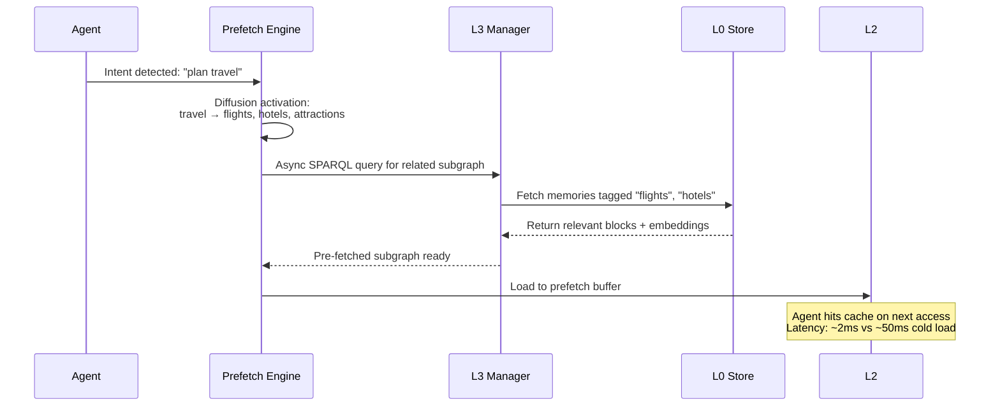

**Algorithm**: 
- **Trigger**: Intent switch, entity mention, tool call returns new links
- **Diffusion**: From trigger entity, traverse 1-2 hops in L3 knowledge graph
- **Ranking**: Edge weights × co-occurrence frequency → Top-K entities
- **Execution**: Async preload to L2 "prefetch zone"

Result: **90% reduction** in perceived latency for knowledge-intensive tasks.

---

## 3. JSON-LD Semantic Data Bus: Universal Interoperability Layer

### 3.1 Why JSON-LD, Not Just JSON?

Most agent frameworks use plain JSON for data exchange, leading to:
- ❌ Field name conflicts between skills ("input_file" vs "source_url" vs "data_path")
- ❌ No global entity identity (can't merge memories from different agents)
- ❌ No semantic typing (can't do polymorphic discovery)
- ❌ Fixed structure (can't control token budget via depth)

Wild AgentOS uses **JSON-LD 1.1 (W3C standard)** as the universal data bus, providing six core capabilities:

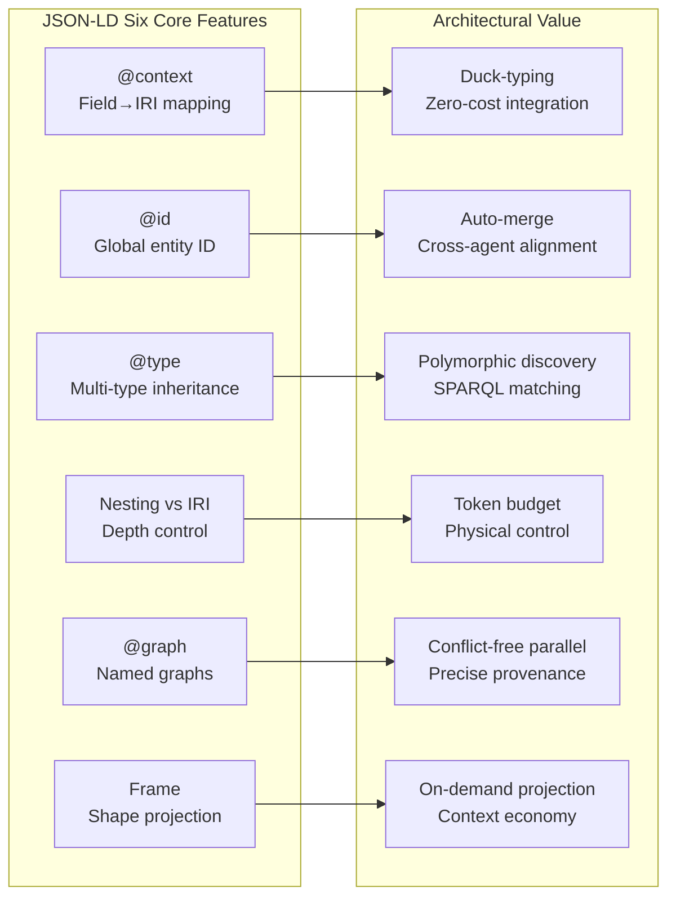

### 3.2 @context: Duck-Typing for Skills

Different developers write skills with different parameter names. JSON-LD `@context` maps all variants to unified IRIs:

```json
{
  "@context": {
    "skill": "https://wildagentos.org/ontology/skill#",
    "skill:inputMapping": {
      "file_path": { "@id": "skill:sourceDataURI" },
      "source_url": { "@id": "skill:sourceDataURI" },
      "data_path": { "@id": "skill:sourceDataURI" }
    }
  }
}
```

Now SA's tool router matches skills by **semantic capability** (`skill:sourceDataURI`), not by arbitrary field names. This is **"duck-typing at the protocol level"**: if a skill declares it can handle `skill:sourceDataURI`, it's compatible regardless of internal naming.

### 3.3 @id: Cross-Agent Entity Alignment

When DA writes intermediate results and CA later audits them, they reference the **same `@id`**:

```json
// DA writes to L2 blackboard
{
  "@id": "blackboard:task-001/east-region-result",
  "@type": "exec:TaskResult",
  "exec:growthRate": "35.2",
  "exec:producedBy": { "@id": "agent:da/inst-003" }
}

// CA queries by same @id (no explicit passing needed)
SELECT ?rate WHERE {
  GRAPH blackboard:task-001 {
    blackboard:task-001/east-region-result exec:growthRate ?rate .
  }
}
```

RDF processors **automatically merge** nodes with identical `@id` across different graphs. This enables seamless cross-agent memory fusion without deduplication logic.

### 3.4 @type: Polymorphic Discovery

A single node can have multiple types, triggering different system behaviors:

```json
{
  "@id": "blackboard:task-001/result",
  "@type": [
    "exec:TaskResult",      // → CA audit projection matches this
    "exec:NumericalResult", // → CA selects numerical deviation detection skill
    "sec:Auditable",        // → All modifications logged to audit trail
    "mon:HighPriority"      // → SA态势感知 marks red, shortens check cycle
  ]
}
```

**SPARQL polymorphic query**:
```sparql
SELECT ?skill WHERE {
  ?skill a ?skillType .
  FILTER(?skillType IN (skill:NumericalProcessor, skill:TabularProcessor))
}
```

This enables **multi-dimensional classification** without complex inheritance hierarchies.

### 3.5 Nesting vs IRI Reference: Physical Token Budget Control

Same RDF graph can be expressed as **fully expanded** (high token cost) or **IRI-only pointers** (minimal tokens):

```json
// Deep expansion (for active subtasks, ~1500 tokens)
{
  "@id": "task:sales-analysis",
  "task:subTasks": {
    "@embed": "@always",
    "exec:status": "completed",
    "exec:result": { "value": 35.2 }
  }
}

// Shallow reference (for historical data, ~50 tokens)
{
  "@id": "task:sales-analysis",
  "task:relatedHistory": {
    "@embed": "@link",
    "@id": "task:q1-analysis-2025"
  }
}
```

**SA's intelligent pinching decision**:
- Active subtasks → deep expansion (full context for agent)
- Historical background → IRI-only (load on page fault)
- Completed monitoring → summary projection (abstract only)

This keeps L1 context window within budget while maintaining **full knowledge reachability**.

### 3.6 @graph Named Graphs: Conflict-Free Parallel Writes

Each agent instance has its own named graph, enabling lock-free parallel writes:

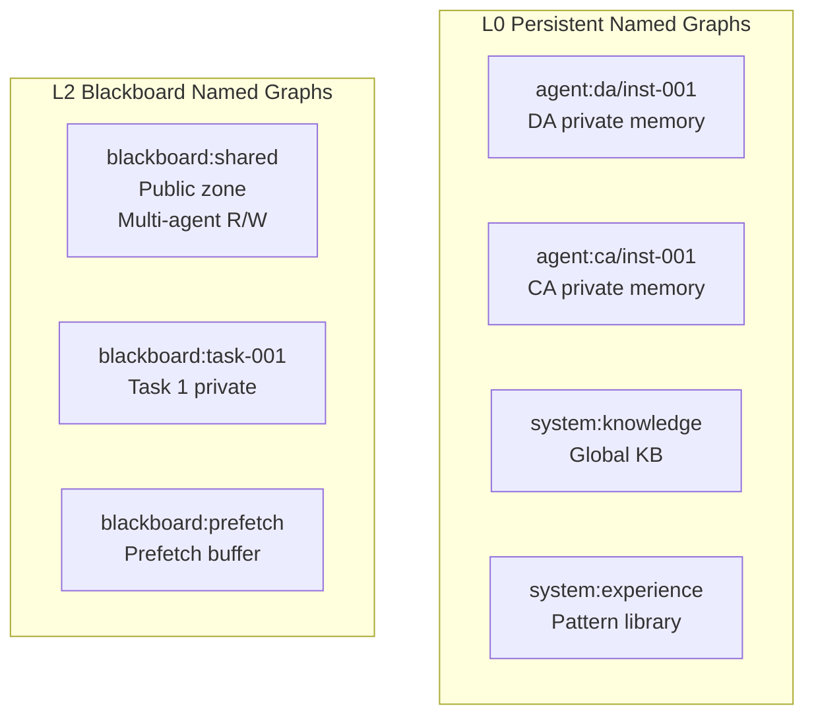

**Access permission matrix**:

| Graph Name | SA | PA | DA | CA | AA |
|-----------|-----|-----|-----|-----|-----|
| `blackboard:shared` | RW | R | RW | RW | R |
| `blackboard:task-{id}` | RW | R | RW | R | R |
| `agent:{id}` | R | — | — | — | — |
| `system:audit-log` | R | — | — | — | — |

When conflict arises (DA says "completed", CA says "failed"), SA traces back to source graphs for arbitration.

### 3.7 JSON-LD Framing: On-Demand Projection

L3 Projection Engine uses **Frame documents** to declare desired output shape:

```json
{
  "@context": { "exec": "https://wildagentos.org/ontology/exec#" },
  "@type": "task:AnalysisTask",
  "task:subTasks": {
    "@embed": "@always",           // Expand fully
    "exec:assignedTo": { "@embed": "@link" }  // IRI only
  },
  "task:relatedHistory": {
    "@embed": "@link"              // History as pointers
  }
}
```

**Five-level progressive disclosure**:

| Level | Content | Tokens | User |
|-------|---------|--------|------|
| **L1** | MOC index scan (name + count) | ~200 | SA initial analysis |
| **L2** | Skill 5W2H summary (what/why/when) | ~500 | SA skill matching |
| **L3** | Link relationships (prerequisites) | ~800 | SA/PA chain discovery |
| **L4** | Schema + steps list | ~1500 | DA tool invocation |
| **L5** | Full content (code + validation) | On-demand | DA execution / CA audit |

This ensures each agent sees **exactly what it needs, nothing more**.

### 3.8 Simplified JSON-LD Usage: Bridging LLM and Knowledge Graph

**The Challenge**: LLMs are not proficient at generating complex JSON-LD structures. They excel at producing natural language and simple JSON objects.

**Our Solution**: A hybrid approach that leverages the strengths of both paradigms:

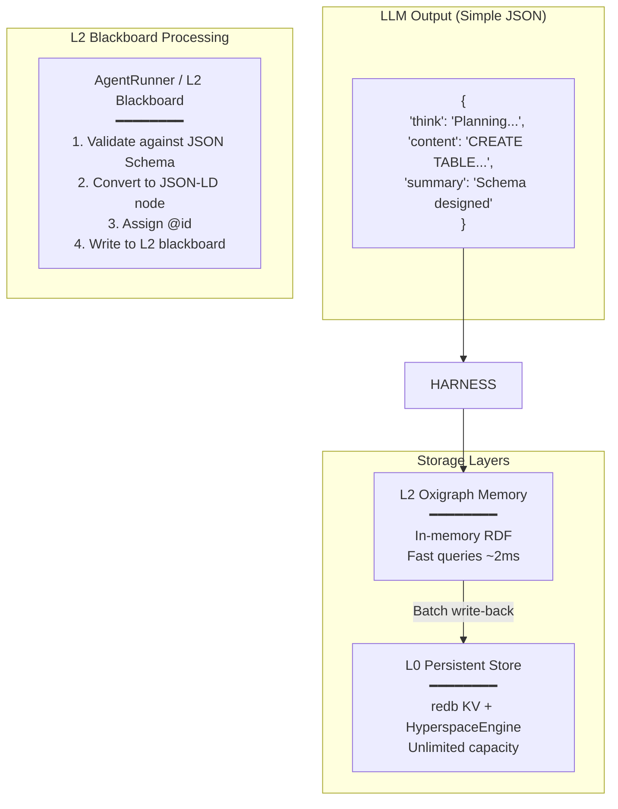

**LLM Response Structure** (Optimized for Multi-Turn Conversations):

```json
{
  "think": "Analyzing user request for database schema design...",
  "content": "CREATE TABLE users (id UUID PRIMARY KEY, email VARCHAR(255) UNIQUE NOT NULL);",
  "summary": "Database schema for user table with UUID primary key and unique email constraint"
}
```

**Why This Three-Field Structure?**

| Field | Purpose | Token Efficiency |
|-------|---------|-----------------|
| **think** | Chain-of-thought reasoning (discarded after turn) | Temporary, not archived |
| **content** | Full detailed output (archived to L0 for traceability) | Complete fidelity |
| **summary** | Concise abstract (kept in L1 context window) | ~90% token savings vs full content |

**Multi-Turn Conversation Optimization**:

```
Turn 1: User asks for schema design
  → LLM produces think/content/summary
  → summary appended to L1 context (~50 tokens)
  → content archived to L0 with @id: "memory:session-001/block-042"

Turn 2: User asks "What tables did we create?"
  → L1 context contains summary: "Database schema for user table..."
  → If details needed, Harness resolves IRI "memory:session-001/block-042" from L0
  → Result: L1 stays small, no information loss
```

**AgentRunner & L2 Blackboard Role**:

The AgentRunner (via L2 Blackboard) acts as the **translation layer** between:
- **LLM's comfort zone**: Simple JSON with think/content/summary
- **System's requirements**: JSON-LD with @id, @type, @context for interoperability

Processing pipeline:
```rust
// Pseudo-code illustrating the transformation
let llm_output = llm_client.generate(prompt).await?; // Returns simple JSON

// Step 1: Validate against JSON Schema
validation_engine.validate(&llm_output.content, &skill.input_schema)?;

// Step 2: Convert to JSON-LD node
let jsonld_node = json!({
    "@id": format!("memory:{}/block-{}", session_id, block_counter),
    "@type": ["mem:MemoryBlock", "exec:TaskResult"],
    "mem:content": llm_output.content,
    "mem:summary": llm_output.summary,
    "mem:embedding": embedding_service.index(&llm_output.content).await?
});

// Step 3: Write to L2 blackboard (Oxigraph in-memory)
l2_manager.insert_node(&jsonld_node)?;

// Step 4: Schedule batch write-back to L0
scheduler.schedule_writeback(session_id, block_counter);
```

This design achieves:
- ✅ **Performance**: L2 in-memory queries at ~2ms latency
- ✅ **Scalability**: L0 disk-backed storage with unlimited capacity
- ✅ **Token Economy**: Summary-based L1 context keeps token usage minimal
- ✅ **Traceability**: Full content preserved in L0 with IRI references
- ✅ **Interoperability**: JSON-LD enables cross-agent data sharing

---

## 4. 5W2H Task Ontology: Structured Intent Modeling

### 4.1 Why 5W2H: The Universal Task Ontology

**The Foundation of All Structured Thinking**

Wild AgentOS is built on **two universal frameworks** that are essential for handling any task:

1. **5W2H (What, Why, Who, When, Where, How, How Much)** - The **Task Ontology**
   - Answers: "What exactly needs to be done?"
   - Purpose: Clarifies intent, constraints, and success criteria
   - Timing: Applied at **task initialization** phase

2. **PDCA Cycle (Plan-Do-Check-Act)** - The **Execution Model**
   - Answers: "How do we systematically execute and improve?"
   - Purpose: Provides iterative execution with continuous feedback
   - Timing: Applied throughout **task lifecycle**

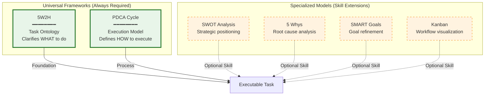

**Why Both Are Irreplaceable:**

```
Any Executable Task = 5W2H (Intent Clarity) + PDCA (Systematic Execution)
```

| Framework | Role | Without It... |
|-----------|------|---------------|
| **5W2H** | Defines **WHAT** needs to be done | Ambiguous goals → misaligned expectations |
| **PDCA** | Defines **HOW** to execute iteratively | Chaotic implementation → no quality control |

**The Complete Workflow:**

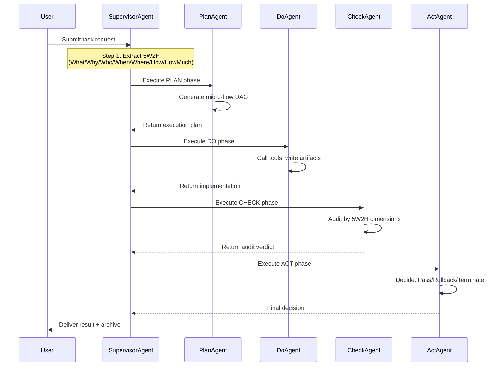

### 4.2 Beyond Free-Text Prompts

Traditional agents accept unstructured prompts, leading to ambiguous goals and unauditable execution. Wild AgentOS introduces **5W2H task ontology** as the standardized metadata framework for all non-trivial tasks.

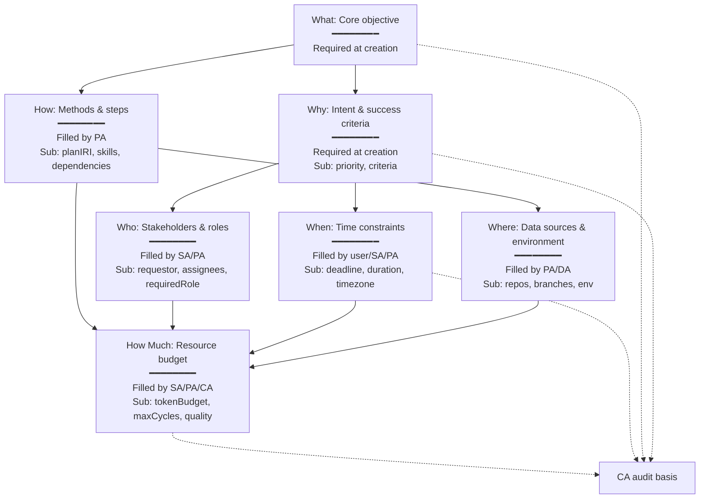

### 4.3 Progressive Filling Lifecycle

Each dimension has a `fillStage` attribute marking when it should be populated:

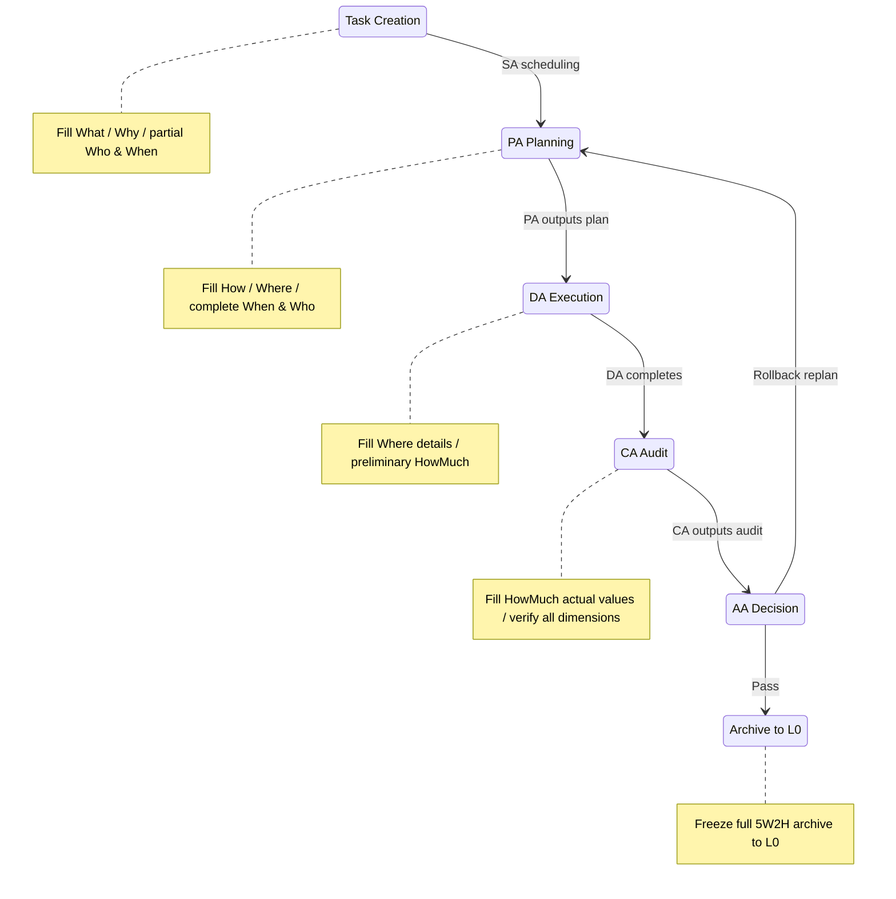

**Example lifecycle**:

```json
// Stage 1: Creation (SA extracts minimal set)
{
  "@id": "task:sales-q2-analysis",
  "task:5W2H": {
    "what": "Analyze Q2 regional sales data and generate forecast report",
    "why": {
      "description": "Provide basis for inventory planning",
      "successCriteria": ["Output visualization with regional growth comparison and forecast"],
      "priority": "high"
    },
    "who": { "requestor": "user:vp-sales", "requiredRole": "agent:Do" },
    "when": { "deadline": "2026-05-20T18:00:00+08:00" }
  }
}

// Stage 2: Planning (PA completes How/Where)
{
  "task:5W2H": {
    "where": {
      "dataSources": ["file://data/sales_q2.csv", "db://crm/deals"],
      "executionEnvironment": "sandbox"
    },
    "how": {
      "planIRI": "plan:task-tree/sales-q2",
      "preferredSkills": ["skill:python-analysis", "skill:forecasting"],
      "requiredSteps": "1. Data cleaning → 2. Regional grouping → 3. Forecast modeling → 4. Report generation"
    }
  }
}

// Stage 3: Audit (CA fills actual HowMuch)
{
  "task:5W2H": {
    "howMuch": {
      "tokenBudget": 5000,
      "actualCost": 5600,
      "maxPDCACycles": 3,
      "actualCycles": 2
    }
  }
}
```

### 4.4 Dimension-Level Structured Audit

CA doesn't just say "PASS/FAIL". It audits **each 5W2H dimension independently**:

```json
{
  "auditBy5W2H": {
    "what": { "verdict": "PASS", "evidence": "Report generated with regional comparison and forecast" },
    "why": { "verdict": "PASS", "evidence": "Conclusions directly usable for inventory planning" },
    "when": { "verdict": "PASS", "evidence": "Delivered at 5/19 14:00, before deadline" },
    "where": { "verdict": "PASS", "evidence": "Data sources matched, sandbox environment secure" },
    "how": { "verdict": "PASS", "evidence": "All four steps completed as planned" },
    "howMuch": { "verdict": "WARNING", "evidence": "Token exceeded by 12%, but result quality high" }
  },
  "overallVerdict": "CONDITIONAL_PASS"
}
```

AA then makes dimension-aware decisions:
- What/Why FAIL → Rollback to SA for re-analysis
- How/Where FAIL → Rollback to PA for plan correction
- When/HowMuch FAIL → If justified, pass; otherwise degrade or terminate

### 4.5 Pattern Recognition: 5W2H-Driven Experience Reuse

L0 stores all completed tasks as frozen `task:CompletedTaskSnapshot`. SA's pattern recognition organ queries for similar experiences:

```sparql
PREFIX task: <https://wildagentos.org/ontology/task#>

SELECT ?pastTask ?whySimilarity ?howSimilarity
WHERE {
  GRAPH system:experience {
    ?pastTask a task:CompletedTaskSnapshot .
    ?pastTask task:5W2H/task:why ?pastWhy .
    ?pastTask task:5W2H/task:how/task:planIRI ?pastPlan .
    BIND(external:cosineSimilarity(?currentWhyVec, ?pastWhyVec) AS ?whySimilarity)
  }
  FILTER(?whySimilarity > 0.85)
}
ORDER BY DESC(?whySimilarity)
LIMIT 5
```

Matched historical 5W2H subgraphs are injected into SA decision context:
- Recommend same `task:how/preferredSkills`
- Warn about historical `task:where` pitfalls (e.g., unstable branch)
- Provide historical `task:howMuch/actualCost` as budget reference

---

## 5. Skill Graph: Cognitive Knowledge Network with Automatic Evolution

### 5.1 Beyond Static Skill Libraries

Traditional agent frameworks treat skills as static function libraries. Wild AgentOS implements a **dynamic cognitive knowledge network** where skills evolve through usage, gain experience fragments, and self-organize via semantic links.

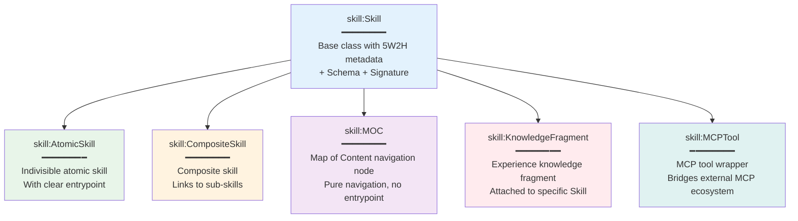

### 5.2 Six Semantic Link Types

Skills connect via six relationship types, each triggering different SA reasoning behaviors:

| Link Type | SA Reasoning Behavior | Example |
|-----------|----------------------|---------|
| `PrerequisiteLink` | Auto-include Skill B when selecting A | JWT auth → auto-load Rust basics |
| `CompositionLink` | Recursively expand sub-skills / MOC navigation | MOC auth domain → expand JWT/OAuth2/Token |
| `RelatedLink` | Recommend B after completing A | Complete JWT implementation → suggest middleware integration |
| `AlternativeLink` | Auto-switch to B if A unavailable | Rust env unavailable → switch to Node.js version |
| `ExtendsLink` | Choose A for basic, B for advanced | Basic JWT → OAuth2 full authorization |
| `GeneralizationLink` | Map specific tasks to general templates | Sales forecast → time series forecasting |

**SPARQL property path recursion** discovers dependency chains up to 3 levels deep:

```sparql
?target (skill:links/skill:target){0,3} ?chainNode .
```

### 5.3 Automatic Evolution Driven by AA

After each task completion, AA analyzes execution trajectory and evolves the Skill Graph:

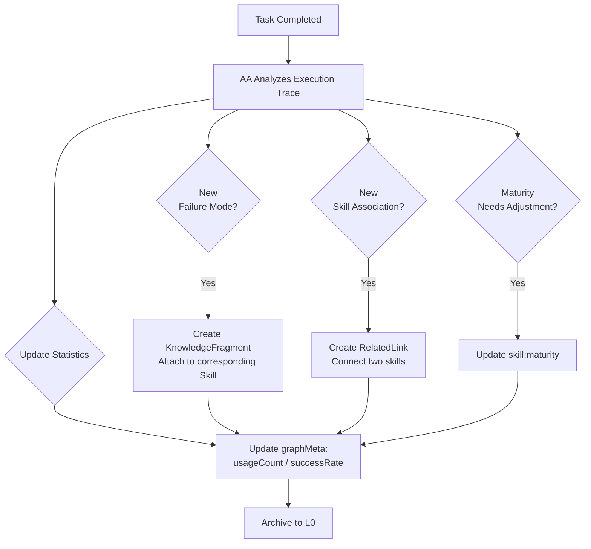

**Example**: CA discovers that JWT key rotation causes mass user logout. AA creates a KnowledgeFragment:

```json
{
  "@id": "skill:fragment/jwt-key-rotation-pitfall",
  "@type": "skill:KnowledgeFragment",
  "schema:name": "JWT Key Rotation Pitfall",
  "skill:attachedTo": "skill:rust-jwt-auth",
  "skill:content": {
    "problem": "Directly replacing old key during rotation invalidates all issued tokens",
    "recommendation": "Use JWKS endpoint to publish multiple public keys simultaneously for graceful transition",
    "alternativeSkill": "skill:jwks-implementation"
  }
}
```

Future SA executions encountering JWT tasks will see this fragment and recommend JWKS approach.

### 5.4 Self-Bootstrapping: /learn and /reduce Mechanisms

When DA encounters a problem with no available skill:

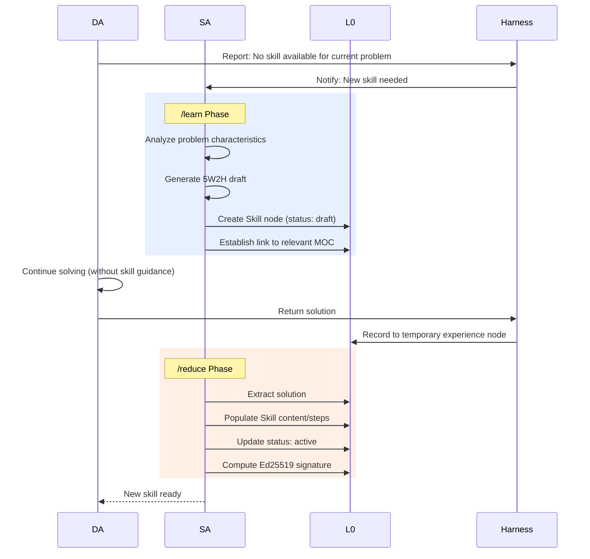

This enables **autonomous skill acquisition** without human intervention.

### 5.5 Advanced Skill Graph Features

The Skill Graph has evolved beyond the six link types and automatic evolution described above, adding four advanced subsystems:

**Hypergraph Composition** (`src/skill_graph/types.rs`): First-class `Hyperedge` type with `CompositionType` enum supporting Sequential, Parallel, Conditional, Optional, and Fallback compositions — enabling complex multi-skill workflows as first-class graph nodes.

**Poincaré Structural Embeddings** (`src/skill_graph/embedding.rs`): Computes geometric embeddings from graph topology (prerequisite depth + tag fingerprinting), enabling Poincaré ball-based similarity search and structural clustering of skills.

**Graph Algorithms** (`src/skill_graph/graph_algorithms.rs`): PageRank for skill importance ranking, betweenness centrality for bottleneck detection, label-propagation community detection for automatic skill clustering, DFS prerequisite chain discovery, and Tarjan SCC for cycle detection in the skill dependency graph.

**Formal Invariant Verification** (`src/skill_graph/verification.rs`): Six invariant checks enforcing graph integrity — acyclicity (no circular dependencies), link existence (no dangling references), composite reachability (all sub-skills accessible), no deprecated prerequisites, valid 5W2H metadata, and valid security levels. Violations are flagged before graph mutations are committed.

**Temporal Versioning**: Snapshot and rollback support, allowing the Skill Graph to be checkpointed before mutations and reverted if verification fails.

**Oxigraph SPARQL Bridge**: Real-time bidirectional sync between `SkillGraphStore` and the unified Oxigraph RDF store via SPARQL INSERT/DELETE operations and named graph isolation (`system:skills`).

---

## 6. Proactive Perception Engine: Anomaly Detection & Intelligent Intervention

### 6.1 Ten Perception Triggers

The ProactiveEngine monitors execution through ten distinct triggers, each mapped to specific intervention plans:

```mermaid
graph TB
    subgraph "10 Perception Triggers"
        T1["TaskStart: Complexity analysis"]
        T2["PlanCompleted: Subtask limit check"]
        T3["ProgressAnomaly: Deduplication window"]
        T4["CheckCompleted: Verdict-based alerts"]
        T5["TaskEnd: Experience extraction"]
        T6["CycleTimeout: Elapsed time monitoring"]
        T7["AgentBlocked: Health detection"]
        T8["ResourceConflict: Queue/delay analysis"]
        T9["QualityDegradation: Rollback signals"]
        T10["UserFeedback: Feedback log"]
    end
    
    subgraph "Intervention Plans"
        A1["Reassess current plan"]
        A2["Restart blocked agent"]
        A3["Adjust resource allocation"]
        A4["Notify human supervisor"]
    end
    
    T1 & T2 & T3 & T4 & T5 & T6 & T7 & T8 & T9 & T10 -->|"Detect Anomaly"| A1 & A2 & A3 & A4
```

### 6.2 Anomaly Deduplication

Time-window based filtering prevents alert storms:

```yaml
perception:
  anomaly_dedup_window_seconds: 60  # Suppress duplicate alerts within 60s
  simple_input_threshold: 50         # Input < 50 chars → simple task
  medium_input_threshold: 200        # Input < 200 chars → medium complexity
  cycle_timeout_secs: 300            # Alert if cycle exceeds 5 minutes
  max_iterations_before_alert: 10    # Alert after 10 iterations without progress
  error_rate_threshold: 0.5          # Alert if > 50% tool calls fail
```

### 6.3 5W2H Constraint Checking

ProactiveEngine validates execution against 5W2H constraints:

- **Deadline violation**: Current time > `task:when/deadline` → escalate to human
- **Budget overrun**: Token consumption > `task:howMuch/tokenBudget × 0.8` → warn SA
- **Role mismatch**: Assigned agent role ≠ `task:who/requiredRole` → reassign
- **Environment conflict**: Two tasks modifying same repo/branch → serialize execution

---

## 7. Advanced Tool Execution Framework

### 7.1 Built-in Tools (20+) with Micro-Tool System

| Category | Tools | Innovation |
|----------|-------|-----------|
| **File Operations** | `file_read`, `file_write`, `file_edit`, `file_list`, `glob_search`, `grep_search` | Symlink detection, path traversal prevention |
| **Network** | `WebFetch`, `WebSearch` (DuckDuckGo fallback chain) | TLS enforcement, proxy support |
| **Execution** | `Bash`, `PowerShell` (sandboxed with timeout) | Configurable timeouts, restricted paths |
| **Knowledge Import** | `knowledge_import_json`, `knowledge_import_url`, `knowledge_import_directory` | Auto-graphification to RDF |
| **Knowledge Graph** | `knowledge_extract`, `knowledge_query`, `kg_search`, `kg_neighbors`, `knowledge_extract_code` | SPARQL queries, AST parsing |
| **Skill Management** | `create_skill`, `convert_skill`, `list_skills` | LLM-powered skill generation |
| **Ontology** | `ontology_register`, `knowledge_bridge` | Cross-domain semantic alignment |

**Micro-Tool Innovation**: For large tool results (>8KB), system automatically generates conversational micro-tools:

```rust
// After file_read returns 50KB content
Micro-Tool: "search_in_results" 
Description: "Search within the previously read file content"
Parameters: { "query": "string", "context_lines": "number" }
```

This transforms unwieldy outputs into **interactive queryable artifacts**.

### 7.2 Model Context Protocol (MCP) Integration

External tool server integration via MCP standard:
- Connect to remote tool providers (GitHub, Slack, Jira, etc.)
- Dynamic tool discovery at runtime
- Secure authentication with API key rotation

---

## 8. Checkpoint & Recovery: Fault-Tolerant Execution

Session state persistence enables recovery from crashes:

```rust
// Create checkpoint at critical points
let checkpoint_id = checkpoint_manager.create(
    &task_iri,
    &format!("cycle:{}", cycle_id),
    &state_json,
    &metadata_json,
    &context_json,
    &artifacts
)?;

// Restore after crash
let restored_state = checkpoint_manager.restore(&task_iri)?;
```

**Use Cases**:
- Long-running task recovery (hours/days)
- Agent restart without losing context
- Debugging and replay for post-mortem analysis

---

## 9. Worker Task Queue: Background Job Processing

Persistent queue for asynchronous operations:

- **Technology**: yaque (Yet Another Queue) + bincode serialization
- **Features**: Disk-backed persistence, acknowledgment, peek operations
- **Use Cases**: 
  - Batch knowledge import (thousands of documents)
  - Scheduled skill evolution (nightly optimization)
  - Periodic cleanup (expired cache entries)
  - Asynchronous embedding generation

---

## 10. Template Engine & JSON Schema Validation

### 10.1 Markdown-Based Prompt Templates

```
## Role: {{agent_role}}
## Task: {{task_description}}

### Context
{{l3_projection}}

### Available Skills
{{skill_list}}

### 5W2H Constraints
- What: {{what}}
- Why: {{why}}
- When: {{deadline}}
- How Much: {{token_budget}}

### Instructions
...
```

**Features**:
- Recursive directory scanning
- Variable interpolation (`{placeholder}` syntax)
- Template inheritance (via includes)
- Version-controlled in Git

### 10.2 One Roundtrip, Double Harvest

Advanced validation mode that extracts both metadata and converts to JSON-LD in a single LLM call:

```
// LLM output
{
  "thought": "Planning database schema...",
  "content": "CREATE TABLE users...",
  "summary": "Database schema designed",
  "metadata": {
    "tables": ["users", "orders"],
    "relationships": ["one-to-many"]
  }
}

// System processes:
// 1. Validate metadata against JSON Schema
// 2. Convert validated metadata to JSON-LD node
// 3. Write to L2 blackboard with @id
// Result: Single LLM call → validated structured data + natural language
```

This doubles information extraction efficiency compared to traditional single-purpose prompts.

---

## 11. Architecture

### 11.1 System Components

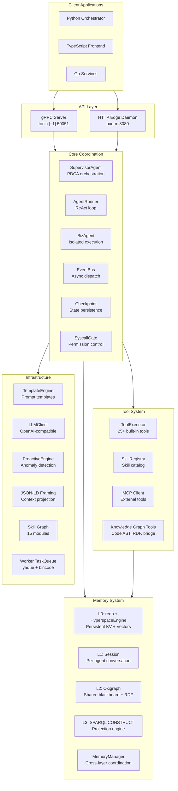

### 11.2 Data Flow: The Modern Wild AgentOS in Action

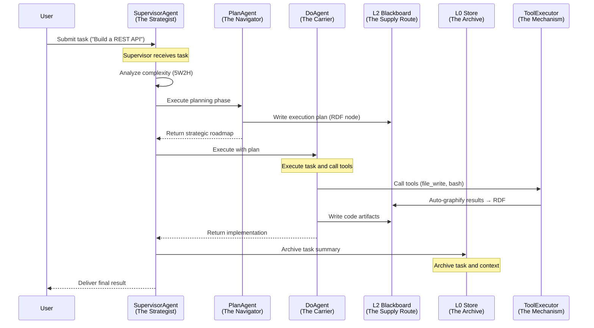

---

> *This document focuses on the architectural design and system innovations of Wild AgentOS. For a quick-start guide, application showcase, and project overview, see the [README.md](../README.md).*
