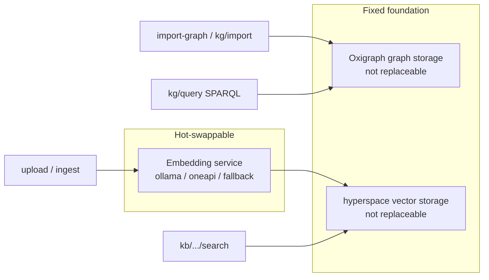

# 16. Knowledge Ingestion and `/import-graph` Extension Guide

> *A Chinese version is available in [16-knowledge-ingest-import-graph.zh.md](16-knowledge-ingest-import-graph.zh.md).*
>
> Related issue: [#7 Knowledge ingestion and /import-graph](https://github.com/skaiy/wild_agentos/issues/7).
> Related code: `src/api/http/mod.rs`, `src/knowledge_graph/`,
> `src/memory/hyperspace_store.rs`, and `src/blob/`. See
> [Knowledge Graph](07-knowledge-graph.md), [Memory System](03-memory-system.md),
> and the [Isolation Contract](17-isolation-contract.md).

This guide covers the current HTTP ingestion/import paths. It does not replace
the graph kernel. Complete “create base → import sample → query with SPARQL” to
validate an integration.

## 1. Two entry points—do not mix them

| Use case | KB type | Main path | Storage |
|---|---|---|---|
| Unstructured text/file semantic search | `kb_type=vector` | `POST /api/v1/kb/bases/:id/upload`, `.../ingest`, `.../search` | Hyperspace, at claims-minted `vector://{tenant}/{project}` |
| Structured triples/entity graph | `kb_type=graph` | `POST /api/v1/kb/bases/:id/import-graph` | Oxigraph, at claims-minted `graph://{tenant}/{project}` |
| Programmatic node/edge JSON | claims scope | `POST /api/v1/kg/import` | Oxigraph; body `graph` is ignored |
| SPARQL SELECT | claims scope | `POST /api/v1/kg/query` | Oxigraph; client `named_graph` is ignored |

Vector paths accept only vector bases; `import-graph` accepts only graph bases.
Wrong types return `400`.

## 2. Architecture constraints



| Component | Replaceable | Notes |
|---|---|---|
| Embedding model/service | yes | Configure `embedding` or use `POST /api/v1/embedding/activate`; switching rebuilds the vector index. |
| Graph storage (Oxigraph) | no | The single RDF/SPARQL engine; KB graphs, `kg/*`, and memory L2 share it with named-graph isolation. |
| Vector storage (hyperspace) | no | Embedded HNSW in `crates/hyperspace-engine`; no external vector database. |

Source documents use `BlobStore` (MinIO or LocalFs fallback). If it is disabled,
vector upload can still embed text, but source content is not persisted and
`reindex` skips it.

## 3. Named graph/namespace isolation

HTTP KG/KB/import/query/RAG paths accept only `IsolationClaims` verified at the
authentication boundary. The server mints storage targets; client `graph`,
`named_graph`, `namespace`, and equivalent KB target fields never select a
location. Catalog metadata uses claims-scoped store APIs.

| Type | Claims-minted target | Purpose |
|---|---|---|
| graph | `graph://{tenant}/{project}` | Oxigraph named-graph IRI |
| vector | `vector://{tenant}/{project}` | Hyperspace namespace and JSON-LD named-graph metadata |

Minting validates and constructs names only; it does not migrate data. Historical
`tenant:` graphs/namespaces are neither migrated nor read through. See the
[Isolation Contract](17-isolation-contract.md). `X-Identity` is development
simulation only and never creates `IsolationClaims`; missing or invalid JWT
claims fail closed with `401`/`403`.

## 4. Authentication and common conventions

```bash
export AUTHORIZATION='Authorization: Bearer <verified-jwt>'
```

The examples use `http://127.0.0.1:8080`. A single upload/import body is limited
to **60MB** by `KB_UPLOAD_MAX_BYTES`.

## 5. Create a base

Create a graph base:

```http
POST /api/v1/kb/bases
Content-Type: application/json
Authorization: Bearer <verified-jwt>
```

```json
{
  "name": "Fault-code example graph",
  "description": "issue#7 minimal import sample",
  "kb_type": "graph",
  "category_id": null
}
```

The `201` response contains an `id`, `status: "created"`, and a base whose
`graph` is `graph://<tenant>/<project>`. Keep the `id`; do not use response
storage fields or client-provided values as routing parameters.

A vector base is optional:

```json
{
  "name": "Repair-manual vector base",
  "kb_type": "vector",
  "description": "plain-text semantic retrieval"
}
```

It writes to `vector://<tenant>/<project>`. Read-only APIs are
`GET /api/v1/kb/bases`, `GET /api/v1/kb/bases/:id/stats`, and
`DELETE /api/v1/kb/bases/:id`; deleting a graph base clears its named graph.

## 6. Graph import: `POST /api/v1/kb/bases/:id/import-graph`

This endpoint requires `kb_type=graph`. Multipart fields are:

| Field | Required | Notes |
|---|---|---|
| `file` | when importing a file | A `schema` alone is allowed. |
| `format` | no | `csv`, `jsonl`, or `triples` (`nt`/`ttl` aliases); inferred from extension, otherwise `csv`. |
| `schema` | no | Any text, stored as named-graph `kbSchema` metadata. |
| `clear_before` | no | `true`/`1`/`yes` clears existing triples from the claims-minted graph. |

Extensions infer `.jsonl`/`.json` as JSONL, `.nt`/`.ttl`/`.triples` as triples,
and all others as CSV. `format=cypher` is explicitly rejected because Oxigraph
uses SPARQL.

### CSV

Header names are case-insensitive and may be `subject|s`,
`predicate|p|relation|rel`, `object|o`, and optional
`object_type|otype|type`; otherwise columns 0/1/2 are used. Short subjects and
predicates become `iri://entity/{sanitize}` and `iri://relation/{sanitize}`.
Existing `http(s)://` / `iri://` values remain unchanged. `object_type=iri`
forces an IRI; `literal` forces a literal.

```csv
subject,predicate,object,object_type
BMS_a067,rdf:type,http://aps.local/ontology/FaultCode,iri
BMS_a067,rdfs:label,BMS_a067 — high-voltage battery requires service,literal
BMS_a067,code,BMS_a067,literal
pack1,hasFault,BMS_a067,iri
```

`rdf:`, `rdfs:`, and `aps:` are expanded by `expand_iri`; a short property such
as `code` becomes `iri://relation/code`. Use a full predicate IRI in CSV when
it must align with the `kg/import` property IRI
`https://agentos.ontology/meta/code`.

```bash
KB_ID=<graph-base-uuid>
curl -sS -X POST "http://127.0.0.1:8080/api/v1/kb/bases/${KB_ID}/import-graph" \
  -H "$AUTHORIZATION" -F "file=@fault_sample.csv;type=text/csv" \
  -F "format=csv" -F "clear_before=true"
```

A successful response has `status: "imported"`, the claims-minted `graph`,
`format`, `triples_written`, `entities`, `relations`, and `schema_saved`.

### JSONL and triples

JSONL has one object per line with the CSV keys. Simplified N-Triples accepts
`<s> <p> <o> .` or `<s> <p> "literal" .`; `#` starts a comment. Triples do not
expand short prefixes, so provide complete IRIs.

## 7. Programmatic import: `POST /api/v1/kg/import`

`KgImportRequest` writes `NodeDef` / `EdgeDef` through `RdfMapper` without a KB
record. `nodes` is required (`id`, `node_type`, `label`, optionally
`description`/`properties`); `edges` defaults to `[]`; `graph` is accepted for
compatibility but ignored; and `clear_before` defaults to **true**. Entities are
`iri://entity/{sanitize(id)}`, `node_type` maps to `rdf:type`, `label` maps to
`rdfs:label`, and short property keys receive
`https://agentos.ontology/meta/`.

## 8. SPARQL: `POST /api/v1/kg/query`

```json
{
  "sparql": "SELECT ?s ?p ?o WHERE { ?s ?p ?o } LIMIT 20",
  "named_graph": "client-selected-graph-is-ignored"
}
```

`sparql` is required; `named_graph` is compatibility input only. The server
queries the claims-minted graph. Syntax failures return `400` with
`{ "error": "..." }`.

## 9. Vector ingestion (`upload` / `ingest`)

`POST /api/v1/kb/bases/:id/ingest` accepts:

```json
{ "text": "one text segment", "texts": ["one of many", "another"] }
```

It is vector-base only; at least one nonempty segment is required. Text is
chunked at roughly **500 characters** and embedded. Success returns
`{ "status": "ingested", "chunks": N, "namespace": "vector://<tenant>/<project>" }`;
an unavailable embedding service returns `503`.

`POST /api/v1/kb/bases/:id/upload` is multipart. `file` can repeat,
`chunk_size` is 50–4000 (default 500), and `min_importance` is 0.0–1.0
(default 0.5). The request may supply any `chunk_strategy`, but only `fixed` is
implemented and returned. Parsable extensions are `.txt`, `.md`, `.markdown`,
`.csv`, `.log`, `.json`, and `.jsonl`. PDF/Word files are recorded as
`status=stored` (when Blob is available) with `skipped_reason`; they are not
vectorized.

Search uses `POST /api/v1/kb/bases/:id/search` with `{ "query", "limit?" }`
(default 5, clamped 1–20). Documents and rebuilding use
`GET /api/v1/kb/bases/:id/documents` and
`POST /api/v1/kb/bases/:id/reindex`.

## 10. Embedding is replaceable; foundations are not

`src/config/settings.rs` configures `embedding`: `ollama` by default, plus
`oneapi` and `fallback`. Changing it hot-switches vector dimensions/model and
queues `reindex`; `POST /api/v1/embedding/activate` activates a registered
embedding model. Replacing an embedding does not replace Hyperspace, and old
vectors require rebuilding. Graph queries always use Oxigraph SPARQL.

## 11. Minimum acceptance checklist

1. Create `kb_type=graph` and retain its `id`/`graph`.
2. Upload the CSV through `import-graph` with `clear_before=true`; verify
   `status=imported` and `triples_written>0`.
3. Query through `kg/query` with a verified JWT; verify a fault-code label in
   the claims-minted graph and `count>=1`.
4. Optionally create a vector base, upload TXT, then search successfully.
5. Do not introduce assumptions that replace Oxigraph, Hyperspace, or the graph
   kernel.

## 12. Common errors

| HTTP | Typical error | Resolution |
|---|---|---|
| 404 | `knowledge base not found` | Check `:id`. |
| 400 | graph-base-only triple import | `import-graph` was sent to a vector base. |
| 400 | vector-base-only upload / `ingest` | Upload/ingest was sent to a graph base. |
| 400 | missing file or schema | Check multipart field names and empty files. |
| 400 | unsupported format / Cypher message | Use csv/jsonl/triples. |
| 503 | vector storage unavailable (embedding initialization failed) | Fix embedding configuration and hot-switch. |
| 400 query | SPARQL error | Check IRI, `GRAPH`, and prefixes. |

## 13. Toolchain relationship

Agent tools include `knowledge_import_json`, `knowledge_query`, and
`knowledge_import_file` (see `05-tool-system.md` and
`07-knowledge-graph.md`). This guide is for **HTTP extension development**:
admin consoles, batch scripts, and external integrations should use
`/api/v1/kb/*` and `/api/v1/kg/*`. Tool semantics align, but the handler paths
and fields here are authoritative.

## 14. Ontology type drafts from CSV or JSON Schema

`POST /api/v1/ontology/type-drafts/from-csv` and
`POST /api/v1/ontology/type-drafts/from-json-schema` provide a deliberately
small, review-first bridge from input schemas to ontology metadata. Both require
a verified JWT with `IsolationClaims`; drafts are stored only in the caller's
claims-scoped draft graph, never in production ontology metadata.

CSV uses only its headers and proposes one `ObjectType`; each property starts as
`string`. JSON Schema maps root `properties` to properties (string, integer,
number, boolean, date-time, and string enums). Optional `links` are explicit
request input—relationships are not guessed. Neither adapter creates
`ActionType`s.

```json
POST /api/v1/ontology/type-drafts/from-csv
{
  "csv": "asset_id,display_name,active\nA-1,Inverter,true\n",
  "object_id": "imported asset",
  "label": "Imported Asset"
}
```

The response has `draft_id` and `preview`. Inspect and edit the draft through
the normal type workflow as needed, then promote it explicitly:

```json
POST /api/v1/ontology/type-drafts/<draft_id>/promote
{ "confirm": true }
```

Promotion again requires verified claims. It rejects `confirm: false`, drafts
outside the caller scope, links to unknown types, and any type ID that already
exists in production; it never auto-overwrites an `ObjectType` or `LinkType`.
After success, `GET /api/v1/ontology/types` exposes the promoted types.

This is a semi-automatic draft helper, not a full Palantir-style ontology
pipeline: there is no automatic semantic inference, no automatic action
generation, and no replacement for Oxigraph.
