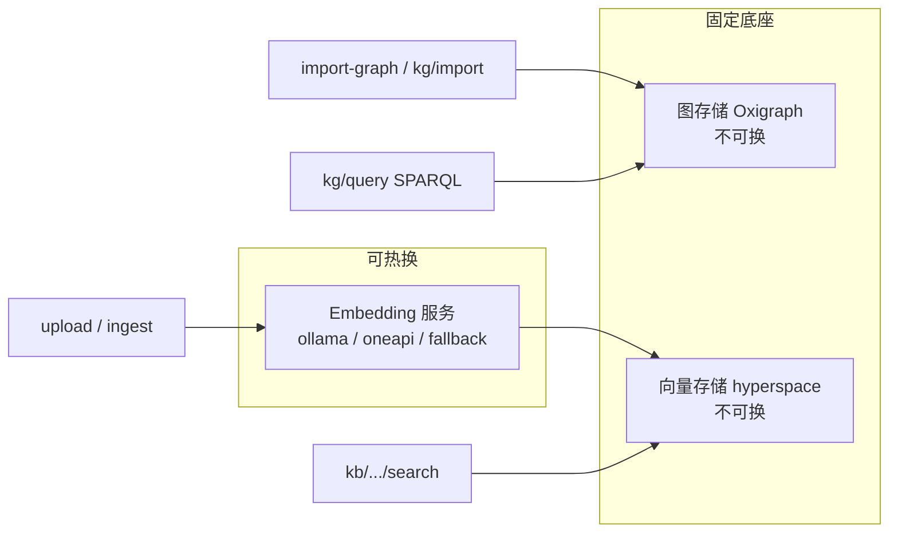

# 16. 知识摄取与 `/import-graph` 二次开发手册

> 关联 Issue：[#7 知识摄取与 /import-graph](https://github.com/skaiy/wild_agentos/issues/7)  
> 关联代码：`src/api/http/mod.rs`（KB CRUD / upload / ingest / import-graph / kg import+query）、`src/knowledge_graph/`、`src/memory/hyperspace_store.rs`、`src/blob/`  
> 关联文档：`07-knowledge-graph.md`（图谱内核与命名图）、`03-memory-system.md`（Oxigraph + hyperspace 存储栈）、[17-isolation-contract.md](17-isolation-contract.md)（可信 claims 边界、命名与历史键）
> **范围外**：不涉及 iDME 图内核替换；本文只讲当前 Wild AgentOS 已落地的 HTTP 摄取/导入路径。

按本文走完「建库 → 导入样例 → SPARQL 查询」即可验收。

---

## 1. 两套入口，别混用

| 场景 | 知识库类型 | 主路径 | 落库位置 |
|------|------------|--------|----------|
| 非结构化文本 / 文件语义检索 | `kb_type=vector` | `POST /api/v1/kb/bases/:id/upload`、`.../ingest`、`.../search` | Hyperspace 向量库（目标由 claims-minted `vector://{tenant}/{project}` 决定） |
| 结构化三元组 / 实体关系图 | `kb_type=graph` | `POST /api/v1/kb/bases/:id/import-graph` | Oxigraph（目标由 claims-minted `graph://{tenant}/{project}` 决定） |
| 程序化节点/边 JSON 写入 | claims 作用域内 | `POST /api/v1/kg/import` | Oxigraph（忽略请求体 `graph`） |
| SPARQL SELECT | claims 作用域内 | `POST /api/v1/kg/query` | Oxigraph（忽略客户端 `named_graph`） |

向量路径只认向量库；`import-graph` 只认图谱库。调错类型会直接 `400`（例如「仅向量知识库支持文件上传」「仅图谱知识库支持三元组导入」）。

---

## 2. 架构约束（二次开发必读）



| 组件 | 可否替换 | 说明 |
|------|----------|------|
| **Embedding 模型/服务** | ✅ 可换 | 配置 `embedding` 段或 `POST /api/v1/embedding/activate`；变更后热切换并排队重建向量索引 |
| **图存储（Oxigraph）** | ❌ 不可换 | 系统唯一 RDF/SPARQL 引擎；KB 图、`kg/*`、记忆 L2 等同实例共享，靠命名图隔离 |
| **向量存储（hyperspace）** | ❌ 不可换 | 嵌入式 HNSW（`crates/hyperspace-engine`）；不接外部向量库 |

原文对象存储走 `BlobStore`（MinIO 或 LocalFs 兜底）。未启用时：向量上传仍可 embedding 入库，但原文不落盘，后续 `reindex` 会跳过。

---

## 3. 命名图 / 命名空间隔离

当前 HTTP KG/KB/import/query/RAG 路径只接受认证边界验证后产生的
`IsolationClaims`。服务器从 claims mint 目标；客户端提交的 `graph`、
`named_graph`、`namespace`（以及等价的 KB 目标字段）均不选择存储位置。
知识库 catalog 元数据也经 claims-scoped store API 写入，不由请求字段拼接隔离键。

| 类型 | claims-minted 目标 | 用途 |
|------|------|------|------|
| graph | `graph://{tenant}/{project}` | Oxigraph 命名图 IRI |
| vector | `vector://{tenant}/{project}` | Hyperspace 向量命名空间与 JSON-LD named-graph 元数据 |

Minting 只验证和构造名称，不迁移数据。历史 `tenant:` 图或命名空间不会被迁移、重写或由这条新路径读穿。完整命名和历史键状态见 [Isolation Contract](17-isolation-contract.md)。

`X-Identity` 仅用于开发模拟，**绝不**产生 `IsolationClaims`，也不是生产租户身份来源。当前 HTTP 边界使用已验证 JWT 产生 claims；缺少或无效的 JWT claims 会 fail closed，返回认证/授权错误（401/403），不会返回空的成功结果。

---

## 4. 鉴权与公共约定

```bash
# 使用认证边界验证、且含 tenant/project scope 的 JWT
export AUTHORIZATION='Authorization: Bearer <verified-jwt>'
```

默认服务根路径以本机部署为准（下文用 `http://127.0.0.1:8080` 占位）。单文件上传/导入体积极限 **60MB**（`KB_UPLOAD_MAX_BYTES`）。

---

## 5. 建库

### 5.1 创建图谱库

```http
POST /api/v1/kb/bases
Content-Type: application/json
Authorization: Bearer <verified-jwt>

{
  "name": "故障码样例图",
  "description": "issue#7 最小导入样例",
  "kb_type": "graph",
  "category_id": null
}
```

成功 `201`，响应含：

```json
{
  "id": "<kb_uuid>",
  "status": "created",
  "base": {
    "id": "<kb_uuid>",
    "name": "故障码样例图",
    "kb_type": "graph",
    "graph": "graph://<tenant>/<project>",
    "vector_namespace": "",
    ...
  }
}
```

记下 `id`。本路径的图目标由验证后的 claims 确定；不要把响应中的存储字段或客户端值作为下一请求的路由参数。

### 5.2 创建向量库（可选，走 upload/ingest）

```json
{
  "name": "维修手册向量库",
  "kb_type": "vector",
  "description": "纯文本语义召回"
}
```

向量数据写入由 claims mint 的 `vector://<tenant>/<project>` 命名空间。

相关只读接口：

| 方法 | 路径 | 说明 |
|------|------|------|
| GET | `/api/v1/kb/bases` | 列表 |
| GET | `/api/v1/kb/bases/:id/stats` | 图库返回 `triples`；向量库暂不枚举 chunk 数 |
| DELETE | `/api/v1/kb/bases/:id` | 删除；图类型会清空对应命名图 |

---

## 6. 图谱导入：`POST /api/v1/kb/bases/:id/import-graph`

**仅 `kb_type=graph`。** Multipart 字段：

| 字段 | 必填 | 说明 |
|------|------|------|
| `file` | 有文件时必填 | 导入文件；也可只传 `schema` |
| `format` | 否 | `csv` \| `jsonl` \| `triples`（亦接受 `nt`/`ttl` 别名）；缺省按扩展名推断，再缺省 `csv` |
| `schema` | 否 | 任意文本，写入命名图元三元组 `kbSchema` |
| `clear_before` | 否 | `true`/`1`/`yes` 时先清空 claims-minted 图中的现有三元组 |

扩展名推断：`.jsonl`/`.json` → jsonl；`.nt`/`.ttl`/`.triples` → triples；其余 → csv。`format=cypher` 会明确拒绝（Oxigraph 走 SPARQL）。

### 6.1 CSV（推荐最小样例）

表头不区分大小写；列名可匹配 `subject|s`、`predicate|p|relation|rel`、`object|o`、可选 `object_type|otype|type`。无匹配则按列位置 0/1/2。

短 ID 会展开：主语 → `iri://entity/{sanitize}`，谓语 → `iri://relation/{sanitize}`；已是 `http(s)://` / `iri://` 则原样。`object_type=iri` 强制当 IRI，`literal` 强制字面量。

**样例文件 `fault_sample.csv`：**

```csv
subject,predicate,object,object_type
BMS_a067,rdf:type,http://aps.local/ontology/FaultCode,iri
BMS_a067,rdfs:label,BMS_a067 — 高压电池需要维修,literal
BMS_a067,code,BMS_a067,literal
BMS_a068,rdf:type,http://aps.local/ontology/FaultCode,iri
BMS_a068,rdfs:label,BMS_a068 — 电池需要维修,literal
pack1,hasFault,BMS_a067,iri
```

说明：`rdf:` / `rdfs:` / `aps:` 前缀在 `import-graph` 的短 ID 路径上会经 `expand_iri` 展开（如 `rdfs:label` → `http://www.w3.org/2000/01/rdf-schema#label`）。属性短名 `code` 会变成 `iri://relation/code`。若希望与 `kg/import` 的属性 IRI（`https://agentos.ontology/meta/code`）对齐，CSV 里请写完整谓词 IRI。

```bash
KB_ID=<图谱库 uuid>
curl -sS -X POST "http://127.0.0.1:8080/api/v1/kb/bases/${KB_ID}/import-graph" \
  -H "$AUTHORIZATION" \
  -F "file=@fault_sample.csv;type=text/csv" \
  -F "format=csv" \
  -F "clear_before=true"
```

成功示例：

```json
{
  "status": "imported",
  "graph": "graph://<tenant>/<project>",
  "format": "csv",
  "triples_written": 6,
  "entities": 3,
  "relations": 4,
  "schema_saved": false
}
```

### 6.2 JSONL

每行一个对象，键同 CSV：`subject`/`s`、`predicate`/`p`/`relation`/`rel`、`object`/`o`、可选 `object_type`。

```jsonl
{"subject":"BMS_a067","predicate":"http://www.w3.org/1999/02/22-rdf-syntax-ns#type","object":"http://aps.local/ontology/FaultCode","object_type":"iri"}
{"subject":"BMS_a067","predicate":"http://www.w3.org/2000/01/rdf-schema#label","object":"BMS_a067 — 高压电池需要维修","object_type":"literal"}
{"subject":"pack1","predicate":"hasFault","object":"BMS_a067","object_type":"iri"}
```

### 6.3 Triples（简化 N-Triples）

每行：`<s> <p> <o> .` 或 `<s> <p> "literal" .`（`#` 开头为注释）。此处主谓宾**不会**再做短前缀展开，请写完整 IRI。

```nt
<iri://entity/BMS_a067> <http://www.w3.org/1999/02/22-rdf-syntax-ns#type> <http://aps.local/ontology/FaultCode> .
<iri://entity/BMS_a067> <http://www.w3.org/2000/01/rdf-schema#label> "BMS_a067 — 高压电池需要维修" .
```

---

## 7. 程序化导入：`POST /api/v1/kg/import`

不依赖 KB 记录，直接往指定命名图写 `NodeDef` / `EdgeDef`（经 `RdfMapper`）。

请求体（`KgImportRequest`）：

| 字段 | 类型 | 说明 |
|------|------|------|
| `nodes` | array | 必填；`id` / `node_type` / `label`，可选 `description` / `properties` |
| `edges` | array | 默认 `[]`；`source` / `target` / `relation`，可选 `properties` |
| `graph` | string | 可兼容传入但被忽略；服务端使用 claims-minted 图 |
| `clear_before` | bool | 默认 **true**：写入前清空该图 |

节点映射要点（与 `07-knowledge-graph.md` 一致）：

- 实体 IRI：`iri://entity/{sanitize(id)}`
- `rdf:type` ← `node_type`（`aps:` 等会展开）
- `rdfs:label` ← `label`
- 属性 key 非完整 IRI 时加前缀 `https://agentos.ontology/meta/`

```bash
curl -sS -X POST "http://127.0.0.1:8080/api/v1/kg/import" \
  -H "Content-Type: application/json" \
  -H "$AUTHORIZATION" \
  -d "{
    \"graph\": \"client-selected-graph-is-ignored\",
    \"clear_before\": true,
    \"nodes\": [
      {
        \"id\": \"dtc:demo:BMS_a067\",
        \"node_type\": \"aps:FaultCode\",
        \"label\": \"BMS_a067 — 高压电池需要维修\",
        \"properties\": { \"code\": \"BMS_a067\" }
      }
    ],
    \"edges\": []
  }"
```

成功：

```json
{
  "status": "ok",
  "entity_count": 1,
  "relation_count": 0,
  "quad_count": 3,
  "graph": "graph://<tenant>/<project>"
}
```

与 `import-graph` 的选择：

- 已有 CSV/JSONL/NT 文件 → `import-graph`
- Agent/服务端已有结构化节点边 → `kg/import`

---

## 8. SPARQL 查询：`POST /api/v1/kg/query`

请求体（`KgQueryRequest`）：

```json
{
  "sparql": "SELECT ?s ?p ?o WHERE { ?s ?p ?o } LIMIT 20",
  "named_graph": "client-selected-graph-is-ignored"
}
```

| 字段 | 说明 |
|------|------|
| `sparql` | SPARQL SELECT（必填） |
| `named_graph` | 可兼容传入但被忽略；服务端使用 claims-minted 图 |

请求中的图选择不会覆盖 claims 作用域；查询在服务器选定的命名图中执行。

**验收查询（按 §6 CSV 样例）：**

```bash
curl -sS -X POST "http://127.0.0.1:8080/api/v1/kg/query" \
  -H "Content-Type: application/json" \
  -H "$AUTHORIZATION" \
  -d "{
    \"sparql\": \"SELECT ?label WHERE { ?s a <http://aps.local/ontology/FaultCode> ; <http://www.w3.org/2000/01/rdf-schema#label> ?label }\",
    \"named_graph\": \"client-selected-graph-is-ignored\"
  }"
```

期望：`status=ok`，`count>=1`，`results` 含故障码标签。跨租户命名图互不可见（集成测试见 `mod.rs` 中租户隔离用例）。

查询失败（语法等）返回 `400` + `{ "error": "..." }`。

---

## 9. 向量摄取（upload / ingest）

### 9.1 JSON 文本摄取

```http
POST /api/v1/kb/bases/:id/ingest
Content-Type: application/json
```

```json
{
  "text": "单段文本",
  "texts": ["多段之一", "多段之二"]
}
```

- 仅向量库；`texts`/`text` 至少有一段非空
- 按约 **500 字符**切块（UTF-8 友好），再 embedding 写入
- 成功：`{ "status": "ingested", "chunks": N, "namespace": "vector://<tenant>/<project>" }`
- embedding 未就绪：`503`「向量库未启用（embedding 初始化失败）」

### 9.2 文件上传

```http
POST /api/v1/kb/bases/:id/upload
Content-Type: multipart/form-data
```

| 字段 | 说明 |
|------|------|
| `file` | 可多次；缺文件 → `400` |
| `chunk_size` | 50–4000，默认 500 |
| `chunk_strategy` | 请求可传任意值；**当前仅实现 `fixed`**，响应里 `chunk_strategy_applied` 恒为 `fixed` |
| `min_importance` | 0.0–1.0，默认 0.5 |

可解析扩展名：`.txt` / `.md` / `.markdown` / `.csv` / `.log` / `.json` / `.jsonl`。PDF/Word 等会进台账 `status=stored`（原文可落 Blob），并标 `skipped_reason`，**不向量化**。

成功摘要字段：`status=uploaded`、`namespace`、`total_chunks`、`files[]`（含 `doc_id`=sha256）。

配套：

| 方法 | 路径 | 说明 |
|------|------|------|
| POST | `/api/v1/kb/bases/:id/search` | body：`{ "query", "limit?" }`，limit 默认 5（钳制 1–20） |
| GET | `/api/v1/kb/bases/:id/documents` | 原文台账 |
| POST | `/api/v1/kb/bases/:id/reindex` | 从 Blob 重建向量（需 BlobStore） |

```bash
curl -sS -X POST "http://127.0.0.1:8080/api/v1/kb/bases/${VEC_ID}/upload" \
  -H "$AUTHORIZATION" \
  -F "file=@manual.txt;type=text/plain" \
  -F "chunk_size=500"

curl -sS -X POST "http://127.0.0.1:8080/api/v1/kb/bases/${VEC_ID}/search" \
  -H "Content-Type: application/json" \
  -H "$AUTHORIZATION" \
  -d '{"query":"高压电池维修","limit":5}'
```

---

## 10. Embedding 可换，底座不可换

配置段 `embedding`（`src/config/settings.rs`）：`provider` 默认 `ollama`，另有 `oneapi`、`fallback`。HTTP 侧：

- 改系统配置中的 `embedding` → 热切换向量库维度/模型，并排队 `reindex`
- `POST /api/v1/embedding/activate`：把某个已登记的 embedding 型号桥接为生效服务

**换 embedding ≠ 换向量引擎**：仍是 Hyperspace；旧向量与新模型不兼容，必须重建。图查询始终走 Oxigraph SPARQL，与 embedding 无关。

---

## 11. 最小验收清单（对应 Issue #7）

1. `POST /api/v1/kb/bases` 创建 `kb_type=graph`，拿到 `id` 与 `graph`
2. `POST .../import-graph` 上传 §6.1 CSV（`clear_before=true`），确认 `status=imported` 且 `triples_written>0`
3. `POST /api/v1/kg/query` 使用已验证 JWT；服务端在 claims-minted 图中执行 SELECT 故障码 label，`count>=1`
4. （可选）再建 `kb_type=vector`，`upload` 一段 TXT，再 `search` 能召回
5. 确认文档/设计未引入「替换 Oxigraph / hyperspace / iDME 图内核」的假设

---

## 12. 常见错误速查

| HTTP | 典型 `error` | 处理 |
|------|----------------|------|
| 404 | `knowledge base not found` | 检查 `:id` |
| 400 | `仅图谱知识库支持三元组导入` | 对向量库误调了 `import-graph` |
| 400 | `仅向量知识库支持文件上传` / `ingest` | 对图库误调了 upload/ingest |
| 400 | `未收到文件…或 schema` | multipart 字段名或空文件 |
| 400 | `不支持的 format` / Cypher 提示 | 改用 csv/jsonl/triples |
| 503 | `向量库未启用（embedding 初始化失败）` | 修好 embedding 配置并热切换 |
| 400（query） | SPARQL 错误串 | 检查 IRI、GRAPH、前缀 |

---

## 13. 与工具链的关系

Agent 侧另有工具 `knowledge_import_json` / `knowledge_query` / `knowledge_import_file` 等（见 `05-tool-system.md`、`07-knowledge-graph.md`）。本手册聚焦 **HTTP 二次开发**：运营后台、批处理脚本、外部系统对接应优先走 `/api/v1/kb/*` 与 `/api/v1/kg/*`，与工具语义对齐但路径、字段以上文 handler 为准。
