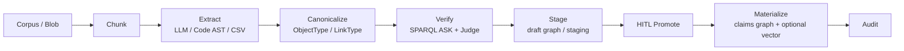

# 21. Ontology Knowledge Engineering Pipeline (design only)

> *A Chinese version is available in
> [21-ontology-knowledge-engineering-pipeline.zh.md](21-ontology-knowledge-engineering-pipeline.zh.md).*
>
> This is a proposed design, not a release plan or an implementation claim.
> It complements [Knowledge Ingestion](16-knowledge-ingest-import-graph.md),
> [Ontology Action Data Sandbox](15-ontology-action-sandbox.md), and the
> [Isolation Contract](17-isolation-contract.md).

## Status and question answered

**Question:** Do the implemented capabilities and pending pull requests form a
complete, online, fully automated ontology knowledge-graph engineering
toolchain?

**Answer: No.**

The current code provides useful ingestion, graph, ontology, staging, and
human-approval primitives. It does **not** provide an online, fully automatic
pipeline that extracts ontology-aligned knowledge from a changing corpus,
validates it, resolves entities, promotes schema, and materializes a governed
warehouse. The design below describes what would be required to make that
statement true without weakening the current security and governance boundary.

## Current capability map

### Available now

| Capability | Current boundary |
|---|---|
| Claims-scoped graph import | `import-graph` and `kg/import` accept CSV, JSONL, or simplified N-Triples and write only to a server-minted Oxigraph graph. |
| Vector ingestion | Vector upload/ingest chunks content into the claims-scoped Hyperspace namespace. |
| Extraction primitives | A Code AST extractor and LLM `KnowledgeExtractor` produce open-vocabulary `NodeDef` / `EdgeDef` candidates. |
| Ontology layer | `ObjectType`, `LinkType`, and `ActionType` model semantic and controlled write concepts. |
| Type-draft bridge | CSV and JSON Schema can create type drafts; an authorized person must explicitly promote them. |
| Governed writes | Actions support HITL staging, SPARQL `ASK` guardrails, and `ACTION_AUDIT`. |
| Optional inference | Limited RDFS query-time expansion is available only when enabled; it is off by default and does not persist inferred triples. |
| Isolation | `IsolationClaims` determine graph, blob, and vector targets; missing or invalid claims fail closed. Minting a safe target name is **not** historical-data migration. |

### Pending or recently completed work does not close this gap

At the time of writing:

- [#130](https://github.com/skaiy/wild_agentos/issues/130) and
  [#133](https://github.com/skaiy/wild_agentos/pull/133) concern historical
  vector/L0/blob-key migration work and remain open.
- [#131](https://github.com/skaiy/wild_agentos/issues/131), production OIDC,
  is already merged.
- [#132](https://github.com/skaiy/wild_agentos/issues/132), operations
  surfaces for keys, tenant scope, and action auditing, is merged.

These changes improve isolation, authentication, or operations. None supplies
continuous ontology extraction, automatic promotion, or governed warehouse
materialization.

### Explicit gaps

The current system has no:

1. continuous online corpus-to-graph job pipeline;
2. ontology-constrained extraction or post-extraction canonicalization and
   correction;
3. entity-resolution / deduplication service;
4. draft-to-instance materialization job;
5. graph-quality gate such as a GraphJudge/refiner;
6. schema-evolution CI;
7. scheduled corpus watchers; or
8. mechanism for type drafts to invent `LinkType`s or `ActionType`s. Type
   drafts are deliberately narrower than schema induction.

## Public best-practice signals

These references are design inputs, not claims of a one-to-one clone of any
external product or research system.

### Ontology as a decision API, governed by promotion

Public Foundry documentation describes an ontology as an operational layer with
object/link semantics and governed actions. That is a useful architectural
principle: treat the ontology as a decision API, not merely a passive schema
file. Start with representative or placeholder data, review a draft model, and
promote it under governance; use Actions for controlled writes rather than
letting arbitrary extractors write production state. See the public
[Ontology overview](https://palantir.com/docs/foundry/ontology/overview/).

This proposal borrows that general pattern only. It does not assert feature
parity, compatibility, or a product clone.

### Research patterns, 2024–2026

- [SAC-KG](https://aclanthology.org/2024.acl-long.238/) separates a
  **Generator**, **Verifier**, and **Pruner**, making validation and controlled
  expansion first-class steps.
- [EDC: Extract, Define,
  Canonicalize](https://aclanthology.org/2024.emnlp-main.548/) makes open
  extraction, schema definition, and post-hoc canonicalization separate
  phases.
- [GraphJudge](https://aclanthology.org/2025.emnlp-main.554/) evaluates
  extracted triples with a graph judge; the later
  [GraphRefine](https://aclanthology.org/2026.acl-long.1353/) work illustrates
  document-grounded deletion, editing, or rewriting after extraction.
- [OAK+MEND](https://arxiv.org/abs/2605.29168) maps open extracted types and
  predicates to ontology candidates with embeddings, then selectively asks an
  LLM to correct detected ontology violations.
- [KGGen](https://arxiv.org/abs/2502.09956) uses extraction followed by
  aggregation and entity/edge deduplication.

The resulting design rule is:

> **Extract open → canonicalize to ontology → verify/refine → stage → human
> promote → materialize instances** is safer and more maintainable than “an LLM
> dumps triples into production.”

## Open-source selection & absorption (commercially usable licenses)

This is a design-level selection snapshot, not a dependency approval or an
implementation plan. Re-verify each project's SPDX expression, transitive
dependencies, model-weight terms, and distribution terms on the day it is
adopted. In particular, a repository license does not automatically license
its model weights.

### License and integration policy

- Prefer **Apache-2.0**, **MIT**, or **BSD-3-Clause** for anything WAO might
  depend on, vendor patterns from, or ship beside.
- Oxigraph plus SPARQL remain the kernel. Neo4j, FalkorDB, Memgraph, and Cypher
  are not replacements for the primary RDF store or query language.
- Use one of three absorption modes: **(A)** pattern/algorithm reference only;
  **(B)** optional out-of-process sidecar or worker; or **(C)** a Rust crate or
  thin adapter. Prefer A/B for Python stacks. Use C only where both license and
  ABI fit.
- **LGPL** is commercially usable, but its linking obligations require review;
  an isolated process boundary is preferred. **NOASSERTION**, unclear dual
  licensing, and **CC-BY-NC** model terms are exclude-or-legal-review cases.
- A pipeline may generate candidates, but it may never auto-promote ontology
  types or production instances.

### Selection table

| Project | License (SPDX snapshot) | Fit | Absorb how | Priority |
|---|---|---|---|---|
| Oxigraph (already in tree) | Apache-2.0 OR MIT | RDF/SPARQL foundation | keep | baseline |
| spaCy | MIT | NER/chunking baseline | optional sidecar or preprocessing worker | P0 |
| GLiNER (`urchade/GLiNER`) + Apache-2.0 model weights only (v2+/multi v2.1) | Apache-2.0 (code); **exclude** CC-BY-NC early weights | zero-shot NER against promoted `ObjectType` labels | sidecar / ONNX, or Rust `gline-rs` if mature | P0 |
| GLinker (`Knowledgator/GLinker`) | Apache-2.0 | entity linking L1–L3 | pattern + optional sidecar for P2 ER | P2 |
| RetriCo (`Knowledgator/RetriCo`) | Apache-2.0 | modular extract-pipeline DAG | **pattern** (processor DAG); do not adopt Neo4j/Falkor backends | P0–P1 |
| Morph-KGC | Apache-2.0 | R2RML/RML CSV/DB → RDF | batch-materialize structured sources into Oxigraph | P0 |
| RDFLib + pySHACL | BSD-3 / Apache-2.0 | SHACL validation | quality-gate ASK/SHACL before promote; Python job may write report JSON consumed by Rust | P1 |
| LinkML | Apache-2.0 | schema authoring → RDF/JSON Schema | type-draft / schema-evolution CI artifacts | P1–P3 |
| OpenSPG + KAG | Apache-2.0 | schema-constrained build + mutual chunk↔entity index | **patterns**: schema-constrained construction and mutual index; do not force an SPG store | P1–P2 |
| Microsoft GraphRAG | MIT | community summaries / hierarchical RAG | **optional retrieval pattern** only; extractors write staging through WAO APIs; maintenance-mode caveat | P2 (query side, not ontology promote) |
| Text2KGBench | Apache-2.0 | ontology-conformance evaluation | golden evaluations for constrained extraction | P1 |
| iText2KG | LGPL-2.1 | incremental ER patterns | **pattern only** or LGPL-isolated process; do not statically link into the AGPL kernel without review | reference |
| `neo4j-graphrag-python` | NOASSERTION | — | **do not adopt** until SPDX is clear | exclude |

LlamaIndex PropertyGraph extractors are also useful as a pattern in the
Apache-2.0 ecosystem, but Cypher and property-graph stores remain non-goals for
the WAO kernel.

### Absorption map

| WAO module | OSS input | Boundary for absorption |
|---|---|---|
| `OntologyExtractJob` | RetriCo processor-DAG pattern; spaCy/GLiNER extractors; Morph-KGC for structured inputs | A/B: workers produce provenance-bearing candidates only. |
| `Canonicalizer` | KAG schema-constrained construction; [OAK+MEND](https://arxiv.org/abs/2605.29168)-style embedding map | Implement in-tree against promoted types; cite and use the research pattern, not its stack. |
| `KgQualityGate` | pySHACL; SPARQL `ASK`; Text2KGBench metrics | Deterministic failures remain fail-closed before staging/promotion. |
| Entity resolution | GLinker and iText2KG incremental-matching patterns | A/B: conservative, reviewable matches with provenance. |
| Staging/HITL | None | Keep WAO Action/type-draft governance; no external replacement. |
| Mutual index | KAG chunk↔entity pattern | Store chunk IDs in Blob plus provenance quads; do not introduce an SPG store. |

### Explicit non-absorb decisions

- Replacing Oxigraph with Neo4j, FalkorDB, or Memgraph.
- Using Cypher as the primary query language.
- Auto-promoting output from any OSS pipeline.
- Shipping CC-BY-NC GLiNER weights.
- Vendoring entire GraphRAG or KAG stacks into the Rust binary.

## Target architecture for Wild AgentOS

Oxigraph and SPARQL remain the RDF/query foundation. `IsolationClaims` remain
the sole authority for selecting tenant/project storage targets, and every
write path remains fail closed when claims are absent or invalid.

### Proposed modules and responsibilities

| Module | Responsibility | Safety boundary |
|---|---|---|
| `OntologyExtractJob` | Reads a versioned blob/corpus input, chunks it, invokes the selected extractor, and preserves source/provenance metadata. | No production graph write. |
| `Canonicalizer` | Maps open node labels and relations to *promoted* `ObjectType` / `LinkType` candidates; marks ambiguity and unsupported candidates. | Domain is promoted types only; it may not create schema. |
| `KgQualityGate` | Runs deterministic SPARQL `ASK` assertions first, then an optional source-grounded Judge/refiner. | Gate failure or uncertainty is fail closed to staging/review, never a production write. |
| Existing type drafts | Holds proposed schema changes created through an explicit draft workflow. | Drafts never auto-promote; this proposal does not make them infer links/actions. |
| Existing Action staging | Retains approved instance changes for merge/discard and records `ACTION_AUDIT`. | Claims-scoped graph selection and approval semantics stay intact. |

The staging graph must be claims-derived and separately addressable from the
production graph. Source blob/version, extractor/model configuration, proposed
canonical mappings, validation results, reviewer decision, and materialization
result should be auditable. A successful canonicalization is not a license to
promote a new type or to bypass the existing approval boundary.

## Phased delivery buckets

### P0 — constrained extraction into staging

- **Implemented first slice:** `POST /api/v1/ontology/constrained-extractions`
  accepts provenance-bearing upstream candidates, deterministically
  canonicalizes them against promoted `ObjectType`/`LinkType` definitions, and
  writes accepted triples plus every mapping decision only to a claims-minted
  staging graph. It never promotes types or writes the production graph.
- Add an ontology-constrained extraction API whose domain is **promoted types
  only**.
- Run post-extraction canonicalization against promoted `ObjectType` and
  `LinkType` definitions.
- Fail closed and write candidates to a claims-scoped staging graph only.
- Record source provenance and rejected/ambiguous mappings.

### P1 — quality gate and review

- Add deterministic `ASK` assertions for type, predicate, cardinality, and
  provenance policy.
- Add an optional, source-grounded Judge/refiner after deterministic checks.
- Add a review queue for staged candidates, evidence, violations, and
  approve/reject decisions.

### P2 — continuous jobs and resolution

- Add explicitly configured blob-watch/reindex jobs with idempotent cursors,
  retries, observability, and backpressure.
- Add entity resolution and deduplication, including reviewable merge
  suggestions and provenance-preserving materialization.

### P3 — limited schema induction as drafts only

- Propose novel object/link concepts as separately reviewable drafts.
- Never auto-promote an ontology draft, and never use schema induction to
  silently create `ActionType`s.
- Require explicit human promotion before a newly proposed type enters a later
  constrained extraction domain.

## Non-goals

This design does not:

1. replace Oxigraph or SPARQL;
2. silently auto-promote a production ontology;
3. add Cypher;
4. claim production-ready multi-tenancy before historical isolation keys are
   migrated; or
5. redefine safe-name minting as migration.

## Acceptance criteria for “online automated with governance”

The toolchain may use that description only when all of the following are
demonstrably true:

1. An authenticated, claims-scoped online job can process a configured corpus
   change end-to-end with idempotency, retry/backpressure, provenance, and
   observable job state.
2. Extraction is constrained to promoted ontology types or is
   post-extraction-canonicalized against them; unsupported and ambiguous
   candidates are explicitly staged or rejected.
3. Deterministic SPARQL quality assertions run before materialization, and any
   enabled Judge/refiner is source-grounded, attributable, and cannot override
   a failed deterministic policy.
4. Entity resolution/deduplication is available with conservative matching,
   provenance, and reviewable merge decisions.
5. Every candidate writes first to a claims-scoped staging graph; failed,
   unknown, cross-scope, or unauthenticated paths fail closed and never affect
   production.
6. Schema induction yields drafts only. New `ObjectType`, `LinkType`, and
   `ActionType` definitions require the appropriate explicit human governance;
   no extraction run silently changes the production ontology.
7. Approved candidates materialize reproducibly into the claims-scoped graph
   (and optional vector index) with an audit record connecting source,
   canonicalization, checks, reviewer decision, and result.
8. Schema-evolution CI protects backwards compatibility and isolation
   contracts, including the distinction between minting and historical-data
   migration.
