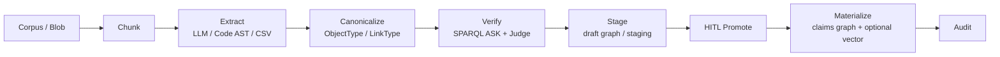

# 21. Ontology Knowledge Engineering Pipeline

> *A Chinese version is available in
> [21-ontology-knowledge-engineering-pipeline.zh.md](21-ontology-knowledge-engineering-pipeline.zh.md).*
>
> v0.5.0 completes the bounded Ontology Knowledge Engineering / Graph
> Engineering milestone documented here. It does not claim a continuous,
> fully automated corpus-to-graph service.
> It complements [Knowledge Ingestion](16-knowledge-ingest-import-graph.md),
> [Ontology Action Data Sandbox](15-ontology-action-sandbox.md), and the
> [Isolation Contract](17-isolation-contract.md).

## Status and question answered

**Question:** Do the implemented capabilities in v0.5.0 form a
complete, online, fully automated ontology knowledge-graph engineering
toolchain?

**Answer: No.**

The current code provides bounded ingestion, graph, ontology, staging, quality,
and human-approval primitives. It does **not** provide an online, fully automatic
pipeline that extracts ontology-aligned knowledge from a changing corpus,
validates it, resolves entities, promotes schema, and materializes a governed
warehouse. The design below describes what would be required to make that
statement true without weakening the current security and governance boundary.

## Two tracks: pre-kernel ontology design vs kernel Graph Engineering

This design has two complementary tracks with an intentional hand-off:

- **Track A — Pre-kernel Ontology Design Automation:** knowledge engineering
  *before* a concrete enterprise scenario is wired into agents. It raises the
  automation of drafting and promoting the ontology layer—`ObjectType` /
  `LinkType` drafts, LinkML, glossary inputs, and DDL/OpenAPI-to-draft—so that
  business onboarding is faster. It produces a reviewable ontology, never an
  automatically promoted production ontology. The already shipped
  [#90 type-draft baseline](https://github.com/skaiy/wild_agentos/issues/90)
  creates drafts from CSV and JSON Schema.
- **Track B — Kernel Graph Engineering:** governance graph engineering inside
  the AgentOS runtime: loops watching loops, anchors/frozen state, and
  external judgment govern how runtime extract, materialize, and skill loops
  may use the reviewed ontology. This is the kernel track represented by
  [#140](https://github.com/skaiy/wild_agentos/issues/140),
  [#144](https://github.com/skaiy/wild_agentos/issues/144),
  [#145](https://github.com/skaiy/wild_agentos/issues/145), and
  [#147](https://github.com/skaiy/wild_agentos/issues/147).

Track A does not bypass Track B's runtime governance, and Track B does not
promote Track A output. A human must explicitly promote a reviewed ontology
before a kernel loop can use it as a promoted schema.

## Current capability map

### Available now

| Capability | Current boundary |
|---|---|
| Claims-scoped graph import | `import-graph` and `kg/import` accept CSV, JSONL, or simplified N-Triples and write only to a server-minted Oxigraph graph. |
| Vector ingestion | Vector upload/ingest chunks content into the claims-scoped Hyperspace namespace. |
| Extraction primitives | A Code AST extractor and LLM `KnowledgeExtractor` produce open-vocabulary `NodeDef` / `EdgeDef` candidates. |
| Ontology layer | `ObjectType`, `LinkType`, and `ActionType` model semantic and controlled write concepts. |
| Type-draft bridge | CSV and JSON Schema can create type drafts; an authorized person must explicitly promote them. |
| Broader type-draft inputs | OpenAPI and SQL DDL generate claims-scoped drafts; LLM schema induction produces reviewable drafts only. |
| Readiness and compatibility | The read-only readiness report identifies promoted, draft, and missing requirements; promotion has a compatibility gate and explicit `force_breaking` audit path. |
| Governed writes | Actions support HITL staging, SPARQL `ASK` guardrails, and `ACTION_AUDIT`. |
| Optional inference | Limited RDFS query-time expansion is available only when enabled; it is off by default and does not persist inferred triples. |
| Isolation | `IsolationClaims` determine graph, blob, and vector targets; missing or invalid claims fail closed. Minting a safe target name is **not** historical-data migration. |

### Completed supporting work does not close the online-job gap

At the time of writing:

- [#130](https://github.com/skaiy/wild_agentos/issues/130) and
  [#133](https://github.com/skaiy/wild_agentos/pull/133) concern historical
  vector/L0/blob-key migration work and remain open.
- [#131](https://github.com/skaiy/wild_agentos/issues/131), production OIDC,
  is already merged.
- [#132](https://github.com/skaiy/wild_agentos/issues/132), operations
  surfaces for keys, tenant scope, and action auditing, is merged.

These changes improve isolation, authentication, or operations. They do not
provide the authenticated, claims-scoped online job and watcher orchestration
required for a continuous corpus-to-graph service.

### Explicit gaps

v0.5.0 closed the bounded primitives previously listed here: constrained
extraction and canonicalization to staging, `KgQualityGate`, anchored
materialization, approval-held entity-resolution suggestions, frozen golden
evaluation, ontology-health reporting, draft-only schema induction, and
schema-evolution compatibility checks.

What remains is:

1. an authenticated, claims-scoped online corpus-to-graph job pipeline that
   invokes those primitives end-to-end with idempotency, retry/backpressure,
   provenance, and observable job state (acceptance criterion 1); and
2. scheduled or event-driven corpus watchers that enqueue those jobs.

This leaves the answer above as **No** for a *fully* online, automated
toolchain until the complete acceptance criteria are demonstrably true.

### v0.6 scope — planned online corpus job + watcher

**In**

- A claims-scoped job model with create, list, get, and cancel (or equivalent)
  operations for configured corpus changes or incremental deltas.
- A runner that orchestrates the existing
  extract → canonicalize → quality gate → optional entity-resolution suggestion
  → staging path. It reuses the existing constrained-extraction endpoints,
  `KgQualityGate`, staging/review records, and anchored materialization
  boundary rather than creating another KE stack.
- Default-off, opt-in scheduled or event-driven watchers that enqueue jobs.
- Job state, retry with backpressure, idempotency, and provenance linking
  source, candidates, gate result, and decision.
- Verified `IsolationClaims` only: unauthenticated or invalid-claims requests
  fail closed. Tests must prove that failed and unauthenticated paths never
  write production.

**Out / non-goals**

- Silent promotion of a production ontology or automatic entity-resolution
  merge; materialization remains approval-held and anchored.
- Replacing Oxigraph/SPARQL, adding Cypher or Nebula, or reimplementing
  `KgQualityGate`, Morph-KGC/RML, golden freeze, or the Admin design studio.
- Claiming “fully online automated with governance” before every acceptance
  criterion below is proven. v0.6 may close criterion 1 and the watcher gap
  while human authority over promotion and materialization remains intact.
- Mixing separate product or business repositories into this tree.

**Proposed future Issue checklist (titles only; do not file yet)**

- Claims-Scoped Online Corpus Job API and State Store
- Idempotent Online Job Runner for Existing KE Primitives
- Default-Off Corpus Watcher Scheduler and Queueing
- Online Job Provenance, Audit, Retry, and Backpressure Observability
- Fail-Closed Online Job Isolation and Production-Write CI
- Companion Admin Job List (outside this repository)

## Public best-practice signals

These references are design inputs, not claims of a one-to-one clone of any
external product or research system.

### Ontology as a decision API, governed by promotion

Public Foundry documentation describes an ontology as an operational layer with
object/link semantics and governed actions. That is a useful architectural
principle: treat the ontology as a decision API, not merely a passive schema
file. Start with representative or placeholder data, review a draft model, and
promote it under governance; use Actions for controlled writes rather than
letting arbitrary extractors write production state. See the public
[Ontology overview](https://palantir.com/docs/foundry/ontology/overview/).

This proposal borrows that general pattern only. It does not assert feature
parity, compatibility, or a product clone.

### Research patterns, 2024–2026

- [SAC-KG](https://aclanthology.org/2024.acl-long.238/) separates a
  **Generator**, **Verifier**, and **Pruner**, making validation and controlled
  expansion first-class steps.
- [EDC: Extract, Define,
  Canonicalize](https://aclanthology.org/2024.emnlp-main.548/) makes open
  extraction, schema definition, and post-hoc canonicalization separate
  phases.
- [GraphJudge](https://aclanthology.org/2025.emnlp-main.554/) evaluates
  extracted triples with a graph judge; the later
  [GraphRefine](https://aclanthology.org/2026.acl-long.1353/) work illustrates
  document-grounded deletion, editing, or rewriting after extraction.
- [OAK+MEND](https://arxiv.org/abs/2605.29168) maps open extracted types and
  predicates to ontology candidates with embeddings, then selectively asks an
  LLM to correct detected ontology violations.
- [KGGen](https://arxiv.org/abs/2502.09956) uses extraction followed by
  aggregation and entity/edge deduplication.

The resulting design rule is:

> **Extract open → canonicalize to ontology → verify/refine → stage → human
> promote → materialize instances** is safer and more maintainable than “an LLM
> dumps triples into production.”

## Open-source selection & absorption (commercially usable licenses)

This is a design-level selection snapshot, not a dependency approval or an
implementation plan. Re-verify each project's SPDX expression, transitive
dependencies, model-weight terms, and distribution terms on the day it is
adopted. In particular, a repository license does not automatically license
its model weights.

### License and integration policy

- Prefer **Apache-2.0**, **MIT**, or **BSD-3-Clause** for anything WAO might
  depend on, vendor patterns from, or ship beside.
- Oxigraph plus SPARQL remain the kernel. Neo4j, FalkorDB, Memgraph, and Cypher
  are not replacements for the primary RDF store or query language.
- Use one of three absorption modes: **(A)** pattern/algorithm reference only;
  **(B)** optional out-of-process sidecar or worker; or **(C)** a Rust crate or
  thin adapter. Prefer A/B for Python stacks. Use C only where both license and
  ABI fit.
- **LGPL** is commercially usable, but its linking obligations require review;
  an isolated process boundary is preferred. **NOASSERTION**, unclear dual
  licensing, and **CC-BY-NC** model terms are exclude-or-legal-review cases.
- A pipeline may generate candidates, but it may never auto-promote ontology
  types or production instances.

### Selection table

| Project | License (SPDX snapshot) | Fit | Absorb how | Priority |
|---|---|---|---|---|
| Oxigraph (already in tree) | Apache-2.0 OR MIT | RDF/SPARQL foundation | keep | baseline |
| spaCy | MIT | NER/chunking baseline | optional sidecar or preprocessing worker | P0 |
| GLiNER (`urchade/GLiNER`) + Apache-2.0 model weights only (v2+/multi v2.1) | Apache-2.0 (code); **exclude** CC-BY-NC early weights | zero-shot NER against promoted `ObjectType` labels | sidecar / ONNX, or Rust `gline-rs` if mature | P0 |
| GLinker (`Knowledgator/GLinker`) | Apache-2.0 | entity linking L1–L3 | pattern + optional sidecar for P2 ER | P2 |
| RetriCo (`Knowledgator/RetriCo`) | Apache-2.0 | modular extract-pipeline DAG | **pattern** (processor DAG); do not adopt Neo4j/Falkor backends | P0–P1 |
| Morph-KGC | Apache-2.0 | R2RML/RML CSV/DB → RDF | batch-materialize structured sources into Oxigraph | P0 |
| RDFLib + pySHACL | BSD-3 / Apache-2.0 | SHACL validation | quality-gate ASK/SHACL before promote; Python job may write report JSON consumed by Rust | P1 |
| LinkML | Apache-2.0 | schema authoring → RDF/JSON Schema | type-draft / schema-evolution CI artifacts | P1–P3 |
| OpenSPG + KAG | Apache-2.0 | schema-constrained build + mutual chunk↔entity index | **patterns**: schema-constrained construction and mutual index; do not force an SPG store | P1–P2 |
| Microsoft GraphRAG | MIT | community summaries / hierarchical RAG | **optional retrieval pattern** only; extractors write staging through WAO APIs; maintenance-mode caveat | P2 (query side, not ontology promote) |
| Text2KGBench | Apache-2.0 | ontology-conformance evaluation | golden evaluations for constrained extraction | P1 |
| iText2KG | LGPL-2.1 | incremental ER patterns | **pattern only** or LGPL-isolated process; do not statically link into the AGPL kernel without review | reference |
| `neo4j-graphrag-python` | NOASSERTION | — | **do not adopt** until SPDX is clear | exclude |

LlamaIndex PropertyGraph extractors are also useful as a pattern in the
Apache-2.0 ecosystem, but Cypher and property-graph stores remain non-goals for
the WAO kernel.

### Absorption map

| WAO module | OSS input | Boundary for absorption |
|---|---|---|
| `OntologyExtractJob` | RetriCo processor-DAG pattern; spaCy/GLiNER extractors; Morph-KGC for structured inputs | A/B: workers produce provenance-bearing candidates only. |
| `Canonicalizer` | KAG schema-constrained construction; [OAK+MEND](https://arxiv.org/abs/2605.29168)-style embedding map | Implement in-tree against promoted types; cite and use the research pattern, not its stack. |
| `KgQualityGate` | pySHACL; SPARQL `ASK`; Text2KGBench metrics | Deterministic failures remain fail-closed before staging/promotion. |
| Entity resolution | GLinker and iText2KG incremental-matching patterns | A/B: conservative, reviewable matches with provenance. |
| Staging/HITL | None | Keep WAO Action/type-draft governance; no external replacement. |
| Mutual index | KAG chunk↔entity pattern | Store chunk IDs in Blob plus provenance quads; do not introduce an SPG store. |

### Explicit non-absorb decisions

- Replacing Oxigraph with Neo4j, FalkorDB, or Memgraph.
- Using Cypher as the primary query language.
- Auto-promoting output from any OSS pipeline.
- Shipping CC-BY-NC GLiNER weights.
- Vendoring entire GraphRAG or KAG stacks into the Rust binary.

## Graph Engineering lens (governance graph ≠ data graph)

Oxigraph RDF is the **data graph**: it stores claims, entities, relations,
provenance, and validation evidence. Graph Engineering adds a distinct
**governance graph**: the explicit topology of loops that make, check, approve,
audit, and arbitrate decisions about that data. It is not another graph-store
replacement.

The public [Graph Engineering framing](https://agentfactory.panaversity.org/docs/graph-engineering-crash-course)
warns that a single optimizing loop fails through Goodhart/metric gaming, goal
blindness, loop conflict, and measurement decay. Its remedy is multi-speed
supervisory loops with three guardrails: anchors, frozen nodes, and external
judgment. A workflow can sequence steps, but it does not by itself express who
can challenge a result, which evidence is independent, or how conflicting
objectives are resolved.

Existing WAO staging, HITL approval, `ASK`-before-Judge ordering, and
`IsolationClaims` already embody parts of this model. v0.5.0 makes them
explicit supervisory loops rather than treating them only as workflow steps:

| Guardrail | WAO mapping |
|---|---|
| **Anchors** | `IsolationClaims` and OIDC identity; deterministic SPARQL/SHACL checks; post-materialization SPARQL re-read. Never accept an LLM-reported “success” as sufficient evidence. |
| **Frozen nodes** | Golden evaluations, Text2KGBench fixtures, and the promoted `ObjectType` schema domain are protected. Extractor and optimizer loops must not mutate them. |
| **External judgment** | Humans promote types and approve instance materialization; humans also set and revise value goals. |

The proposed cadence layers are:

- **Fast:** constrained extraction to staging ([#138](https://github.com/skaiy/wild_agentos/issues/138), done).
- **Medium:** `KgQualityGate` plus review queue ([#140](https://github.com/skaiy/wild_agentos/issues/140)); optional business or quality metrics may be added later.
- **Slow:** ontology-health and “should we still extract this?” goal review.
- **Arbitration:** an explicit decision path for quality-versus-coverage conflicts.

Graph Engineering is therefore distinct from (1) a **workflow**, which orders
execution; and (2) the **knowledge-graph store**, which persists RDF facts.
The governance graph connects bounded loops and their authority; the data graph
is evidence those loops read and write under governed boundaries.

This cross-cutting pattern also applies conceptually to the shipped Skill golden
evaluations and emergent-tool promotion: protected evidence, independent gates,
and human promotion make a loop governable. Those shipped features remain as
documented; this proposal does not reopen their completed work.

For the concrete Skill/Emergent cross-cut, tenant admission verifies
package-declared SHA-256 digests for frozen golden fixtures before evaluation,
records a named safety/isolation/side-effect rule review, and stores promotion
audit evidence with the reviewed candidate digest. An optimizer may improve a
candidate but cannot change the fixture that measures it or grant itself tenant
authority.

## Target architecture for Wild AgentOS

Oxigraph and SPARQL remain the RDF/query foundation. `IsolationClaims` remain
the sole authority for selecting tenant/project storage targets, and every
write path remains fail closed when claims are absent or invalid.



### Proposed modules and responsibilities

| Module | Responsibility | Safety boundary |
|---|---|---|
| `OntologyExtractJob` | Reads a versioned blob/corpus input, chunks it, invokes the selected extractor, and preserves source/provenance metadata. | No production graph write. |
| `Canonicalizer` | Maps open node labels and relations to *promoted* `ObjectType` / `LinkType` candidates; marks ambiguity and unsupported candidates. | Domain is promoted types only; it may not create schema. |
| `KgQualityGate` | Runs deterministic SPARQL `ASK` assertions first, then an optional source-grounded Judge/refiner. | Gate failure or uncertainty is fail closed to staging/review, never a production write. |
| Existing type drafts | Holds proposed schema changes created through an explicit draft workflow. | Drafts never auto-promote; this proposal does not make them infer links/actions. |
| Existing Action staging | Retains approved instance changes for merge/discard and records `ACTION_AUDIT`. | Claims-scoped graph selection and approval semantics stay intact. |

The staging graph must be claims-derived and separately addressable from the
production graph. Source blob/version, extractor/model configuration, proposed
canonical mappings, validation results, reviewer decision, and materialization
result should be auditable. A successful canonicalization is not a license to
promote a new type or to bypass the existing approval boundary.

## Phased delivery buckets

### Track A — Pre-kernel Ontology Design Automation

#### Baseline shipped — schema → type-draft

[#90](https://github.com/skaiy/wild_agentos/issues/90) already delivers the
baseline: CSV and JSON Schema generate claims-scoped type drafts, and an
authorized person must explicitly promote them. Drafts currently do not invent
`LinkType`s unless they are explicitly supplied.

#### Delivered — broader inputs and compatibility-gated drafts

- OpenAPI and SQL DDL generate claims-scoped type drafts for review.
- Suggest relationship drafts from explicit FK evidence or co-occurrence, as
  drafts only; no suggestion may create or promote a production `LinkType`
  automatically.
- Draft promotion applies compatibility checks. A caller may use
  `force_breaking` only with explicit audit evidence; it does not bypass
  human confirmation.

#### Shipped — pre-attach ontology readiness report

`POST /api/v1/ontology/readiness-report` is the recommended onboarding gate
before attaching a business scenario to agents. Supply the domain pack's
required `ObjectType` and `LinkType` IDs:

```json
{
  "required_object_types": ["Vehicle", "FaultCode", "RepairOrder"],
  "required_link_types": ["triggers", "diagnoses"]
}
```

The endpoint requires verified `IsolationClaims` and fails closed with `401`
when they are absent. It reads the promoted ontology definition and only the
caller's non-expired type drafts, then reports each requirement as
`promoted`, `draft`, or `missing`, with coverage totals, open drafts, and
assets recommended for draft creation. A scenario is attach-ready only when
every requirement is promoted—an open draft is explicitly not coverage.

This is a pure read audit: it does not seed metadata, delete expired drafts,
promote drafts, or write any instance graph. Feed the reported missing items
into the existing schema/glossary/DDL/OpenAPI-to-draft workflows; promotion
still requires the separate explicit human-confirmation endpoint.

#### Delivered — LLM schema induction, drafts only

- LLM-assisted schema induction proposes novel object/link concepts as
  separately reviewable drafts only.
- Never auto-promote an ontology draft, and never use schema induction to
  silently create `ActionType`s.
- Require explicit human promotion before a newly proposed type enters a later
  constrained extraction domain.
- An admin-facing ontology design studio is a follow-on surface, not a
  prerequisite for this track.

### Track B — Kernel Graph Engineering

This runtime track applies governance-graph controls—loops watching loops,
anchors/frozen state, and external judgment—to extraction, materialization,
and skill loops that use a promoted ontology.

#### P0 — constrained extraction into staging

- **Done, first slices:** [#138](https://github.com/skaiy/wild_agentos/issues/138)
  constrained extraction and [#139](https://github.com/skaiy/wild_agentos/issues/139)
  Morph-KGC structured-source materialization establish bounded inputs to the
  pipeline. `POST /api/v1/ontology/constrained-extractions`
  accepts provenance-bearing upstream candidates, deterministically
  canonicalizes them against promoted `ObjectType`/`LinkType` definitions, and
  writes accepted triples plus every mapping decision only to a claims-minted
  staging graph. It never promotes types or writes the production graph.

#### P1 — quality gate and review

- **Implemented (#140):** `KgQualityGate` runs claims-scoped, configurable
  SPARQL `ASK` anchors and an opt-in pySHACL sidecar before review. Its
  versioned quality-vs-coverage arbitration defaults to compliance; reports
  remain attached to the staging `extraction_id` and claims-scoped review
  queue; approve/reject records no production write, and a Judge cannot
  run—or overturn the result—when a deterministic anchor fails.

#### P1.5 — materialize with anchors

- **Implemented (#144):** `POST
  /api/v1/ontology/constrained-extractions/:extraction_id/materialize` accepts
  only verified `IsolationClaims`, the path extraction ID, and
  `{"confirm": true}`. It accepts no `named_graph`; both staging and
  production targets are server-minted from claims. A passed quality-gate
  report or a recorded approved human review is required before the write.
- The server copies the claims-derived staging graph, retains staging for
  audit, then independently SPARQL re-reads the production graph's triple
  count. It returns `materialized` only when that anchor passes; otherwise it
  returns `materialize_failed` and emits an `ACTION_AUDIT` event with the
  source extraction, authority, reviewer, and anchor evidence. LLM or worker
  completion is never success evidence.
- Materialization never promotes an `ObjectType`, `LinkType`, or `ActionType`.

#### P2 — entity resolution with external judgment

- **Implemented (#141):** `POST /api/v1/ontology/entity-resolution/suggestions`
  retrieves `rdfs:label` candidates only from the caller's claims graph, then
  invokes the one-path, process-isolated
  `AGENTOS_KG_GLINKER_COMMAND` worker with those candidates. The included
  worker follows GLinker's Apache-2.0 mention → retrieve → disambiguate
  pattern and has a frozen initial matcher: exact normalized labels only
  (score `1.0`, threshold `0.98`). It writes
  `owl:sameAs` plus provenance only to a staging graph, and creates an
  approval-held suggestion. It never auto-merges. The existing
  `/action-approvals/:approval_id/approve` endpoint materializes an approved
  suggestion and independently re-reads its server-authored SPARQL anchor;
  an absent anchor returns `needs_repair` and retains the record for repair.
  GLinker is used as an Apache-2.0 pattern and can be installed only in that
  worker environment; no GLinker code, model weights, or LGPL component is
  linked into the kernel process. Any LGPL linker must remain process-isolated.
- The online-job runner and default-off watcher that schedule these existing
  primitives are v0.6 planned work; see the scope boundary above.

#### P2b — frozen extraction evaluation and measurement-decay audit

- **Implemented (#145):** ontology-extraction golden evaluations and fixtures
  are frozen behind a SHA gate, so extractors or optimizers cannot rewrite
  their own scorecard. The [golden-freeze policy](22-ontology-ke-golden-freeze-policy.md)
  records the required measurement-decay audit.
- The slow ontology-health and extraction-goal review may stop or redefine
  extraction, but never auto-promotes a draft.

#### Implemented slow-loop evidence — ontology health report

`GET /api/v1/ontology/health` is the claims-scoped, read-only evidence input
for this slow loop. It reports:

- the canonicalization reject rate for reviewed staging extractions;
- quality-gate failures grouped by deterministic anchor (plus pySHACL/Judge
  outcomes when present);
- instance counts and a sparse flag for every promoted `ObjectType`; and
- stale and expired type drafts, without cleaning them up.

The endpoint accepts optional `sparse_type_threshold` (default `1`) and
`stale_draft_hours` (default `24`) query parameters. Its evidence scope is
limited to extraction IDs that have a persisted review/gate record, since those
are the claims-scoped records that can be enumerated safely. It does not list
or inspect another tenant/project's graphs.

Run it before a release, at a milestone, or when coverage/quality trends change.
Treat the output as a human goal-review input: a person may decide to stop,
retarget, or investigate extraction. The report performs no production write,
does not create a type draft, and cannot resolve a review, materialize
instances, or promote schema. If a finding warrants a schema proposal, submit
it explicitly through an existing `/api/v1/ontology/type-drafts/from-*` API and
use its separate `confirm: true` promotion endpoint after human review.

#### Implemented Skill/Emergent promotion governance

Tenant Skill and emergent-candidate promotion verifies the package-declared
SHA-256 digest of frozen golden fixtures before evaluation, records a named
safety/isolation/side-effect rule review, and stores audit evidence with the
reviewed candidate digest. An optimizer cannot alter its fixture or grant
itself tenant authority.

## Non-goals

This design does not:

1. replace Oxigraph or SPARQL;
2. silently auto-promote a production ontology;
3. add Cypher;
4. claim production-ready multi-tenancy before historical isolation keys are
   migrated; or
5. redefine safe-name minting as migration.

## Acceptance criteria for “online automated with governance”

The toolchain may use that description only when all of the following are
demonstrably true:

1. An authenticated, claims-scoped online job can process a configured corpus
   change end-to-end with idempotency, retry/backpressure, provenance, and
   observable job state.
2. Extraction is constrained to promoted ontology types or is
   post-extraction-canonicalized against them; unsupported and ambiguous
   candidates are explicitly staged or rejected.
3. Deterministic SPARQL quality assertions run before materialization, and any
   enabled Judge/refiner is source-grounded, attributable, and cannot override
   a failed deterministic policy.
4. Entity resolution/deduplication is available with conservative matching,
   provenance, and reviewable merge decisions.
5. Every candidate writes first to a claims-scoped staging graph; failed,
   unknown, cross-scope, or unauthenticated paths fail closed and never affect
   production.
6. Schema induction yields drafts only. New `ObjectType`, `LinkType`, and
   `ActionType` definitions require the appropriate explicit human governance;
   no extraction run silently changes the production ontology.
7. Approved candidates materialize reproducibly into the claims-scoped graph
   (and optional vector index) with an audit record connecting source,
   canonicalization, checks, reviewer decision, and result.
8. Schema-evolution CI protects backwards compatibility and isolation
   contracts, including the distinction between minting and historical-data
   migration.
9. Multi-loop supervision is evidenced: fast extraction, medium quality/review,
   slow goal/ontology-health review, and quality-versus-coverage arbitration
   have explicit authority and audit records.
10. Anchors are verified independently through identity, deterministic
    SPARQL/SHACL checks, and post-materialization graph re-reads; an LLM
    success report alone never satisfies the gate.
11. Frozen golden evaluations, Text2KGBench fixtures, and the promoted schema
    domain cannot be mutated by an extractor or optimizer being evaluated.
12. A human supplies external judgment for type promotion and instance
    materialization, and retains authority over the value goals.
