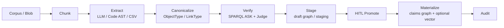

> *本文是 [21-ontology-knowledge-engineering-pipeline.md](21-ontology-knowledge-engineering-pipeline.md) 的中文版本。*

---

# 21. 本体知识工程流水线（仅设计）

> 本文是提案设计，不是发布计划，也不代表已实现。
> 参见[知识摄取](16-knowledge-ingest-import-graph.zh.md)、
> [本体 Action 数据沙箱](15-ontology-action-sandbox.zh.md) 和
> [Isolation Contract](17-isolation-contract.zh.md)。

## 状态与回答的问题

**问题：** 已实现能力加上待合并 PR，是否已经构成完整、在线、全自动的本体知识图谱工程工具链？

**回答：否。**

当前代码提供了有价值的摄取、图谱、本体、暂存和人工审批原语；它**尚未**提供一条在线全自动流水线，用于从持续变化的语料中提取本体对齐知识、验证知识、消解实体、提升 schema，并物化为受治理的知识仓库。以下设计说明了在不削弱现有安全与治理边界的前提下，需要具备哪些能力才能作出这一表述。

## 当前能力地图

### 已具备

| 能力 | 当前边界 |
|---|---|
| claims 作用域的图导入 | `import-graph` 与 `kg/import` 接受 CSV、JSONL 或简化 N-Triples，且只写入服务端 mint 的 Oxigraph 图。 |
| 向量摄取 | 向量 upload/ingest 将内容切块并写入 claims 作用域的 Hyperspace namespace。 |
| 提取原语 | Code AST extractor 与 LLM `KnowledgeExtractor` 产生开放词表的 `NodeDef` / `EdgeDef` 候选。 |
| 本体层 | `ObjectType`、`LinkType`、`ActionType` 建模语义概念与受控写入概念。 |
| 类型草稿桥接 | CSV 和 JSON Schema 可以生成 type draft；只有获授权人员显式 promote 后才能生效。 |
| 受治理的写入 | Action 支持 HITL staging、SPARQL `ASK` guardrail 和 `ACTION_AUDIT`。 |
| 可选推理 | 有限 RDFS query-time 扩展可选且默认关闭；不持久化推理三元组。 |
| 隔离 | `IsolationClaims` 决定 graph、blob、vector 目标；缺失或无效 claims 必须 fail closed。mint 安全目标名称**不等于**迁移历史数据。 |

### 待办或近期完成的工作不会填补该缺口

本文编写时：

- [#130](https://github.com/skaiy/wild_agentos/issues/130) 与
  [#133](https://github.com/skaiy/wild_agentos/pull/133) 涉及历史
  vector/L0/blob key 迁移，仍处于 open 状态。
- [#131](https://github.com/skaiy/wild_agentos/issues/131) 的生产 OIDC 已合并。
- [#132](https://github.com/skaiy/wild_agentos/issues/132) 的密钥、tenant scope 和 action audit 运维能力已合并。

这些工作改进隔离、认证或运维；没有任何一项提供连续本体提取、自动 promote 或受治理的仓库物化。

### 明确缺口

当前系统没有：

1. 连续、在线的 corpus-to-graph job pipeline；
2. 本体约束提取，或提取后的 canonicalization/correction；
3. entity resolution / deduplication 服务；
4. draft-to-instance materialization job；
5. GraphJudge/refiner 一类图质量 gate；
6. schema evolution CI；
7. 定时 corpus watcher；以及
8. 让 type draft 发明 `LinkType` 或 `ActionType` 的机制。type draft 被刻意限定得比 schema induction 更窄。

## 公开最佳实践信号

这些引用是设计输入，不表示与任何外部产品或研究系统一一对应、兼容或克隆。

### 把本体当作决策 API，并通过 promote 治理

公开的 Foundry 文档把本体描述为包含 object/link 语义与受治理 Action 的 operational layer。这带来一个有益的架构原则：将本体视为决策 API，而非静态 schema 文件。先用代表性或占位数据起草模型，在治理下审阅并 promote；用 Action 进行受控写入，而不是让任意 extractor 写入生产状态。参见公开的
[Ontology overview](https://palantir.com/docs/foundry/ontology/overview/)。

本提案仅借鉴该通用模式，不宣称功能对等、兼容或产品克隆。

### 2024–2026 研究模式

- [SAC-KG](https://aclanthology.org/2024.acl-long.238/) 分离
  **Generator**、**Verifier** 和 **Pruner**，将验证与受控扩展作为一等步骤。
- [EDC: Extract, Define,
  Canonicalize](https://aclanthology.org/2024.emnlp-main.548/) 将开放提取、schema 定义和事后 canonicalization 分成不同阶段。
- [GraphJudge](https://aclanthology.org/2025.emnlp-main.554/) 以 graph judge 评估提取的 triple；后续
  [GraphRefine](https://aclanthology.org/2026.acl-long.1353/) 展示了提取后基于源文档的删除、编辑和重写。
- [OAK+MEND](https://arxiv.org/abs/2605.29168) 用 embedding 将开放提取的 type/predicate 映射至本体候选，再选择性地让 LLM 修正检测到的本体违规。
- [KGGen](https://arxiv.org/abs/2502.09956) 采用提取、聚合和 entity/edge deduplication。

由此得到的设计规则是：

> **开放提取 → canonicalize 到本体 → verify/refine → stage → 人工 promote → 物化实例**，优于“让 LLM 将 triples 直接倾倒到生产环境”。

## 开源选型与吸收（可商用协议）

本节是设计层面的选型快照，不构成依赖审批或实施计划。实际采用当天必须重新核验项目的 SPDX 表达式、传递依赖、模型权重条款和分发条款。尤其是，代码仓库的许可证并不自动覆盖其模型权重。

### 协议与集成策略

- 对 WAO 可能依赖、借鉴模式或随产品分发的任何内容，优先选用
  **Apache-2.0**、**MIT** 或 **BSD-3-Clause**。
- Oxigraph 加 SPARQL 仍是内核。Neo4j、FalkorDB、Memgraph 和 Cypher 都不是主 RDF store 或查询语言的替代方案。
- 采用三种吸收方式之一：**(A)** 仅参考 pattern/algorithm；**(B)** 可选的进程外 sidecar 或 worker；**(C)** Rust crate 或 thin adapter。Python stack 优先 A/B；仅在许可证和 ABI 都合适时采用 C。
- **LGPL** 可用于商业场景，但 linking 义务需要审查，优先采用隔离的进程边界。**NOASSERTION**、不清晰的 dual license，以及 **CC-BY-NC** 模型条款应当排除或交由法务审查。
- 流水线可以生成候选，但绝不可自动 promote ontology type 或 production instance。

### 选型表

| 项目 | 许可证（SPDX 快照） | 适配性 | 吸收方式 | 优先级 |
|---|---|---|---|---|
| Oxigraph（已在代码树中） | Apache-2.0 OR MIT | RDF/SPARQL 基础 | 保留 | baseline |
| spaCy | MIT | NER/chunking 基线 | 可选 sidecar 或预处理 worker | P0 |
| GLiNER（`urchade/GLiNER`）+ 仅 Apache-2.0 模型权重（v2+/multi v2.1） | Apache-2.0（代码）；**排除**早期 CC-BY-NC 权重 | 针对已 promote `ObjectType` label 的 zero-shot NER | sidecar / ONNX，或成熟后使用 Rust `gline-rs` | P0 |
| GLinker（`Knowledgator/GLinker`） | Apache-2.0 | entity linking L1–L3 | pattern + 可选 sidecar 用于 P2 ER | P2 |
| RetriCo（`Knowledgator/RetriCo`） | Apache-2.0 | 模块化 extract-pipeline DAG | **pattern**（processor DAG）；不采用 Neo4j/Falkor backend | P0–P1 |
| Morph-KGC | Apache-2.0 | R2RML/RML CSV/DB → RDF | 将结构化 source 批量物化进 Oxigraph | P0 |
| RDFLib + pySHACL | BSD-3 / Apache-2.0 | SHACL 验证 | promote 前的质量 gate ASK/SHACL；Python job 可写入由 Rust 消费的 report JSON | P1 |
| LinkML | Apache-2.0 | schema authoring → RDF/JSON Schema | type-draft / schema-evolution CI artifact | P1–P3 |
| OpenSPG + KAG | Apache-2.0 | schema-constrained build + 双向 chunk↔entity index | **pattern**：schema-constrained construction 和 mutual index；不强制采用 SPG store | P1–P2 |
| Microsoft GraphRAG | MIT | community summary / hierarchical RAG | 仅作**可选 retrieval pattern**；extractor 经 WAO API 写入 staging；注意 maintenance-mode | P2（query side，不用于 ontology promote） |
| Text2KGBench | Apache-2.0 | ontology-conformance evaluation | constrained extraction 的 golden eval | P1 |
| iText2KG | LGPL-2.1 | incremental ER pattern | **仅 pattern** 或 LGPL-isolated process；未经审查不得静态链接到 AGPL kernel | reference |
| `neo4j-graphrag-python` | NOASSERTION | — | SPDX 未明确前**不得采用** | exclude |

LlamaIndex PropertyGraph extractor 也可作为 Apache-2.0 ecosystem 中的 pattern 参考，但 Cypher 和 property-graph store 仍是 WAO kernel 的非目标。

### 吸收映射

| WAO 模块 | OSS 输入 | 吸收边界 |
|---|---|---|
| `OntologyExtractJob` | RetriCo processor-DAG pattern；spaCy/GLiNER extractor；面向结构化输入的 Morph-KGC | A/B：worker 只产生带 provenance 的候选。 |
| `Canonicalizer` | KAG schema-constrained construction；[OAK+MEND](https://arxiv.org/abs/2605.29168) 风格 embedding map | 针对 promoted type 在树内实现；引用并采用研究 pattern，而非引入其 stack。 |
| `KgQualityGate` | pySHACL；SPARQL `ASK`；Text2KGBench metric | deterministic failure 在 staging/promotion 前仍须 fail closed。 |
| Entity resolution | GLinker 与 iText2KG 的 incremental-matching pattern | A/B：保守、可审阅且保留 provenance 的 match。 |
| Staging/HITL | 无 | 保留 WAO Action/type-draft governance；不以外部项目替换。 |
| Mutual index | KAG chunk↔entity pattern | 在 Blob 中存储 chunk ID 加 provenance quad；不引入 SPG store。 |

### 明确不吸收的内容

- 用 Neo4j、FalkorDB 或 Memgraph 替换 Oxigraph。
- 将 Cypher 作为主查询语言。
- 自动 promote 任何 OSS pipeline 的输出。
- 分发 CC-BY-NC GLiNER 权重。
- 将完整 GraphRAG 或 KAG stack vendor 到 Rust binary。

## Graph Engineering 视角（治理图 ≠ 数据图）

Oxigraph RDF 是**数据图**：它存储 claims、实体、关系、provenance 和验证证据。
Graph Engineering 增加的是不同的**治理图**：让生成、检查、审批、审计和仲裁数据决策的
各个 loop 的显式拓扑。它不是另一种用于替换的 graph store。

公开的 [Graph Engineering 表述](https://agentfactory.panaversity.org/docs/graph-engineering-crash-course)
指出，单一优化 loop 会因 Goodhart/指标操纵、目标盲区、loop 冲突和 measurement decay
而失败；其补救是采用多速度的 supervisory loop，并设置三类 guardrail：anchor、frozen
node 和 external judgment。workflow 可以排列步骤，却不能天然表达谁可以质疑结果、哪类
证据独立，以及相互冲突的目标如何解决。

现有 WAO 的 staging、HITL 审批、`ASK`-before-Judge 顺序和 `IsolationClaims` 已经包含
这个模型的一部分。v0.5.0 应将它们提升为明确的 supervisory loop，而不只视为 workflow
步骤：

| Guardrail | WAO 映射 |
|---|---|
| **Anchors** | `IsolationClaims` 和 OIDC identity；确定性的 SPARQL/SHACL 检查；materialization 后的 SPARQL re-read。绝不只接受 LLM 所报告的“成功”。 |
| **Frozen nodes** | golden evaluation、Text2KGBench fixture 和已 promote 的 `ObjectType` schema domain 均受保护。extractor 和 optimizer loop 不得修改它们。 |
| **External judgment** | 人工 promote type 并审批 instance materialization；价值目标也由人工设定和修订。 |

提议的 cadence layer 为：

- **Fast：** 受约束提取至 staging（[#138](https://github.com/skaiy/wild_agentos/issues/138)，已完成）。
- **Medium：** `KgQualityGate` 加 review queue（[#140](https://github.com/skaiy/wild_agentos/issues/140)）；之后可选择加入 business 或 quality metric。
- **Slow：** ontology health，以及“是否仍应提取这个？”的目标审查。
- **Arbitration：** 对 quality 与 coverage 冲突作出显式裁决的路径。

因此，Graph Engineering 不等同于 (1) 决定执行顺序的 **workflow**，也不等同于 (2) 持久化
RDF 事实的 **knowledge-graph store**。治理图连接有边界的 loop 及其权限；数据图是在受治理
边界内供这些 loop 读取和写入的证据。

同一 cross-cutting pattern 也在概念上适用于已交付的 Skill golden evaluation 和
emergent-tool promotion：受保护的证据、独立 gate 和人工 promotion 使 loop 可被治理。
这些已交付能力保持现有文档所述状态；本提案不将已完成工作重新列为未完成。

## Wild AgentOS 的目标架构

Oxigraph 和 SPARQL 保持为 RDF/query 基础。`IsolationClaims` 仍是选择 tenant/project 存储目标的唯一权威；claims 缺失或无效时，所有写路径仍必须 fail closed。

### 提议模块与职责

| 模块 | 职责 | 安全边界 |
|---|---|---|
| `OntologyExtractJob` | 读取带版本的 blob/corpus 输入，切块，调用选定 extractor，并保留 source/provenance metadata。 | 不写生产图。 |
| `Canonicalizer` | 把开放 node label/relation 映射至**已 promote**的 `ObjectType` / `LinkType` 候选；标出歧义和不支持候选。 | domain 只包含 promoted type；不得创建 schema。 |
| `KgQualityGate` | 先运行确定性的 SPARQL `ASK` assertion，再运行可选的、以 source 为依据的 Judge/refiner。 | gate 失败或不确定时，必须 fail closed 到 staging/review，绝不可写生产。 |
| 已有 type draft | 通过显式 draft workflow 承载提议的 schema 变更。 | draft 永不自动 promote；本提案不让它推断 link/action。 |
| 已有 Action staging | 保留已批准的 instance change 以供 merge/discard，并记录 `ACTION_AUDIT`。 | claims 作用域图选择和 approval 语义保持不变。 |

staging graph 必须由 claims 派生，并可与 production graph 分开寻址。source blob/version、extractor/model configuration、建议 canonical mapping、validation result、reviewer decision 和 materialization result 都应可审计。canonicalization 成功不代表可 promote 新 type，也不代表可绕过现有 approval 边界。

## 分阶段交付桶

### P0 — 受约束提取进入 staging

- **已完成的首个切片：** [#138](https://github.com/skaiy/wild_agentos/issues/138)
  的 constrained extraction 及 [#139](https://github.com/skaiy/wild_agentos/issues/139)
  的 Morph-KGC structured-source materialization，已建立流水线的有边界输入。
  `POST /api/v1/ontology/constrained-extractions`
  接收带 provenance 的上游候选，针对已 promote 的
  `ObjectType`/`LinkType` 做确定性 canonicalize，并且只将接受的
  triple 及每项 mapping decision 写入 claims mint 的 staging 图；绝不
  promote type，也绝不写 production 图。
- 增加本体约束 extraction API，其 domain **仅限 promoted type**。
- 对 promoted `ObjectType` 和 `LinkType` 执行提取后 canonicalization。
- fail closed，只能把候选写入 claims-scoped staging graph。
- 记录 source provenance 与被拒绝/有歧义的 mapping。

### P1 — 质量 gate 与审阅

- [#140](https://github.com/skaiy/wild_agentos/issues/140)：将 `KgQualityGate`
  作为中速 quality supervisory loop，使用针对 type、predicate、cardinality 和
  provenance policy 的确定性 `ASK`/SHACL anchor。
- 可选、以 source 为依据的 Judge/refiner 位于确定性检查后，但绝不可覆盖失败的 anchor。
- 增加 review queue，用于暂存候选、证据、违规及 approve/reject decision。

### P1.5 — 带 anchor 的 materialize

- 只有在 quality gate 和 HITL approval 都通过后，才可从 staging 写入 production。
- 对已写入的 claims-scoped graph 进行 SPARQL re-read，并在 audit trail 中记录这项独立的
  post-write verification。

### P2 — 带 external judgment 的实体消解

- [#141](https://github.com/skaiy/wild_agentos/issues/141)：增加保守的 entity resolution
  与 deduplication，并提供保留 provenance、可审阅的 merge suggestion；merge 由人工提供
  external judgment。
- 增加显式配置的 blob-watch/reindex job，并具备 idempotent cursor、retry、observability 和 backpressure。

### P2b — 冻结提取评测与 measurement-decay 审计

- 冻结 ontology-extraction golden evaluation 和 Text2KGBench fixture，避免 extractor 或
  optimizer 改写自己的 scorecard。
- 审计 metric、fixture 和 provenance 是否仍在衡量以 source 为依据的 ontology quality，
  而不是已经衰减的 proxy。

### P3 — schema induction draft 与慢速目标审查

- 将新的 object/link 概念作为独立、可审阅的 draft 提议。
- 永不自动 promote ontology draft，也绝不让 schema induction 静默创建 `ActionType`。
- 只有显式人工 promote 后，新 type 才可进入之后的 constrained extraction domain。
- 运行慢速 ontology-health 与 extraction-goal 审查；它可以停止或重定义提取，但绝不自动
  promote draft。

## 非目标

本设计不会：

1. 替换 Oxigraph 或 SPARQL；
2. 静默自动 promote 到生产本体；
3. 引入 Cypher；
4. 在历史 isolation key 完成迁移前宣称生产就绪的多租户；或
5. 将安全名称 mint 重新定义成迁移。

## 可称为“具有治理的在线自动化”时的验收标准

只有以下各项均可证明时，工具链才可使用这一描述：

1. 已认证、claims-scoped 的 online job 能以 idempotency、retry/backpressure、provenance 和可观测 job state 端到端处理已配置的 corpus change。
2. extraction 被限定至 promoted ontology type，或在提取后针对它们 canonicalize；不支持和有歧义的候选会明确 stage 或 reject。
3. materialization 前先运行确定性的 SPARQL quality assertion；任何启用的 Judge/refiner 都以 source 为依据、可归因，且不能覆盖失败的确定性 policy。
4. 提供 entity resolution/deduplication，具备保守匹配、provenance 和可审阅的 merge decision。
5. 每个候选先写入 claims-scoped staging graph；失败、未知、跨 scope 或未认证路径均 fail closed，绝不影响 production。
6. schema induction 仅生成 draft。新的 `ObjectType`、`LinkType`、`ActionType` 均需对应的显式人工治理；任何 extraction run 都不能静默改变 production ontology。
7. 已批准候选可复现地物化到 claims-scoped graph（及可选 vector index），并有 audit record 串联 source、canonicalization、check、reviewer decision 和 result。
8. schema-evolution CI 保护 backwards compatibility 和 isolation contract，包括 minting 与 historical-data migration 的区别。
9. 有证据证明 multi-loop supervision：快速提取、中速质量/审阅、慢速目标/ontology-health
   审查，以及 quality-versus-coverage arbitration 都具备明确权限和 audit record。
10. 通过 identity、确定性 SPARQL/SHACL 检查和 materialization 后 graph re-read 独立验证
    anchor；仅有 LLM success report 绝不可满足 gate。
11. frozen golden evaluation、Text2KGBench fixture 和已 promote schema domain 不能被正在评估
    的 extractor 或 optimizer 修改。
12. type promotion 和 instance materialization 必须有人类提供 external judgment，价值目标的
    权威也保留给人类。
