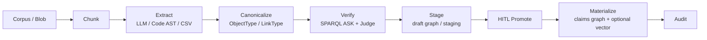

> *本文是 [21-ontology-knowledge-engineering-pipeline.md](21-ontology-knowledge-engineering-pipeline.md) 的中文版本。*

---

# 21. 本体知识工程流水线（仅设计）

> 本文是提案设计，不是发布计划，也不代表已实现。
> 参见[知识摄取](16-knowledge-ingest-import-graph.zh.md)、
> [本体 Action 数据沙箱](15-ontology-action-sandbox.zh.md) 和
> [Isolation Contract](17-isolation-contract.zh.md)。

## 状态与回答的问题

**问题：** 已实现能力加上待合并 PR，是否已经构成完整、在线、全自动的本体知识图谱工程工具链？

**回答：否。**

当前代码提供了有价值的摄取、图谱、本体、暂存和人工审批原语；它**尚未**提供一条在线全自动流水线，用于从持续变化的语料中提取本体对齐知识、验证知识、消解实体、提升 schema，并物化为受治理的知识仓库。以下设计说明了在不削弱现有安全与治理边界的前提下，需要具备哪些能力才能作出这一表述。

## 当前能力地图

### 已具备

| 能力 | 当前边界 |
|---|---|
| claims 作用域的图导入 | `import-graph` 与 `kg/import` 接受 CSV、JSONL 或简化 N-Triples，且只写入服务端 mint 的 Oxigraph 图。 |
| 向量摄取 | 向量 upload/ingest 将内容切块并写入 claims 作用域的 Hyperspace namespace。 |
| 提取原语 | Code AST extractor 与 LLM `KnowledgeExtractor` 产生开放词表的 `NodeDef` / `EdgeDef` 候选。 |
| 本体层 | `ObjectType`、`LinkType`、`ActionType` 建模语义概念与受控写入概念。 |
| 类型草稿桥接 | CSV 和 JSON Schema 可以生成 type draft；只有获授权人员显式 promote 后才能生效。 |
| 受治理的写入 | Action 支持 HITL staging、SPARQL `ASK` guardrail 和 `ACTION_AUDIT`。 |
| 可选推理 | 有限 RDFS query-time 扩展可选且默认关闭；不持久化推理三元组。 |
| 隔离 | `IsolationClaims` 决定 graph、blob、vector 目标；缺失或无效 claims 必须 fail closed。mint 安全目标名称**不等于**迁移历史数据。 |

### 待办或近期完成的工作不会填补该缺口

本文编写时：

- [#130](https://github.com/skaiy/wild_agentos/issues/130) 与
  [#133](https://github.com/skaiy/wild_agentos/pull/133) 涉及历史
  vector/L0/blob key 迁移，仍处于 open 状态。
- [#131](https://github.com/skaiy/wild_agentos/issues/131) 的生产 OIDC 已合并。
- [#132](https://github.com/skaiy/wild_agentos/issues/132) 的密钥、tenant scope 和 action audit 运维能力已合并。

这些工作改进隔离、认证或运维；没有任何一项提供连续本体提取、自动 promote 或受治理的仓库物化。

### 明确缺口

当前系统没有：

1. 连续、在线的 corpus-to-graph job pipeline；
2. 本体约束提取，或提取后的 canonicalization/correction；
3. entity resolution / deduplication 服务；
4. draft-to-instance materialization job；
5. GraphJudge/refiner 一类图质量 gate；
6. schema evolution CI；
7. 定时 corpus watcher；以及
8. 让 type draft 发明 `LinkType` 或 `ActionType` 的机制。type draft 被刻意限定得比 schema induction 更窄。

## 公开最佳实践信号

这些引用是设计输入，不表示与任何外部产品或研究系统一一对应、兼容或克隆。

### 把本体当作决策 API，并通过 promote 治理

公开的 Foundry 文档把本体描述为包含 object/link 语义与受治理 Action 的 operational layer。这带来一个有益的架构原则：将本体视为决策 API，而非静态 schema 文件。先用代表性或占位数据起草模型，在治理下审阅并 promote；用 Action 进行受控写入，而不是让任意 extractor 写入生产状态。参见公开的
[Ontology overview](https://palantir.com/docs/foundry/ontology/overview/)。

本提案仅借鉴该通用模式，不宣称功能对等、兼容或产品克隆。

### 2024–2026 研究模式

- [SAC-KG](https://aclanthology.org/2024.acl-long.238/) 分离
  **Generator**、**Verifier** 和 **Pruner**，将验证与受控扩展作为一等步骤。
- [EDC: Extract, Define,
  Canonicalize](https://aclanthology.org/2024.emnlp-main.548/) 将开放提取、schema 定义和事后 canonicalization 分成不同阶段。
- [GraphJudge](https://aclanthology.org/2025.emnlp-main.554/) 以 graph judge 评估提取的 triple；后续
  [GraphRefine](https://aclanthology.org/2026.acl-long.1353/) 展示了提取后基于源文档的删除、编辑和重写。
- [OAK+MEND](https://arxiv.org/abs/2605.29168) 用 embedding 将开放提取的 type/predicate 映射至本体候选，再选择性地让 LLM 修正检测到的本体违规。
- [KGGen](https://arxiv.org/abs/2502.09956) 采用提取、聚合和 entity/edge deduplication。

由此得到的设计规则是：

> **开放提取 → canonicalize 到本体 → verify/refine → stage → 人工 promote → 物化实例**，优于“让 LLM 将 triples 直接倾倒到生产环境”。

## Wild AgentOS 的目标架构

Oxigraph 和 SPARQL 保持为 RDF/query 基础。`IsolationClaims` 仍是选择 tenant/project 存储目标的唯一权威；claims 缺失或无效时，所有写路径仍必须 fail closed。

### 提议模块与职责

| 模块 | 职责 | 安全边界 |
|---|---|---|
| `OntologyExtractJob` | 读取带版本的 blob/corpus 输入，切块，调用选定 extractor，并保留 source/provenance metadata。 | 不写生产图。 |
| `Canonicalizer` | 把开放 node label/relation 映射至**已 promote**的 `ObjectType` / `LinkType` 候选；标出歧义和不支持候选。 | domain 只包含 promoted type；不得创建 schema。 |
| `KgQualityGate` | 先运行确定性的 SPARQL `ASK` assertion，再运行可选的、以 source 为依据的 Judge/refiner。 | gate 失败或不确定时，必须 fail closed 到 staging/review，绝不可写生产。 |
| 已有 type draft | 通过显式 draft workflow 承载提议的 schema 变更。 | draft 永不自动 promote；本提案不让它推断 link/action。 |
| 已有 Action staging | 保留已批准的 instance change 以供 merge/discard，并记录 `ACTION_AUDIT`。 | claims 作用域图选择和 approval 语义保持不变。 |

staging graph 必须由 claims 派生，并可与 production graph 分开寻址。source blob/version、extractor/model configuration、建议 canonical mapping、validation result、reviewer decision 和 materialization result 都应可审计。canonicalization 成功不代表可 promote 新 type，也不代表可绕过现有 approval 边界。

## 分阶段交付桶（未编码）

### P0 — 受约束提取进入 staging

- 增加本体约束 extraction API，其 domain **仅限 promoted type**。
- 对 promoted `ObjectType` 和 `LinkType` 执行提取后 canonicalization。
- fail closed，只能把候选写入 claims-scoped staging graph。
- 记录 source provenance 与被拒绝/有歧义的 mapping。

### P1 — 质量 gate 与审阅

- 为 type、predicate、cardinality、provenance policy 增加确定性 `ASK` assertion。
- 在确定性检查后增加可选、以 source 为依据的 Judge/refiner。
- 增加 review queue，用于暂存候选、证据、违规及 approve/reject decision。

### P2 — 连续 job 与消解

- 增加显式配置的 blob-watch/reindex job，并具备 idempotent cursor、retry、observability 和 backpressure。
- 增加 entity resolution 与 deduplication，包括可审阅的 merge suggestion 和保留 provenance 的 materialization。

### P3 — 受限 schema induction，仅生成 draft

- 将新的 object/link 概念作为独立、可审阅的 draft 提议。
- 永不自动 promote ontology draft，也绝不让 schema induction 静默创建 `ActionType`。
- 只有显式人工 promote 后，新 type 才可进入之后的 constrained extraction domain。

## 非目标

本设计不会：

1. 替换 Oxigraph 或 SPARQL；
2. 静默自动 promote 到生产本体；
3. 引入 Cypher；
4. 在历史 isolation key 完成迁移前宣称生产就绪的多租户；或
5. 将安全名称 mint 重新定义成迁移。

## 可称为“具有治理的在线自动化”时的验收标准

只有以下各项均可证明时，工具链才可使用这一描述：

1. 已认证、claims-scoped 的 online job 能以 idempotency、retry/backpressure、provenance 和可观测 job state 端到端处理已配置的 corpus change。
2. extraction 被限定至 promoted ontology type，或在提取后针对它们 canonicalize；不支持和有歧义的候选会明确 stage 或 reject。
3. materialization 前先运行确定性的 SPARQL quality assertion；任何启用的 Judge/refiner 都以 source 为依据、可归因，且不能覆盖失败的确定性 policy。
4. 提供 entity resolution/deduplication，具备保守匹配、provenance 和可审阅的 merge decision。
5. 每个候选先写入 claims-scoped staging graph；失败、未知、跨 scope 或未认证路径均 fail closed，绝不影响 production。
6. schema induction 仅生成 draft。新的 `ObjectType`、`LinkType`、`ActionType` 均需对应的显式人工治理；任何 extraction run 都不能静默改变 production ontology。
7. 已批准候选可复现地物化到 claims-scoped graph（及可选 vector index），并有 audit record 串联 source、canonicalization、check、reviewer decision 和 result。
8. schema-evolution CI 保护 backwards compatibility 和 isolation contract，包括 minting 与 historical-data migration 的区别。
